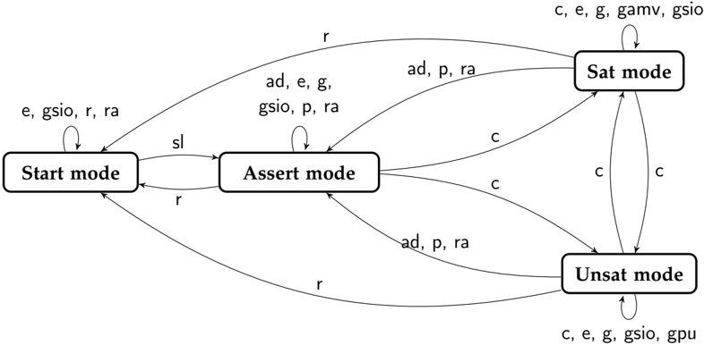
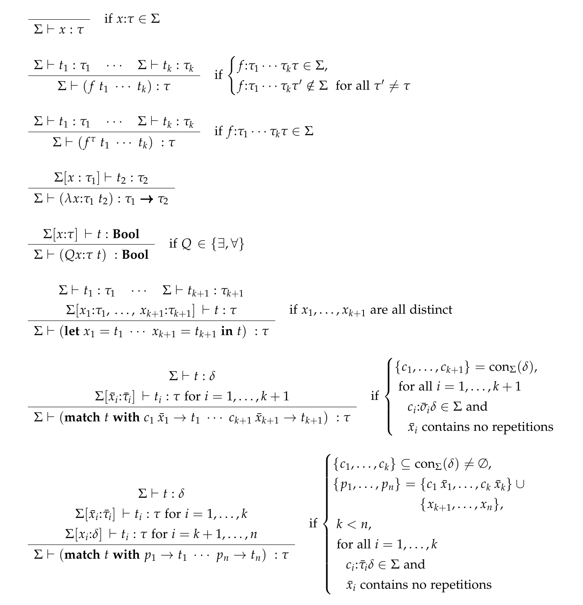
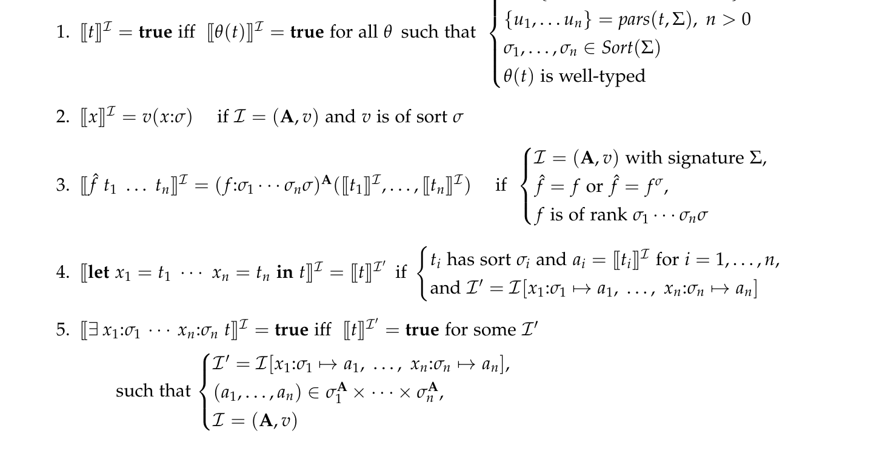
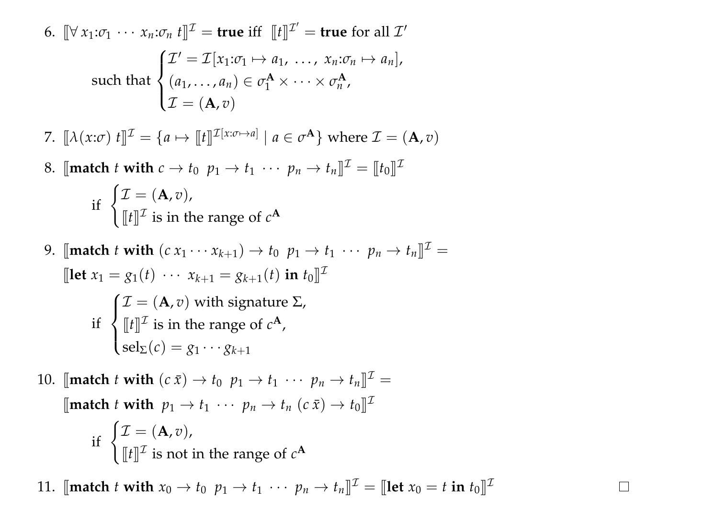
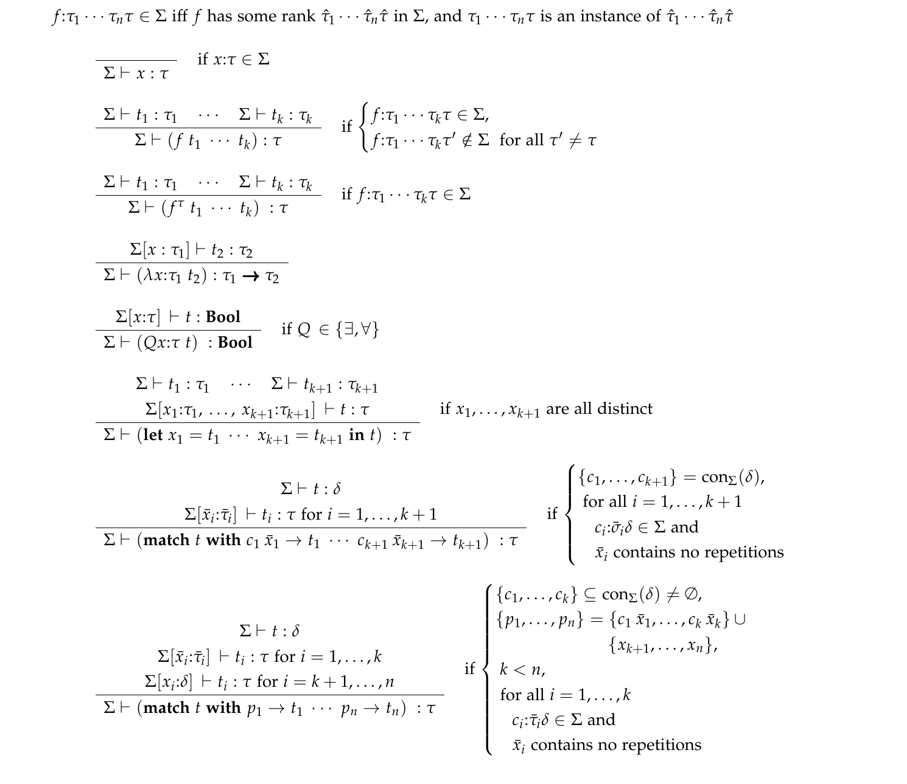

# The SMT-LIB Standard — Version 2.7

Clark Barrett, Pascal Fontaine, Cesare Tinelli

**Release:** July 7, 2025

Copyright © 2015-25 Clark Barrett, Pascal Fontaine, and Cesare Tinelli.

Permission is granted to anyone to make or distribute verbatim copies of this document, in any medium, provided that the copyright notice and permission notice are preserved, and that the distributor grants the recipient permission for further redistribution as permitted by this notice. Modified versions may not be made.

## Preface

The SMT-LIB initiative is an international effort, supported by several research groups worldwide, with the two-fold goal of producing an extensive on-line library of benchmarks and promoting the adoption of common languages and interfaces for SMT solvers. This document specifies Version 2.7 of the SMT-LIB Standard , a backward-compatible extension of Version 2.6

## Acknowledgments

We would like to thank the people below for their feedback, suggestions and corrections on this document. It is understood that we, the authors, are to blame for any remaining errors and omissions.

### Version 2.0

Version 2.0 of the SMT-LIB standard was developed with the input of the whole SMT community and three international work groups consisting of developers and users of SMT tools: the SMT-API work group, led by A. Stump, the SMT-LOGIC work group, led by C. Tinelli, and the SMT-MODELS work group, led by C. Barrett. The Version 2.0 document was written by C. Barrett, A. Stump and C. Tinelli.

Particular thanks are due to the following work group members, who contributed numerous suggestions and helpful constructive criticism in person or in email discussions: Nikolaj Bjørner, Sascha Boehme, David Cok, David Deharbe, Bruno Dutertre, Pascal Fontaine, Vijay Ganesh, Alberto Griggio, Jim Grundy, Paul Jackson, Albert Oliveras, Sava Krsti´ c, Michal Moskal, Leonardo de Moura, Philipp Rümmer, Roberto Sebastiani, and Johannes Waldmann.

Thanks also go to David Cok, Morgan Deters, Anders Franzén, Amit Goel, Jochen Hoenicke, and Tjark Weber for additional feedback on the standard, and to Jochen Hoenicke, Philipp Rümmer, and above all David Cok, for their careful proof-reading of earlier versions of the Version 2.0 document.

### Version 2.5

Version 2.5 was developed again with the input of the SMT community, based on their experience with Version 2.0.

Special thanks go to the following people for their thoughtful feedback and useful suggestions: Martin Brain, Adrien Champion, Jürgen Christ, David Cok, Morgan Deters, Bruno Dutertre, Andrew Gacek, Alberto Griggio, Jochen Hoenicke, Tim King, Tianyi Liang, Aina Niemetz, Margus Veanes, and Christoph Wintersteiger. We also thank David Cok and Jürgen Christ for their very careful proof reading of this document.

### Version 2.6

The main difference between 2.6 and Version 2.5 is the addition of algebraic datatypes to the language. Special thanks go to the following people for their feedback and useful suggestions on this extension: Guillaume Bury, David Cok, Tim King, Viktor Kuncak, Jochen Hoenicke, Pierre van de Laar, Calvin Loncaric, Andres Nötzli, Andrew Reynolds, and Cristina Serban.

### Version 2.7

The main difference between Version 2.7 and Version 2.6 is the inclusion of two extensions to the SMT-LIB base logic:

1. support for a form of prenex polymorphism in user-defined sorts and functions, and
2. an extension to higher-order logic syntax obtained with the introduction of a theory of maps .

Aside from new functionality, which required introducing a new command and assigning special meaning to the symbols @ , lambda , and -> , Version 2.7 is fully backward-compatible with Version 2.6 and is designed to ease the transition to the upcoming Version 3, whose base logic will be a higher-order logic with dependent (and polymorphic) types.

We thank Andrew Jones, Nikolaj Bjørner, and Andrew Reynolds for proposing a transitional version to SMT-LIB 3. Special thanks go to Nikolaj Bjørner and Andrew Reynolds for their feedback and useful suggestions. We also thank Haniel Barbosa, Guillaume Bury, David Cok, Levent Erkök, and Jochen Hoenicke for their feedback on the reference document and the standard, and Andrei Paskevich and Jasmin Blanchette for illuminating conversations on the semantics of logics with polymorphism. Pascal Fontaine is grateful to Jasmin Blanchette for his support through his European Research Council (ERC) starting grant Matryoshka (713999). He also thanks Amazon for its support through the Amazon Research Award program (SMT: Modules, Formats, and Standards).

## Contents

- **Preface** — 2
- **Acknowledgments** — 3
- **Contents** — 5
- **List of Figures** — 8
- **I  Introduction** — 9
  - **1  General Information** — 10
    - 1.1 About This Document — 10
      - 1.1.1 Change log for Version 2.7 — 10
      - 1.1.2 Differences between Version 2.7 and Version 2.6 — 11
      - 1.1.3 Change log for Version 2.6 — 12
      - 1.1.4 Differences between Version 2.6 and Version 2.5 — 12
      - 1.1.5 Change log for Version 2.5 — 12
      - 1.1.6 Differences between Version 2.5 and Version 2.0 — 13
      - 1.1.7 Typographical and notational conventions — 14
    - 1.2 Overview of SMT-LIB — 15
      - 1.2.1 What is SMT-LIB? — 15
      - 1.2.2 Main features of the SMT-LIB standard — 16
  - **2  Basic Assumptions and Structure** — 17
    - 2.1 Satisfiability Modulo Theories — 17
    - 2.2 Underlying Logic — 18
    - 2.3 Background Theories — 18
    - 2.4 Input Formulas — 19
    - 2.5 Interface — 20
- **II  Syntax** — 21
  - **3  The SMT-LIB Language** — 22
    - 3.1 Lexicon — 22
    - 3.2 S-expressions — 25
    - 3.3 Identifiers — 26
    - 3.4 Attributes — 26
    - 3.5 Sorts — 27
      - 3.5.1 Ranks — 28
    - 3.6 Terms and Formulas — 28
      - 3.6.1 Variable Binders — 29
      - 3.6.2 Scoping of variables — 32
      - 3.6.3 Well-sortedness requirements — 33
      - 3.6.4 Annotations — 34
      - 3.6.5 Term attributes — 34
    - 3.7 Theory Declarations — 35
      - 3.7.1 Theory Declaration Examples — 39
    - 3.8 Core Theory — 41
    - 3.9 Higher-order Core Theory — 44
    - 3.10 Logic Declarations — 45
      - 3.10.1 Examples — 47
    - 3.11 Scripts — 47
      - 3.11.1 Command responses — 50
      - 3.11.2 Example scripts — 52
      - 3.11.3 SMT-LIB Benchmarks — 53
- **III  Semantics** — 54
  - **4  Operational Semantics of SMT-LIB** — 55
    - 4.1 General Requirements — 55
      - 4.1.1 Execution Modes — 56
      - 4.1.2 Solver responses — 57
      - 4.1.3 Printing of terms and defined symbols — 58
      - 4.1.4 The assertion stack — 58
      - 4.1.5 Symbol declarations and definitions — 59
      - 4.1.6 In-line definitions — 59
      - 4.1.7 Solver options — 59
      - 4.1.8 Solver information — 61
    - 4.2 Commands — 62
      - 4.2.1 (Re)starting and terminating — 63
      - 4.2.2 Modifying the assertion stack — 63
      - 4.2.3 Introducing new symbols — 64
      - 4.2.4 Asserting and inspecting formulas — 68
      - 4.2.5 Checking for satisfiability — 70
      - 4.2.6 Inspecting models — 70
      - 4.2.7 Inspecting proofs — 73
      - 4.2.8 Inspecting settings — 73
      - 4.2.9 Script information — 74
  - **5  Logical Semantics of SMT-LIB Formulas** — 76
    - 5.1 The language of sorts — 77
    - 5.2 The language of terms — 78
      - 5.2.1 Signatures — 79
      - 5.2.2 Well-sorted terms — 81
    - 5.3 Structures and Satisfiability — 84
      - 5.3.1 The meaning of terms — 86
    - 5.4 Theories — 87
      - 5.4.1 Combined Theories — 88
      - 5.4.2 Theory declarations — 88
    - 5.5 Logics — 90
      - 5.5.1 Logic declarations — 90
- **IV  References** — 92
  - **Bibliography** — 93
- **V  Appendices** — 95
  - **A  Notes** — 96
  - **B  Concrete Syntax** — 101
  - **C  Abstract Syntax** — 108
- **Index** — 111


## List of Figures

| Figure | Title | Page |
|--------|-------|------|
| 3.1 | Theory declarations. | 35 |
| 3.2 | A possible theory declaration for the integer numbers. | 40 |
| 3.3 | The ArraysEx theory declaration. | 41 |
| 3.4 | A possible declaration for a theory of sets and relations. | 42 |
| 3.5 | The Core theory declaration. | 43 |
| 3.6 | The HO-Core theory declaration. | 44 |
| 3.7 | SMT-LIB Commands. | 48 |
| 3.8 | Command options. | 49 |
| 3.9 | Info flags. | 49 |
| 3.10 | Command responses. | 51 |
| 3.11 | Example script (over two columns), with expected solver responses in comments. | 52 |
| 3.12 | Another example script (excerpt), with expected solver responses in comments, assuming that the :print-success option is not set to true. | 53 |
| 4.1 | Abstract view of transitions between solver execution modes. The symbol * here stands for the matching wildcard. | 56 |
| 5.1 | Abstract syntax for sort terms. | 77 |
| 5.2 | Abstract syntax for unsorted terms. | 78 |
| 5.3 | Well-sortedness rules for terms. | 82 |
| 5.4 | Abstract syntax for theory declarations. | 89 |
| 5.5 | Abstract syntax for logic declarations. | 90 |


## Part I  Introduction

### 1  General Information

#### 1.1 About This Document

This document is mostly self-contained, though it assumes some familiarity with first-order logic, aka predicate calculus, and higher-order logic, aka simple type theory. The reader is referred to any of several textbooks on first-order logic [Gal86, Fit96, End01, Men09] and monographs on higher-order logic [And86, NS24]. Previous knowledge of Version 1.2 of the SMT-LIB standard [RT06] is not necessary. 1

This document provides BNF-style abstract and concrete syntax for a number of SMT-LIB languages. Only the concrete syntax is part of the official SMT-LIB standard. The abstract syntax is used here mainly for descriptive convenience; adherence to it is not prescribed. Implementors are free to use whatever internal structure they please for their abstract syntax trees.

New releases of the document are identified by their release date. Each new release of the same version of the SMT-LIB standard contains, by and large, only conservative additions and changes with respect to the standard described in the previous release, as well as improvements to the presentation. The only non-conservative changes may be error fixes.

Historical notes and explanations of the rationale of design decisions in the definition of the SMT-LIB standard are provided in Appendix A, with reference in the main text given as a superscript number enclosed in parentheses.

> 1 Version 2 and its subversions, while largely based on Version 1.2, are not backward compatible with it. See the Version 2.0 document [BST10b] for a summary of the major differences.

##### 1.1.1 Change log for Version 2.7

**Release: 2025-07-07**

- Clarified that quantifier patterns of the form :pattern () are allowed.
- Clarified the interactions between the :print-success option, the exit command, and commands returning values.
- Clarified that every formula returned by the get-assertions command must include :named and :pattern annotations, if present in the initially asserted formula.
- Fixed several typos and minor errors.
- Clarified difference between sort parameter and uninterpreted sort.

**Release: 2025-04-09**

- Replaced \_ with @ as the map application operator in theory HO-Core.

**Release: 2025-02-05**

- First release of Version 2.7.

##### 1.1.2 Differences between Version 2.7 and Version 2.6

The command language is extended with a new command for declaring (global) sort parameters, which can be used to assert formulas with terms of polymorphic sort in scripts. Semantically, the sort parameters are treated as implicitly universally quantified sort variables in each asserted formula. This has the effect of allowing prenex (or rank-1) polymorphism in assertions but not more general forms of polymorphism.

The term language is extended with a λ binder to construct function abstractions and a symbol for function application, @ , intentionally equal to that for the construction of indexed symbols in Version 2.6. The semantics of the λ binder and the application symbol are provided in a new theory, of higher-order functions, which includes the binary sort constructor -> for map sorts. In this version, values of sort (-> τ 1 τ 2 ) are treated as any other value, and so can be passed to and returned from functions. However, they are not identified with functions of rank τ 1 τ 2 (such as those introduced by declare-fun ), keeping the underlying logic of Version 2.7 first order. 2 Consistent with this extension, the command language is extended with the constant definition command define-const , which can be used in particular to define constants of sort (-> τ 1 τ 2 ) .

The reserved word \_ can now also be used (unambiguously) as a wildcard symbol in match patterns.

The functionality of check-sat-assuming has been extended to allow arbitrary Boolean terms to be passed as assumptions. The semantics of the commands get-unsat-assumptions and get-unsat-core has been correspondingly generalized and clarified.

The format of answers to the get-model command has been further restricted to prevent forward references in models.

2 This identification will occur in Version 3, which will be based on higher-order logic.

##### 1.1.3 Change log for Version 2.6

**Release: 2024-09-20**

- Changed verbosity to have no standard default value.
- Changed default for print-success to be false.

**Release: 2021-05-12**

- Fixed misleading example of usage of as to disambiguate symbol sorts.

**Release: 2021-04-02**

- Now allowing reserved words in s-expression (as arguments of attributes).
- Disambiguated description of in-line definition ( :named annotation).

**Release: 2017-07-18**

- First release of Version 2.6.

##### 1.1.4 Differences between Version 2.6 and Version 2.5

The SMT-LIB 2 language and logic now supports user-defined algebraic datatypes. Such types can be introduced with two new commands: declare-datatype , to declare a single algebraic datatype, and declare-datatypes , to declare two or more mutually recursive datatypes (see Section 4.2.3). The language of terms now includes a new binder, match , for pattern-matchingbased case analysis over datatype values (see Section 3.6.1). The variables bound by match are those that occur in patterns , also a new addition to the language. The underlying logic has also been modified to provide built-in semantics for the constructor, selector and tester symbols defined with each new algebraic datatype (see Chapter 5).

This version also makes official a number of set-info attributes used in benchmarks from the official SMT-LIB repository and specifies some requirements on their occurrence and order (see Section 3.11.3 and Section 4.2.9). Any other differences in this document are only edits to improve the presentation. Except for the addition of algebraic datatypes, which is fully backward compatible, the rest of the SMT-LIB language is unchanged.

##### 1.1.5 Change log for Version 2.5

**Release: 2015-06-28**

- Clarified in Section 4.1.1 that the exit command can be issued in any mode.

**Release: 2015-05-28**

- First release of Version 2.5.

##### 1.1.6 Differences between Version 2.5 and Version 2.0

Version 2.5 is an extension of Version 2.0 and, with two minor exceptions, is fully backward compatible with it. There is then no need to have separate support for 2.0 if one supports Version 2.5. The following list summarizes notable differences and extensions. The first two items are the only non-backward compatible changes.

- There is now a different set of escape sequences for string literals. It consists of a single sequence, "" , used to represent the double quote character within the literal.
- The standard option :expand-definitions has been removed because there are now no cases in which it applies.
- SMT-LIB source files are not limited to the US-ASCII format anymore and can now consist of Unicode characters. The concrete encoding is currently left unspecified, but should be a compatible 8-bit extension of the 7-bit US-ASCII set, such as UTF-8.
- We have clarified several points about the character set used by the SMT-LIB language and specified more precisely which characters are allowed in string literals, identifiers and symbols.
- We have made explicit several details on the scoping and shadowing rules for identifiers, in particulars those occurring in binders.
- Identifiers can now be indexed not just with numerals but also with symbols.
- The use of the term attribute :pattern and its related syntax for quantifier patterns has been made official.
- The solver option :interactive-mode has been renamed :produce-assertions . The old name is still accepted but its use is now deprecated.
- There is now a predefined argument, ALL , for the set-logic command which refers to the most general logic supported by the solver executing the command.
- We have introduced a notion of execution mode for a solver to better describe the restriction on when commands can be executed or options set.
- There is a new solver option :global-declarations that makes all definitions and declarations global and not removable by pop operations. Global declarations can be removed only by the new command reset .
- The new command reset brings the state of a solver to the state it had immediately after start up (resetting everything).
- The new command reset-assertions empties the assertion stack and removes all assertions. If :global-declarations is set to false , it also removes all declarations and definitions.

- The new command check-sat-assuming checks the satisfiability of the current context under an additional number of assumptions provided as input to the command. When it returns unsat , a new companion command, get-unsat-assumptions , returns the subset of input assumptions used by the solver to prove the context unsatisfiable. The latter command is enabled or disabled with the new option :produce-unsat-assumptions . The old check-sat command can now be defined, conservatively, as a special case of check-sat-assuming with an empty set of assumptions.
- The new command declare-const can now be used to declare nullary function symbols.
- The new command echo prints back on the regular output channel a string provided as input.
- The new commands define-fun-rec and define-funs-rec respectively allow the definition of recursive functions and of sets of mutually recursive functions.
- The new command get-model returns a representation of a model computed by the solver in response to an invocation of the check-sat or check-sat-assuming command.
- The new get-info flag :assertion-stack-levels returns the current number of levels in the assertion stack.
- The new option :reproducible-resource-limit can be used to set a solver-defined resource limit that applies to each invocation of check-sat or check-sat-assumptions .

##### 1.1.7 Typographical and notational conventions

The concrete syntax of the SMT-LIB language is defined by means of BNF-style production rules. In the concrete syntax notation, terminals are written in typewriter font, as in false , while syntactic categories (non-terminals) are written in slanted font and enclosed in angular brackets, as in ⟨ term ⟩ . In the production rules, the meta-operators :: = and | are used as usual in BNF. Also, as usual, the meta-operators \_ ∗ and \_ + denote zero, respectively, one, or more repetitions of their argument. We use \_ n and \_ n + 1 instead of \_ ∗ and \_ + when we want to relate the number of repetitions in several occurrences of the latter operators. We use the notation d dec (resp., e hex) to represent the Unicode character with decimal code d (resp., hexadecimal code e ). Remember that the US-ASCII character with code d < 128 is also the Unicode character d dec. Examples of concrete syntax expressions are provided in shaded boxes

like the following.

(f

(- x)

x)

In the abstract syntax notation, which uses the same meta-operators as the concrete syntax, words in boldface as well as the symbols ≈ , ∃ , ∀ , and Π denote terminal symbols, while words in italics and Greek letters denote syntactic categories. For instance, x , σ are non-terminals and Bool is a terminal. Parentheses are meta-symbols, used just for grouping-they are not part of the abstract language. Function applications are denoted simply by juxtaposition, which is enough at the abstract level.

To simplify the notation, when there is no risk of confusion, the name of an abstract syntactic category is also used, possibly with subscripts, to denote individual elements of that category. For instance, t is the category of terms and t (as well as t 1, t 2 and so on) is also used to denote individual terms.

The meta-syntax ¯ x denotes a sequence of the form x 1 x 2 · · · xn for some x 1, x 2, . . . , xn and n ≥ 0.

#### 1.2 Overview of SMT-LIB

Satisfiability Modulo Theories (SMT) is an area of automated deduction that studies methods for checking the satisfiability of first-order formulas with respect to some logical theory T of interest [BSST09]. What distinguishes SMT from general automated deduction is that the background theory T need not be finitely or even first-order axiomatizable, and that specialized inference methods are used for each theory. By being theory-specific and restricting their language to certain classes of formulas (such as, typically but not exclusively, quantifier-free formulas), these specialized methods can be implemented in solvers that are more efficient in practice than general-purpose theorem provers.

While SMT techniques have been traditionally used to support deductive software verification, they have found applications in other areas of computer science such as, for instance, planning, model checking and automated test generation. Typical theories of interest in these applications include formalizations of various forms of arithmetic, arrays, finite sets, bit vectors, algebraic datatypes, strings, floating point numbers, equality with uninterpreted functions, and various combinations of these.

##### 1.2.1 What is SMT-LIB?

SMT-LIB is an international initiative, coordinated by the authors of this document and endorsed by a large number of research groups world-wide, aimed at facilitating research and development in SMT [BST10a]. Since its inception in 2003, the initiative has pursued these aims by focusing on the following concrete goals: provide standard rigorous descriptions of background theories used in SMT systems; develop and promote common input and output languages for SMT solvers; establish and make available to the research community a large library of benchmarks for SMT solvers.

The main motivation of the SMT-LIB initiative was the expectation that the availability of common standards and of a library of benchmarks would greatly facilitate the evaluation and the comparison of SMT systems, and advance the state of the art in the field, in the same way as, for instance, the TPTP library [Sut09] has done for theorem proving, or the SATLIB library [HS00] did for propositional satisfiability. These expectations have been largely met, thanks in no small part to extensive benchmark contributions from the research community and to an annual SMT solver competition, SMT-COMP [BdMS05], based on benchmarks from the library.

At the time of this writing, the library contains more than 400,000 benchmarks and continues to grow. Formulas in SMT-LIB format are accepted by the great majority of current SMT

solvers. Moreover, much published experimental work in SMT relies significantly on SMT-LIB benchmarks.

##### 1.2.2 Main features of the SMT-LIB standard

The previous main version of the SMT-LIB standard, Version 1.2, provided a language for specifying theories, logics (see later), and benchmarks, where a benchmark was, in essence, a logical formula to be checked for satisfiability with respect to some theory.

Version 2.0 sought to improve the usefulness of the SMT-LIB standard by simplifying its logical language while increasing its expressiveness and flexibility. In addition, it introduced a command language for SMT solvers that expanded their SMT-LIB interface considerably, allowing users to tap the numerous functionalities that most modern SMT solvers provide.

Like Version 2.0 and later versions, Version 2.7 defines:

- a language for writing terms and formulas in a sorted (i.e., typed) version of first-order logic;
- a language for specifying background theories and fixing a standard vocabulary of sort, function, and predicate symbols for them;
- a language for specifying logics , suitably restricted classes of formulas to be checked for satisfiability with respect to a specific background theory;
- a command language for interacting with SMT solvers via a textual interface that allows asserting and retracting formulas, querying about their satisfiability, examining their models or their unsatisfiability proofs, and so on.

### 2  Basic Assumptions and Structure

This chapter introduces the defining basic assumptions of the SMT-LIB standard and describes its overall structure.

#### 2.1 Satisfiability Modulo Theories

The defining problem of Satisfiability Modulo Theories is checking whether a given (closed) logical formula φ is satisfiable , not in general but in the context of some background theory T which constrains the interpretation of the symbols used in φ . Technically, the SMT problem for φ and T is the question of whether there is a model of T that makes φ true.

A dual version of the SMT problem, which we could call Validity Modulo Theories , asks whether a formula φ is valid in some theory T , that is, satisfied by every model of T . As the name suggests, SMT-LIB focuses only on the SMT problem. However, at least for classes of formulas that are closed under logical negation, this is no restriction because the two problems are inter-reducible: a formula φ is valid in a theory T exactly when its negation is not satisfiable in the theory.

Informally speaking, SMT-LIB calls an SMT solver any software system that implements a procedure for satisfiability modulo some given theory. In general, one can distinguish among a solver's

1. underlying logic , e.g., first-order, modal, temporal, second-order, and so on,
2. background theory , the theory against which satisfiability is checked,
3. input formulas , the class of formulas the solver accepts as input, and
4. interface , the set of functionalities provided by the solver.

For instance, in a solver for linear arithmetic the underlying logic is first-order logic with equality, the background theory is the theory of real numbers, and the input language may be limited to conjunctions of inequations between linear polynomials. The interface may be as simple as accepting a system of inequations and returning a binary response indicating whether the system is satisfiable or not. More sophisticated interfaces include the ability to return concrete solutions for satisfiable inputs, return proofs for unsatisfiable ones, allow incremental and backtrackable input, and so on.

For better clarity and modularity, the aspects above are kept separate in SMT-LIB. SMTLIB's commitment to each of them is described in the following.

#### 2.2 Underlying Logic

The most recent past version of the SMT-LIB format (Version 2.6) adopts as its underlying logic a version of many-sorted first-order logic with equality [Man93, Gal86, End01]. Like traditional many-sorted logic, it has sorts (i.e., basic types) and sorted terms. Unlike that logic, however, it does not have a syntactic category of formulas distinct from terms. Formulas are just sorted terms of a distinguished Boolean sort, which is interpreted as a two-element set in every SMT-LIB theory. 1 Furthermore, the SMT-LIB logic uses a language of sort terms, as opposed to just sort constants, to denote sorts: sorts can be denoted by sort constants like Int as well as sort terms like (List (Array Int Real)) . Finally, in addition to the usual existential and universal quantifiers, the logic includes a let binder and a match binder analogous to constructs with the same name found in functional programming languages.

Version 2.7 introduces a new core theory of maps, that is, values with a sort of the form (-> τ 1 τ 2 ) , and extends the language of Version 2.6 with a λ binder for map abstraction, as well as an explicit application operator \_ for values of sort (-> τ 1 τ 2 ) . This allows, in effect, the use of higher-order functions, while keeping the underlying logic nominally first order. 2

SMT-LIB's underlying logic, henceforth SMT-LIB logic , provides the formal foundations of the SMT-LIB standard. The concrete syntax of the logic is part of the SMT-LIB language of formulas and theories, which is defined in Part II of this document. An abstract syntax for SMT-LIB logic and the logic's formal semantics are provided in Part III.

#### 2.3 Background Theories

One of the goals of the SMT-LIB initiative is to clearly define a catalog of background theories, starting with a small number of popular ones, and adding new ones as solvers for them are developed. 3 Theories are specified in SMT-LIB independently of any benchmarks or solvers. On the other hand, each SMT-LIB script refers, indirectly, to one or more theories in the SMTLIB catalog.

This version of the SMT-LIB standard distinguishes between basic theories and combined theories. Basic theories, such as the theory of real numbers, the theory of arrays, the theory of fixed-size bit vectors and so on, are those explicitly defined in the SMT-LIB catalog. Combined theories are defined implicitly in terms of basic theories by means of a general modular combination operator. The difference between a basic theory and a combined one in SMT-LIB is essentially operational. Some SMT-LIB theories, such as the theory of finite sets with a cardinality operator, are defined as basic theories, even if they are in fact a combination of smaller theories, because they cannot be obtained by modular combination.

1 This is similar to some formulations of classical higher-order logic, such as that of [And86].

2 Version 3 of the standard, which will be based on a higher-order logic, will identify maps and functions.

3 This catalog is available, separately from this document, from the SMT-LIB website (www.smt-lib.org).

Theory specifications have mostly documentation purposes. They are meant to be standard references for human readers. For practicality then, the format insists that only the signature of a theory (essentially, its set of sort symbols and sorted function symbols) be specified formally-provided it is finite. 4 By 'formally' here we mean written in a machine-readable and processable format, as opposed to written in free text, no matter how rigorously. By this definition, theories themselves are defined informally, in natural language. Some theories, such as the theory of bit vectors, have an infinite signature. For them, the signature too is specified informally in English. ( 1 )

#### 2.4 Input Formulas

SMT-LIB adopts a single and general (sorted) language for writing logical formulas. It is often the case, however, that SMT applications work with formulas expressed in some particular fragment of the language. The fragment in question matters because one can often write a solver specialized on that sublanguage that is much more efficient than a solver meant for a larger sublanguage. 5

An extreme case of this situation occurs when satisfiability modulo a given theory T is decidable for a certain fragment (quantifier-free, say) but undecidable for a larger one (full first-order, say), as for instance happens with the theory of arrays [BMS06]. But a similar situation occurs even when the decidability of the satisfiability problem is preserved across various fragments. For instance, if T is the theory of real numbers, the satisfiability in T of full-first order formulas built with the symbols { 0, 1, + , ∗ , < , = } is decidable. However, one can implement increasingly faster solvers by restricting the language respectively to quantifierfree formulas, linear equations and inequations, difference inequations (inequations of the form x < y + n ), and inequations between variables [BBC + 05].

Certain pairs of theories and input languages are very common in the field and are often conveniently considered as a single entity. In recognition of this practice, the SMT-LIB format allows one to pair together a background theory and an input language into a sublogic , or, more briefly, logic . We call these pairs (sub)logics because, intuitively, each of them defines a sublogic of SMT-LIB logic for restricting both the set of allowed models-to the models of the background theory-and the set of allowed formulas-to the formulas in the input language.

4 The finiteness condition can be relaxed a bit for signatures that include certain commonly used sets of constants such as the set of all numerals.

5 By efficiency here we do not necessarily refer to worst-case time complexity, but efficiency in practice.

#### 2.5 Interface

Starting with Version 2.0, the SMT-LIB standard includes a scripting language that defines a textual interface for SMT solvers. SMT solvers implementing this interface act as interpreters of the scripting language. The language is command-based, and defines a number of input/output functionalities that go well beyond simply checking the satisfiability of an input formula. It includes commands for setting various solver parameters, declaring new symbols, asserting and retracting formulas, checking the satisfiability of the current set of asserted formulas, inquiring about models of satisfiable sets, printing various diagnostics, and so on.

## Part II  Syntax

### 3  The SMT-LIB Language

This chapter defines and explains the concrete syntax of the SMT-LIB standard, what we comprehensively refer to as the SMT-LIB language . The SMT-LIB language has three main components: theory declarations , logic declarations , and scripts . Its syntax is similar to that of the LISP programming language. In fact, every expression in this version is a legal S-expression of Common Lisp [Ste90]. The choice of the S-expression syntax and the design of the concrete syntax was mostly driven by the goal of simplifying parsing, as opposed to facilitating human readability. ( 2 )

The three main components of the language are defined in this chapter by means of BNFstyle production rules. The rules, with additional details, are also provided in Appendix B. The language generated by these rules is actually a superset of the SMT-LIB language. The legal expressions of the language must satisfy additional constraints, such as well-sortedness, also specified in this document.

#### 3.1 Lexicon

The syntax rules in this chapter are given directly with respect to streams of lexical tokens from the set defined in this section. The whole set of concrete syntax rules is also available for easy reference in Appendix B.

SMT-LIB source files consist of Unicode characters in any 8-bit encoding, such as UTF8. Most lexical tokens defined below are limited to US-ASCII printable characters, namely, characters 32dec to 126dec. The remaining printable characters, mostly used for non-English alphabet letters (characters 128dec and beyond), are allowed in string literals, quoted symbols, and comments.

A comment is any character sequence not contained within a string literal or a quoted symbol (see later) that begins with the semi-colon character ; and ends with the first subsequent line-breaking character, i.e., 10dec or 13dec. Both comments and consecutive white space characters occurring outside a string literal or a symbol (see later) are considered whitespace . The only lexical function of whitespace is to break the source text into tokens. 1

The lexical tokens of the language are the parenthesis characters ( and ) , the elements of the syntactic categories ⟨ numeral ⟩ , ⟨ decimal ⟩ , ⟨ hexadecimal ⟩ , ⟨ binary ⟩ , ⟨ string ⟩ , ⟨ symbol ⟩ , ⟨ keyword ⟩ , as well as a number of reserved words , all defined below together with a few auxiliary syntactic categories.

- White Space Characters. A ⟨ white\_space\_char ⟩ is one of the following characters: 9dec (tab), 10dec (line feed), 13dec (carriage return), and 32dec (space).
- Printable Characters. A ⟨ printable\_char ⟩ is any character from 32dec to 126dec (US-ASCII) and from 128dec on. 2
- Digits. A ⟨ digit ⟩ is any character from 48dec to 57dec ( 0 through 9 )
- Letters. A ⟨ letter ⟩ is any character from 65dec to 90dec (English alphabet letters A through Z ) and from 97dec to 122dec (English alphabet letters a through z ). ( 3 )
- Numerals. A ⟨ numeral ⟩ is the digit 0 or a non-empty sequence of digits not starting with 0 .
- Decimals. A ⟨ decimal ⟩ is a token of the form ⟨ numeral ⟩ .0 ∗ ⟨ numeral ⟩ .
- Hexadecimals. A ⟨ hexadecimal ⟩ is a non-empty case-insensitive sequence of digits and letters from A to F preceded by the (case sensitive) characters #x .
- Binaries. A ⟨ binary ⟩ is a non-empty sequence of the characters 0 and 1 preceded by the characters #b .
- String literals. A ⟨ string ⟩ (literal) is any sequence of characters from ⟨ printable\_char ⟩ or ⟨ white\_space\_char ⟩ delimited by the double quote character " (34dec). The character " can itself occur within a string literal only if duplicated. In other words, after an initial " that starts a literal, a lexer should treat the sequence "" as an escape sequence denoting a single occurrence of " within the literal.

```
#x0 #xA04
#x01Ab #x61ff
```

```
#b0 #b1
#b001 #b101011
```

```
"this is a string literal"
""
```

1 Which implies that the language's semantics does not depend on indentation and spacing.

2 Note that the space character is both a printable and a whitespace character.

```
"She said: ""Bye bye"" and left."
"this is a string literal
with a line break in it"
```

SMT-LIB string literals are akin to raw strings in certain programming languages. However, they have only one escape sequence: "" . This means, for example and in contrast to most programming languages, that within a ⟨ string ⟩ the character sequences \n , \012 , \x0A , and \u0008 are not escape sequences (all denoting the new line character), but regular sequences denoting their individual characters. ( 4 )

Reserved words. The language uses a number of reserved words, sequences of printable characters that are to be treated as individual tokens. The basic set of reserved words consists of the following:

```
     BINARY DECIMAL HEXADECIMAL NUMERAL STRING
_ ! as lambda let exists forall match par
```

Additionally, each command name in the scripting language defined in Section 3.11 ( set-logic , set-option , . . . ) is also a reserved word. ( 5 )

The syntactic category ⟨ reserved ⟩ denotes any reserved word.

Symbols. A ⟨ symbol ⟩ is either a simple symbol or a quoted symbol. A simple symbol is any non-empty sequence of elements of ⟨ letter ⟩ and ⟨ digit ⟩ and the characters

```
~ ! @ $ % ^ & * _ -+ = < > . ? /
```

that does not start with a digit and is not a reserved word. 3

```
+ <= x plus ** $ <sas <adf>
abc77 *$s&6 .kkk .8 +34 -32
```

A quoted symbol is any sequence of whitespace characters and printable characters that starts and ends with | and does not contain | or \ . ( 6 )

```
|this is a quoted symbol|
|so is
  this one|
||
```

3 Note that simple symbols cannot contain non-English letters.

```
|" can occur too| |af klj^*0asfe2(&*)&(#^$>>>?"']]984|
```

Symbols are case sensitive. They are used mainly as operators or identifiers. Conventionally, arithmetic characters and the like are used, individually or in combination, as operator names; in contrast, alpha-numeric symbols, possibly with punctuation characters and underscores, are used as identifiers. But, as in LISP, this usage is only recommended (for human readability), not prescribed. For additional flexibility, arbitrary sequences of whitespace and printable characters (except for | and \ ) enclosed in vertical bars are also allowed as symbols. Following Common Lisp's conventions, enclosing a simple symbol in vertical bars does not produce a new symbol . This means for instance that abc and |abc| are the same symbol.

Simple symbols starting with the character @ or . are reserved for solver use. 4 Solvers can use them respectively as identifiers for abstract values and solver-generated function symbols other than abstract values.

Keywords. A ⟨ keyword ⟩ is a token of the form : ⟨ simple\_symbol ⟩ . Elements of this category have a special use in the language. They are used as attribute names or option names (see later).

```
:date :a2 :foo-bar
:<= :56 :->
```

#### 3.2 S-expressions

An S-expression is either a non-parenthesis token or a (possibly empty) sequence of S-expressions enclosed in parentheses. Every syntactic category of the SMT-LIB language is a specialization of the category ⟨ s\_expr ⟩ defined by the production rules below.

```
⟨spec_constant⟩ ::= ⟨numeral⟩ | ⟨decimal⟩ | ⟨hexadecimal⟩ | ⟨binary⟩ | ⟨string⟩
⟨s_expr⟩ ::= ⟨spec_constant⟩ | ⟨symbol⟩ | ⟨reserved⟩ | ⟨keyword⟩
                      | (⟨s_expr⟩∗)
```

Remark 1 (Meaning of special constants) . Elements of the ⟨ spec\_constant ⟩ category do not always have the expected associated semantics in the SMT-LIB language (i.e., elements of ⟨ numeral ⟩ denoting integers, elements of ⟨ string ⟩ denoting character strings, and so on). In particular, in the ⟨ term ⟩ category (defined later) they simply denote constant symbols, with no fixed, predefined semantics. Their semantics is determined locally by each SMT-LIB theory that uses them. For instance, it is possible for an SMT-LIB theory of sets to use the numerals 0 and 1 to denote respectively the empty set and universal set. Similarly, the elements of ⟨ binary ⟩ may denote integers modulo n in one theory and binary strings in another; the elements of ⟨ decimal ⟩ may denote rational numbers in one theory and floating point values in another.

4 This includes symbols such as |@abc| and |.abc| which are considered the same as @abc and .abc , respectively.

#### 3.3 Identifiers

Identifiers are used mostly as function and sort symbols. When defining certain SMT-LIB theories it is convenient to have indexed identifiers as well. Instead of having a special token syntax for that, indexed identifiers are defined more systematically as the application of the reserved word \_ to a symbol and one or more indices . Indices can be numerals or symbols. ( 7 )

```
⟨index⟩ ::= ⟨numeral⟩ | ⟨symbol⟩
⟨identifier⟩ ::= ⟨symbol⟩ | (_ ⟨symbol⟩ ⟨index⟩+)
```

```
plus + <= Real |John Brown|
(_ vector-add 4 5) (_ BitVec 32)
(_ move up) (_ move down) (_ move left) (_ move right)
```

We refer to identifiers from ⟨ symbol ⟩ as simple identifiers and to the others as indexed identifiers. Since identifiers are used as the names of function symbols, sort symbols, sort parameters, (term) variables and commands, we often refer to them informally as names in this document.

Remark 2 (Namespaces and shadowing of identifiers) . There are several namespaces for identifiers: sorts, terms, command names, and attributes. The same identifier can occur in different namespaces with no risk of conflicts because each namespace can always be identified syntactically. Within the term namespace, bound variables can shadow one another as well as function symbols in accordance with a lexical scoping discipline described in Section 3.6. Similarly, sort parameters can shadow user sort symbols, as described in Section 4.2.3.

#### 3.4 Attributes

Several syntactic categories in the language contain attributes . These are generally pairs consisting of an attribute name and an associated value, although attributes with no value are also allowed.

Attribute names belong to the ⟨ keyword ⟩ category. Attribute values are in general Sexpressions other than keywords, although most predefined attributes use a more restricted category for their values.

```
⟨attribute_value⟩ ::= ⟨spec_constant⟩ | ⟨symbol⟩ | (⟨s_expr⟩∗)
⟨attribute⟩ ::= ⟨keyword⟩ | ⟨keyword⟩ ⟨attribute_value⟩
```

```
:left-assoc
:status unsat
:my_attribute (humpty dumpty)
:authors "Jack and Jill"
```

#### 3.5 Sorts

Amajor subset of the SMT-LIB language is the language of well-sorted terms, used to represent logical expressions. Such terms are typed, or sorted in first-order logic terminology; that is, each is associated with a (unique) sort . The set of sorts consists itself of sort terms . In essence, a sort is a sort symbol , a sort parameter , or a sort symbol applied to a sequence of sort terms.

Syntactically, a sort symbol can be either the distinguished symbol Bool or any ⟨ identifier ⟩ . A sort parameter can be any ⟨ symbol ⟩ (which in turn, is an ⟨ identifier ⟩ ).

```
⟨sort⟩ ::= ⟨identifier⟩ | (⟨identifier⟩ ⟨sort⟩+)
```

```
Int Bool
(_ BitVec 3) (List (Array Int Real))
((_ FixedSizeList 4) Real) (Set (_ Bitvec 3))
(-> Int Real) (-> Int (-> Int Real))
```

A monomorphic sort is a sort containing no parameters. A polymorphic sort is a sort containing zero or more parameters. For instance, if X and Y are sort parameters, and Int and Array are sort symbols, then (Array Int Int) is a monomorphic sort while (Array Int Y) , (Array X Int) , and (Array X Y) are all polymorphic sorts. Note that we treat monomorphic sorts as a special case of polymorphic ones; hence, (Array Int Int) is also a (trivially) polymorphic sort. Contextual information is needed in general to know whether a particular symbol occurring in a sort is a sort parameter or not. Local sort parameters are introduced by a specific binder, par . Global sort parameters are declared in a script by the command declare-sort-parameter (see Section 4.2.3).

We say that a sort is over a set of sort symbols and parameters if it is built exclusively with elements from that set. Intuitively, for a given set C of sort symbols and parameters, a sort τ over C stands for the set of all monomorphic sorts σ obtained by replacing the sort parameters of τ (if any) with monomorphic sorts over C . We call such a sort σ a (monomorphic) instance of τ .

We will write just sort to mean a polymorphic sort, and write instead monomorphic sort when we want to emphasize that the sort has no parameters. We will use σ to denote monomorphic sorts and τ to denote, more generally, polymorphic sorts.

##### 3.5.1 Ranks

Each function symbol in an SMT-LIB script is associated with one or more ranks , non-empty sequences of sorts. Intuitively, a function symbol f with rank σ 1 · · · σ n σ , (with monomorphic sorts), denotes a function that takes as input n values of respective sorts σ 1, . . . , σ n , and returns a value of sort σ .

In contrast, a function symbol f with rank τ 1 · · · τ n τ , where each sort may contain sort parameters, actually stands for a whole family of function symbols, all named f and each with a rank obtained from τ 1 · · · τ n τ by instantiating in all possible ways every occurrence in τ 1 · · · τ n τ of a sort parameter with a monomorphic sort (over a given set of sort constructors). We refer to f as polymorphic function symbol .

Remark 3. Note that, contrary to other logic or programming languages, SMT-LIB does not insist that members of a polymorphic function family be defined uniformly, as in parametric polymorphism. In our case, a function symbol with a polymorphic type is effectively an infinitely overloaded symbol. In other words, it is possible, for example, for the family of functions associated to a function symbol f of rank A A , where A is a sort parameter, to contain a function symbol f of rank Int Int , say, that behaves like the identity function and a function of rank Bool Bool that does not.

#### 3.6 Terms and Formulas

Abstractly, terms are constructed out of constant symbols in the ⟨ spec\_constant ⟩ category (numerals, decimals, strings, etc.), variables , function symbols , five kinds of binders (introduced by the reserved words lambda , let , forall , exists , and match ), and an annotation operator: the reserved word ! . In its simplest form, a term is a special constant symbol, a variable, a function symbol, or the application of a function symbol to one or more terms. More complex terms include one or more binders.

Concretely, a variable can be any ⟨ symbol ⟩ , while a function symbol can be any ⟨ identifier ⟩ (i.e., a symbol or an indexed symbol). As a consequence, contextual information is needed during parsing to know whether an identifier is to be treated as a variable or a function symbol. For variables, this information is provided by the binders let , lambda , forall , exists , and match , which are the only mechanism to introduce variables. Function symbols, in contrast, are predefined, as explained later. Recall that every function symbol f is separately associated with one or more ranks, each specifying the sorts of f 's arguments and result. To simplify sort checking, a function symbol in a term can be annotated with one of its result sorts τ . Such an annotated function symbol is a qualified identifier of the form (as f τ ) .

```
⟨qual_identifier⟩ ::= ⟨identifier⟩ | (as ⟨identifier⟩ ⟨sort⟩)
⟨var_binding⟩ ::= (⟨symbol⟩ ⟨term⟩)
⟨sorted_var⟩ ::= (⟨symbol⟩ ⟨sort⟩)
⟨symbol_⟩ ::= ⟨symbol⟩ | _
⟨pattern⟩ ::= ⟨symbol_⟩ | (⟨symbol⟩ ⟨symbol_⟩+)
⟨match_case⟩ ::= (⟨pattern⟩ ⟨term⟩)
⟨term⟩ ::= ⟨spec_constant⟩
                       | ⟨qual_identifier⟩
                       | (⟨qual_identifier⟩ ⟨term⟩+)
                       | (let (⟨var_binding⟩+) ⟨term⟩)
                       | (lambda (⟨sorted_var⟩+) ⟨term⟩)
                       | (forall (⟨sorted_var⟩+) ⟨term⟩)
                       | (exists (⟨sorted_var⟩+) ⟨term⟩)
                       | (match ⟨term⟩ (⟨match_case⟩+))
                       | (! ⟨term⟩ ⟨attribute⟩+)
```

Terms are members of the syntactic category ⟨ term ⟩ . Note that sort terms occur within terms containing binders or qualified identifiers. These sort terms may contain sort parameters, which must be declared in a script by the command declare-sort-parameter (see Section 4.2.3).

SMT-LIB scripts can contain only well-sorted terms (see Section 3.6.3). Formulas in SMTLIB are just well-sorted terms of sort Bool (see Section 3.8). As a consequence, there is no syntactic distinction between function and predicate symbols; the latter are simply function symbols whose result sort is Bool . Another consequence is that function symbols can take formulas (even quantified ones) as arguments.

```
(forall ((x (List Int)) (y (List Int)))
   (= (append x y)
     (ite (= x (as nil (List Int)))
        y
        (let ((h (head x)) (t (tail x)))
           (insert h (append t y))))))
```

##### 3.6.1 Variable Binders

Variables are introduced by means of one of the five binders. Each binder allows the introduction of one or more variables with local scope.

Lambda. This binder corresponds to the abstraction binder of higher-order logic. It takes a non-empty list of variables, which abbreviates a sequential nesting of lambda abstractions. Specifically, a term of the form

```
(lambda ((x1 τ1) (x2 τ2) · · · (xn τn)) t)                              (3.1)
```

has the same semantics as the term

```
(lambda ((x1 τ1)) (lambda ((x2 τ2)) (· · · (lambda ((xn τn)) t) · · · )))   (3.2)
```

See Section 3.8 for more details on the use of this binder.

Exists and forall quantifiers. These binders correspond to the usual universal and existential quantifiers of first-order logic, except that each variable they quantify is also associated with a sort. Both binders have a non-empty list of variables, which abbreviates a sequential nesting of quantifiers. Specifically, a formula of the form

```
(forall ((x1 τ1) (x2 τ2) · · · (xn τn)) φ)                               (3.3)
```

has the same semantics as the formula

```
(forall ((x1 τ1)) (forall ((x2 τ2)) (· · · (forall ((xn τn)) φ) · · · )))   (3.4)
```

Note that the variables in the list (( x 1 τ 1 ) ( x 2 τ 2 ) · · · ( xn τ n )) of (3.3) are not required to be pairwise disjoint. However, because of the nested quantifier semantics, earlier occurrences of same variable in the list are shadowed by the last occurrence-making those earlier occurrences useless. The same argument applies to the exists binder.

Let. The let binder introduces and defines one or more local variables in parallel . Semantically, a term of the form

```
(let ((x1 t1) · · · (xn tn)) t)                                          (3.5)
```

is equivalent to the term t [ t 1/ x 1, . . . , tn / xn ] obtained from t by simultaneously replacing each free occurrence of xi in t by t i , for each i = 1, . . . , n , possibly after a suitable renaming of t 's bound variables to avoid capturing any variables in t 1, . . . , tn . Because of the parallel semantics, the variables x 1, . . . , xn in (3.5) must be pairwise distinct .

Remark 4 (No sequential version of let ) . The language does not have a sequential version of let . Its effect is achieved by nesting lets, as in (let (( x 1 t 1 )) (let (( x 2 t 2 )) t )) .

Match. Similarly to pattern matching statements in functional programming languages or in certain interactive theorem provers, the match binder is used to perform pattern matching on values of an algebraic data type (see Section 4.2.3). It has the form

```
(match t ((p1 t1) · · · (pm+1 tm+1)))                                    (3.6)
```

where t is a term of some datatype sort δ and, for each i = 1, . . . , m + 1, pi is a pattern for δ , and t i a term of some sort τ . A pattern p in turn is either a variable x of sort δ , the wildcard \_ , a nullary constructor c of δ , or a term of the form ( c x 1 · · · xk ) , where c is a constructor of δ of rank τ 1 · · · τ k δ with k > 0, and x 1, . . . , xk are distinct variables of respective sort τ 1, . . . , τ k . ( 8 )

An exception is the wildcard \_ which can only occur in place of one or more of the variables x 1, . . . , xk . This variable acts as a wildcard, with each occurrence matching any term of any sort, hence effectively behaving as a fresh variable.

The list p 1, . . . pm + 1 may contain more than one pattern with the same constructor or more than one pattern consisting of a variable. ( 9 ) However, it must contain a pattern consisting of a variable, unless every constructor of δ occurs in one of the patterns. ( 10 ) The recommended choice for a single variable pattern is \_ ; the use of other variables will be deprecated in future versions. ( 11 )

The term t i in (3.6) can contain free occurrences of the variables occurring in pattern pi , if any. The scope of those variables is the term t i .

```
; Axiom for list append: version 1
; List is a polymorphic datatype
; with constructors "nil" and "cons"
;
(forall ((l1 (List Int)) (l2 (List Int)))
   (= (append l1 l2)
      (match l1 (
         (nil l2)
         ((cons h t) (cons h (append t l2)))))))
; Axiom for list append: version 2
(forall ((l1 (List Int)) (l2 (List Int)))
   (= (append l1 l2)
      (match l1 (
         ((cons h t) (cons h (append t l2)))
         (_ l2)))))
; Axiom for list length
(forall ((l (List Int)))
   (= (length l)
      (match l (
         (nil 0)
         ((cons _ t) (+ 1 (length t)))))))
```

Remark 5 (No nested patterns) . Nested patterns, where the arguments of a constructor can be themselves non-variable patterns, are not allowed. ( 12 ) This implies in particular that in a pattern of the form ( c s 1 · · · sk ) , where s 1, . . . , sk are symbols, those symbols are always to be parsed as variables.

Remark 6 (Double use of \_ ) . The reserved word \_ is used both to construct indexed terms and as a wildcard in match patterns. These two different uses can always be disambiguated syntactically since \_ occurs in a function symbol position in the first case (e.g., in (\_ BitVec 5) ) and in an argument position in the second case (e.g., in (cons h \_) , (cons \_ t) , or (cons \_ \_) ).

Strictly speaking, the match binder is not essential since it can be defined in terms of the other binders. Specifically, expression (3.6) can be written equivalently as follows.

1. If the match statement contains one or more occurrences of \_ , each of them is replaced by a fresh variable.
2. Suppose that for all i = 1, . . . , m + 1, the pattern pi has the form ( ci xi ,1 · · · xi , ki ) with ki > 0; qi is the associated tester for that constructor; and si ,1 , . . . , si , ki are the selectors associated, in order, with the constructor's arguments. Then, match expression (3.6) has the same meaning as
3. When for some i ∈ { 1, . . . , m + 1 } , the pattern pi is a nullary constructor, the corresponding let subexpression in (3.7) is replaced by t i .
4. If instead for some minimal i ∈ { 1, . . . , m + 1 } , the pattern pi is a variable x , then the whole i th ite subexpression of (3.7), if i ≤ m , or the let subexpression, if i = m + 1, is replaced by (let (( x t )) t i ) .

```
(ite (q1 t) (let ((x1,1 (s1,1 t)) · · · (x1,k1 (s1,k1 t))) t1)
 (ite (q2 t) (let ((x2,1 (s2,1 t)) · · · (x2,k2 (s2,k2 t))) t2)
   · · ·
    (ite (qm t) (let ((xm,1 (sm,1 t)) · · · (xm,km (sm,km t))) tm)
     (let ((xm+1,1 (sm+1,1 t)) · · · (xm+1,km+1 (sm+1,km+1 t))) tm+1) · · · )            (3.7)
```

##### 3.6.2 Scoping of variables

The notions of free variable occurrence in an s-expression, bound variable, and (binder) scope are defined as follows.

A variable x :

- occurs free in the expression x ;
- occurs free in an expression ( e 1 · · · en ) if e 1 is par or not a binder, and x occurs free in some ei (1 ≤ i ≤ n );
- occurs free in an expression ( Q (( x 1 σ 1 ) · · · ( xn σ n )) t ) , where Q is lambda , forall , or exists , if it does not occur in x 1, . . . , xn and occurs free in t ;
- occurs free in an expression (let (( x 1 t 1 ) · · · ( xn tn )) t ) if ( i ) it occurs free in some t i (1 ≤ i ≤ n ) and the corresponding xi occurs free in t , or ( ii ) it does not occur in x 1, . . . , xn and occurs free in t ;
- occurs free in an expression (match t (( p 1 t 1 ) · · · ( pn tn ))) if it occurs free in t or it occurs free in some t i (1 ≤ i ≤ n ) and does not occur in the corresponding pi .

Each non-free, or bound , occurrence of a variable in an expression has a scope defined as follows.

- In an expression ( Q (( x 1 σ 1 ) ( x 2 σ 2 ) · · · ( xn σ n )) t ) where Q is either the binder lambda , forall , or exists , or in an expression (let (( x 1 t 1 ) · · · ( xn tn )) t ) , the scope of each variable in { x 1, . . . , xn } is the term t .
- In an expression (match t (( p 1 t 1 ) · · · ( pn tn ))) , the scope of each variable occurring in pattern pi is the corresponding term t i (1 ≤ i ≤ n ).

Shadowing All binders follow a lexical scoping discipline, consistent with the semantics of the SMT-LIB logic, as described in Section 5.3. In particular, a bound variable will shadow any variable or user-defined function symbol with the same name from an enclosing scope. For instance, in a term like (forall ((a Int)) (> (+ a 1) 0)) , variable a would shadow any user-declared function symbol called a . Similarly, in a match pattern like (cons x nil) , the symbol nil is a variable regardless of the existence of a previously defined constructor symbol nil . 5

Remark 7 (No shadowing of theory symbols) . One exception to the shadowing rule above is that binders cannot shadow theory function or sort symbols , that is, function or sort symbols from the declaration (see Section 3.7) of a theory included in the current logic (see Section 3.10 and Subsection 4.2.1). In other words, variables cannot have the same name as a function symbol declared in the current logic, and sort parameters (see Section 4.2.3) cannot have the same name as a sort symbol declared in the current logic. ( 13 )

##### 3.6.3 Well-sortedness requirements

All terms of the SMT-LIB language are additionally required to be well sorted. Well-sortedness rules are presented and discussed in Section 5.2, in terms of the logic's abstract syntax.

Because of polymorphism and ad-hoc overloading, it is possible for a function symbol to be ambiguous , in the sense of having more than one possible output sort for the same sequence of input sorts (see Subsection 5.2.1). This is necessarily the case for every non-monomorphic constant symbol. More generally, it is true for all non-monomorphic function symbols whose output sort contains a sort parameter that occurs in none of its input sorts.

Except for patterns in match expressions, every occurrence of an ambiguous function symbol f in a term must occur as a qualified identifier of the form (as f τ ) where τ is the intended output sort of that occurrence and an instance of one of f 's output sorts. ( 14 )

For example, let A and B be two sort parameters. Consider the usual nil and cons list constructors, of respective rank (List A) and A (List A) (List A) . Then consider function symbol select of rank (Array A B) A B , denoting the array access function, and the const-array function symbol of rank B (Array A B) , denoting the constant array function 6 . The symbols nil and const-array are ambiguous, while the symbols cons and select are not. This means that none of the following terms is well sorted:

```
; ill-sorted terms
(cons "abc" nil)
(cons b nil)
(select (const-array 0.0) i)
```

In contrast, if "abc" is a constant of sort String , b is a constant of sort (List B) , and i is a constant of sort A , all the following terms are well sorted:

```
(cons "abc" (as nil (List String)))
```

5 Note that a pattern (cons x nil) , where nil is a constructor, would be nested, which is not allowed.

6 Taking a value v of sort B and returning an array storing v at all positions.

```
(cons b (as nil (List (List B))))
(select ((as const-array (Array A Real)) 0.0) i)
```

The same disambiguation requirement applies to occurrences of solver-generated constants within terms output by the solver - as the type of these constants is unknown to the user.

```
; Suppose @a1 is solver-generated and has sort (Array Int Int)
(select (as @a1 (Array Int Int)) 3)
```

Remark 8. A term of the form (as f τ ) is allowed even if the symbol f is non-ambiguous, as long as τ matches the return sort of f .

##### 3.6.4 Annotations

Every term t can be optionally annotated with one or more attributes α 1, . . . , α n using the wrapper expression (! t α 1 · · · α n ) . Term attributes have no logical meaning-semantically, (! t α 1 · · · α n ) is equivalent to t -but they are a convenient mechanism for adding metalogical information for SMT solvers.

##### 3.6.5 Term attributes

Currently there are only two predefined term attributes: :named and :pattern . The values of the :named attribute range over the ⟨ symbol ⟩ category. The attribute can be used in scripts to give a closed term a symbolic name, which can then be used as a proxy for the term (see Section 4.2).

```
(=> (! (> x y) :named p1)
     (! (= x z) :named p2))
```

The values of the :pattern attribute range over sequences of ⟨ term ⟩ elements. The attribute is used to define instantiation patterns for quantifiers, which provide heuristic information to SMT solvers that reason about quantified formulas by quantifier instantiation. Instantiation patterns can only be used to annotate the body φ of a quantified formula of the form

```
(Q ((x 1 σ 1) · · · (xk σ k)) φ)
```

where Q is forall or exists , so that the resulting annotated formula has the form

```
(Q ((x 1 σ 1) · · · (xk σ k)) (! φ :pattern (p 1,1 · · · p 1, n 1)
                                          .
                                          .
                                          .
                                   :pattern (pm ,1 · · · pm , nm)))
```

where each pi , j is a binder-free term with no annotations and the same well-sortedness requirements as the formula's body. Empty patterns ( nj = 0) are allowed. ( 15 )

```
⟨sort_symbol_decl⟩ ::= (⟨identifier⟩ ⟨numeral⟩ ⟨attribute⟩∗)
⟨meta_spec_constant⟩ ::= NUMERAL | DECIMAL | STRING
⟨fun_symbol_decl⟩ ::= (⟨spec_constant⟩ ⟨sort⟩ ⟨attribute⟩∗)
                                   | (⟨meta_spec_constant⟩ ⟨sort⟩ ⟨attribute⟩∗)
                                   | (⟨identifier⟩ ⟨sort⟩+ ⟨attribute⟩∗)
⟨par_fun_symbol_decl⟩ ::= ⟨fun_symbol_decl⟩
                                   | (par (⟨symbol⟩+) (⟨identifier⟩ ⟨sort⟩+ ⟨attribute⟩∗))
⟨theory_attribute⟩ ::= :sorts (⟨sort_symbol_decl⟩+)
                                   | :funs (⟨par_fun_symbol_decl⟩+)
                                   | :sorts-description ⟨string⟩
                                   | :funs-description ⟨string⟩
                                   | :definition ⟨string⟩
                                   | :values ⟨string⟩
                                   | :notes ⟨string⟩
                                   | ⟨attribute⟩
⟨theory_decl⟩ ::= (theory ⟨symbol⟩ ⟨theory_attribute⟩+)
```

Figure 3.1: Theory declarations.

```
(forall ((x0 A) (x1 A) (x2 A))
   (! (=> (and (r x0 x1) (r x1 x2)) (r x0 x2))
    :pattern ((r x0 x1) (r x1 x2))
    :pattern ((p x0 a))
   ))
```

The intended use of these patterns is to suggest to the solver that it should try to find independently for each i = 1, . . . , m , a sequence t i ,1 · · · t i , ni of ni ground terms that simultaneously match the pattern terms pi ,1 · · · pi , ni . 7

#### 3.7 Theory Declarations

The set of SMT-LIB theories is defined by a catalog of theory declarations written in the format specified in this section. This catalog is available on the SMT-LIB web site at www.smtlib.org. In earlier versions of the SMT-LIB standard, a theory declaration defined both a manysorted signature , i.e., a collection of sorts and sorted function symbols, and a theory with that signature. The signature was determined by the collection of individual declarations of sort symbols and function symbols with an associated rank -specifying the sorts of the symbol's arguments and of its result.

From Version 2.0 on, theory declarations may also declare entire families of overloaded function symbols by using ranks that contain sort parameters , locally scoped sort symbols of arity 0. This kind of polymorphism entails that a theory declaration generally defines a whole class of similar theories.

7 The terms assigned to the variables x 1 , . . . , x k by the simultaneous matching substitution are typically used to instantiate the body of a universally quantified formula in order to generate ground consequences of that formula.

The syntax of theory declarations, specified in Figure 3.1, follows an attribute-value-based format. A theory declaration consists of a theory name and a list of ⟨ attribute ⟩ elements. Theory attributes with the following keywords are predefined attributes , with prescribed usage and semantics:

```
    :definition :funs :funs-description
:notes :sorts :sorts-description :values .
```

Additionally, a theory declaration can contain any number of user-defined attributes. ( 16 )

Theory attributes can be formal or informal depending on whether or not their values have a formal semantics and can be processed in principle automatically. The value of an informal attribute is free text, in the form of a ⟨ string ⟩ literal or a quoted symbol. For instance, the attributes :funs and :sorts are formal in the sense above, whereas :definition , :funs-description and :sorts-description are not.

A theory declaration (theory T α 1 · · · α n ) defines a theory schema with name T and attributes α 1, . . . , α n . Each instance of the schema is a theory T Σ with an expanded signature Σ , containing (zero or more) additional sort and function symbols with respect to those declared in T . Theories are defined as classes of first-order structures (or models ) of signature Σ . See Section 5.4 for a formal definition of theories and a more detailed explanation of how a theory declaration can be instantiated to a theory. Concrete examples of instances of theory declarations are discussed later.

The value of a :sorts attribute is a non-empty sequence of sort symbol declarations ⟨ sort\_symbol\_decl ⟩ . A sort symbol declaration ( s n α 1 · · · α m ) declares a sort symbol s of arity n , and may additionally contain zero or more annotations, each in the form of an ⟨ attribute ⟩ . In this version, there are no predefined annotations for sort declarations.

The value of a :funs attribute is a non-empty sequence of possibly polymorphic function symbol declarations ⟨ par\_fun\_symbol\_decl ⟩ . A (monomorphic) function symbol declaration ⟨ fun\_symbol\_decl ⟩ of the form ( c σ ) , where c is an element of ⟨ spec\_constant ⟩ , declares c to have sort σ . For convenience, it is possible to declare all the special constants in ⟨ numeral ⟩ to have sort σ by means of the function symbol declaration (NUMERAL σ ) . This is done for instance in the theory declaration in Figure 3.2. The same can be done for the set of ⟨ decimal ⟩ and ⟨ string ⟩ constants by using DECIMAL and STRING , respectively.

A function symbol declaration of the form

```
(f σ1 · · · σn σ)
```

with n ≥ 0 declares a monomorphic function symbol f with rank σ 1 · · · σ n σ , provided that σ and all σ i 's are monomorphic sorts.

A function symbol declaration of the form,

```
(par (u 1 · · · uk) (f τ 1 · · · τ n τ))
```

with k > 0, n ≥ 0 and u 1, . . . , uk all distinct, declares a polymorphic function symbol f with rank τ 1 · · · τ n τ provided that τ and all τ i 's are polymorphic sorts over the (local) parameters u 1, . . . , uk , where par is a binder for these parameters. This effectively declares a class of function symbols, all named f and each with a rank obtained from τ 1 · · · τ n τ by instantiating in all possible ways each occurrence in τ 1 · · · τ n τ of the sort parameters u 1, . . . , uk with monomorphic sorts.

Note that a parameter will shadow any sort symbol with the same name. For instance, in a function symbol declaration like (par (A) (f (Array A B) A)) , all occurrences of A are sort parameters regardless of the existence of a previously declared sort symbol A , whereas B must be a previously declared sort symbol. ( 17 )

As with sorts, each function symbol declaration may additionally contain zero or more annotations α 1, . . . , α n , each in the form of an ⟨ attribute ⟩ . In this version, there are only four, mutually exclusive, predefined function symbol annotations, all attributes with no value: :chainable , :left-assoc , :right-assoc , and :pairwise . The :left-assoc annotation can be added only to function symbol declarations of the form

```
(f σ 1 σ 2 σ 1) or (par (u 1 · · · uk) (f τ 1 τ 2 τ 1)) .
```

Then, an expression of the form ( f t 1 · · · tn ) with n > 2 is allowed as syntactic sugar (recursively) for ( f ( f t 1 · · · tn -1 ) tn ) . Similarly, the :right-assoc annotation can be added only to function symbol declarations of the form

```
                      (f σ 1 σ 2 σ 2) or (par (u 1 · · · uk) (f τ 1 τ 2 τ 2)) .
Then, (f t 1 · · · tn) with n > 2 is syntactic sugar for (f t 1 (f t 2 · · · tn)) .
```

The :chainable and :pairwise annotations can be added only to function symbol declarations of the form

```
(f σ σ Bool) or (par (u 1 · · · uk) (f τ τ Bool)) .
```

With the first annotation, ( f t 1 · · · tn ) with n > 2 is syntactic sugar for (and ( f t 1 t 2 ) ( f t 2 t 3 ) · · · ( f tn -1 tn )) where and is itself a symbol declared as :left-assoc in every theory (see Subsection 3.7.1); with the second, ( f t 1 · · · tn ) is syntactic sugar (recursively) for (and ( f t 1 t 2 ) · · · ( f t 1 tn ) ( f t 2 · · · tn )) .

```
(+ Real Real Real :left-assoc)
(and Bool Bool Bool :left-assoc)
(par (X) (insert X (List X) (List X) :right-assoc))
(< Real Real Bool :chainable)
(equiv Elem Elem Bool :chainable)
(par (X) (Disjoint (Set X) (Set X) Bool :pairwise))
(par (X) (distinct X X Bool :pairwise))
```

For many theories in SMT-LIB, in particular those with a finite signature, it is possible to declare all of their symbols using a finite number of sort and function symbol declarations in :sorts and :funs attributes. For others, such as, for instance, the theory of bit vectors, one would need infinitely many such declarations. In those cases, sort symbols and function symbols are defined informally, in plain text, in :sorts-description , and :funs-description attributes, respectively. ( 18 )

```
:sorts_description
  "All sort symbols of the form (_ BitVec m) with m > 0."
```

```
:funs_description
  "All function symbols with rank of the form
      (concat (_ BitVec i) (_ BitVec j) (_ BitVec m))
   where i,j > 0 and i + j = m."
```

The :definition attribute is meant to contain a natural language definition of the theory. While this definition is expected to be as rigorous as possible, it does not have to be a formal one. ( 19 ) For some theories, a mix of formal notation and natural language might be more appropriate. In the presence of polymorphic function symbol declarations, the definition must also specify the meaning of each instance of the declared symbol. ( 20 )

The attribute :values is used to specify, for each sort σ , a distinguished, decidable set of ground terms of sort σ that are to be considered as values for σ . We will call these terms value terms . Intuitively, given an instance theory containing a sort σ , σ 's set of value terms is a set of terms that denotes, in each countable model of the theory, all the elements of that sort. These terms might be over a signature with additional function symbols with respect to those specified in the theory declaration. Ideally, the set of value terms is minimal, which means that no two distinct terms in the set denote the same element in some model of the theory. However, this is only a recommendation, not a requirement because it is impractical, or even impossible, to satisfy it for some theories. See the next subsection for examples of value sets, and Section 5.5 for a more in-depth explanation.

The attribute :notes is meant to contain documentation information on the theory declaration such as authors, date, version, references, etc., although this information can also be provided with more specific, user-defined attributes.

Constraint 1 (Theory Declarations) . The only legal theory declarations of the SMT-LIB language are those that satisfy the following restrictions.

1. They contain exactly one occurrence of the :definition and the :values attribute 8 and any number of occurrences of other attributes.
2. Each sort symbol mentioned in a :funs or :funs-description attribute is previously declared in some :sorts or :sorts-description attribute. In each polymorphic function symbol declaration (par ( u 1 · · · uk ) ( f τ 1 · · · τ n τ )) , any symbol other than f that is not a previously declared sort symbol must be one of the sort parameters u 1, . . . , uk .

8 Which makes those attributes non-optional.

3. The definition of the theory, provided in the :definition attribute, refers only to sort and function symbols previously declared formally in :sorts and :funs attributes or informally in :sorts-description and :funs-description attributes.

Note that the :funs attribute is optional in a theory declaration because a theory might lack function symbols (although such a theory would not be not very interesting).

There might be several occurrences of :funs and :sorts attributes in a theory. Such a theory could equivalently be described merging all :sorts attributes into a single one, and similarly for :funs .

##### 3.7.1 Theory Declaration Examples

This subsection contains examples of possible theory declarations. The list of all official theories of SMT-LIB is provided in separate documentation available on the SMT-LIB website.

###### Core theory

To provide the usual set of Boolean connectives for building formulas, in addition to the predefined logical symbol distinct , a basic core theory is implicitly included in every other SMT-LIB theory. Concretely, every theory declaration is assumed to contain implicitly the :sorts and :funs attributes of the Core theory declaration and to define the symbols in those attributes in the same way as in Core . The full Core theory definition is shown in Figure 3.5. A more detailed description of this theory is provided in Section 3.8.

###### Integers

The theory declaration of Figure 3.2 defines all theories that extend the standard theory of the (mathematical) integers with additional uninterpreted sort and function symbols. 9 The integers theory proper is the instance with no additional symbols. More precisely, since the Core theory declaration is implicitly included in every theory declaration, that instance is the two-sorted theory of the integers and the Booleans. The set of values for the Int sort consists of all numerals and all terms of the form (-n ) where n is a numeral other than 0.

###### Arrays with extensionality

A schematic version of the theory of functional arrays with extensionality is defined in the theory declaration ArraysEx in Figure 3.3. Each instance gives a theory of (arbitrarily nested) arrays. For instance, with the addition of the nullary sort symbols Int and Real , we get an instance theory whose sort set S contains, inductively, Bool , Int , Real and all sorts of the form (Array σ 1 σ 2 ) with σ 1, σ 2 ∈ S . This includes flat array sorts such as

```
(Array Int Int) , (Array Int Real) , (Array Real Int) , (Array Bool Int) ,
```

conventional nested array sorts such as

9 For simplicity, the theory declaration in the figure is an abridged version of the declaration actually used in the SMT-LIB catalog.

```
(theory Ints
 :sorts ((Int 0))
 :funs ((NUMERAL Int)
         (- Int Int) ; negation
         (- Int Int Int :left-assoc) ; subtraction
         (+ Int Int Int :left-assoc)
         (* Int Int Int :left-assoc)
         (<= Int Int Bool :chainable)
         (< Int Int Bool :chainable)
         (>= Int Int Bool :chainable)
         (> Int Int Bool :chainable))
 :definition
 "For every expanded signature Sigma, the instance of Ints with that
  signature is the theory consisting of all Sigma-models that interpret
  - the sort Int as the set of all integers,
  - the function symbols of Ints as expected. "
 :values
 "The Int values are all the numerals and all the terms of the form (- n)
  where n is a non-zero numeral."
)
```

Figure 3.2: A possible theory declaration for the integer numbers.

```
(Array Int (Array Int Real))
```

as well as nested sorts such as

```
(Array (Array Int Real) Int), (Array (Array Int Real) (Array Real Int))
```

with an array sort in the index position of the outer array sort. ( 21

The function symbols of the theory include all symbols with name select and rank of the form ((Array σ 1 σ 2 ) σ 1 σ 2 ) for all σ 1, σ 2 ∈ S . Similarly for store .

###### Sets and Relations

A schematic many-sorted version of the theory of hereditary well-founded sets with urelements is defined in the theory declaration SetsRelations in Figure 3.4. Each instance gives a theory of sets of elements of the same sort. These elements can be either atomic (i.e., of a primitive sort like Bool), or tuples of elements, or sets themselves. For instance, with the addition of the nullary sort symbol Int we get an instance theory whose sort set S contains, inductively, Bool , Int and all sorts of the form (Set σ ) or (Prod σ 1 · · · σ n ) with σ , σ 1, . . . , σ n ∈ S . In each model of the theory that interprets Int as the integers, we get Booleans, integers, sets of Booleans, sets of integers, sets of tuples over these sets, and so on.

Note that every sort σ in the signature is internalized in the theory, since the set denoted by σ is also denoted by the constant univSet of (the powerset) sort (Set σ ) .

```
(theory ArraysEx
 :sorts ((Array 2))
 :funs ((par (X Y) (select (Array X Y) X Y))
         (par (X Y) (store (Array X Y) X Y (Array X Y))))
 :notes
  "A schematic version of the theory of functional arrays with extensionality."
 :definition
  "For every expanded signature Sigma, the instance of ArraysEx with that
   signature is the theory consisting of all Sigma-models that satisfy all
   axioms of the form below, for all sorts s1, s2 in Sigma:
     - (forall ((a (Array s1 s2)) (i s1) (e s2))
         (= (select (store a i e) i) e))
     - (forall ((a (Array s1 s2)) (i s1) (j s1) (e s2))
         (=> (distinct i j) (= (select (store a i e) j) (select a j))))
     - (forall ((a (Array s1 s2)) (b (Array s1 s2)))
         (=>
           (forall ((i s1)) (= (select a i) (select b i))) (= a b))) "
    :values
     "For all sorts s1, s2, the values of sort (Array s1 s2) are either abstract
      or have the form (store a i v) where
      - a is value of sort (Array s1 s2),
      - i is a value of sort s1, and
      - v is a value of sort s2."
)
```

Figure 3.3: The ArraysEx theory declaration.

Remark 9 (Instances of polymorphic sorts) . For some applications, the instantiation mechanism defined here for theory declarations will definitely over-generate. For instance, it is not possible to define by instantiation of the ArraysEx declaration a theory of just the arrays of sort (Array Int Real) , without all the other nested array sorts over { Int , Real } . This, however, is not a problem because scripts refer to logics, not directly to theories. And the language of a logic can be always restricted to contain only a selected subset of the sorts in the logic's theory.

#### 3.8 Core Theory

The core theory is a subtheory of all SMT-LIB theories. It introduces the basis sort and function symbols of the underlying logic, which are then automatically available in all theories. It provides the standard Bool sort for Boolean values. The theory also provides the usual set of Boolean connectives for building formulas, as well polymorphic function symbols for equality ( = ), disequality ( distinct ), and if-then-else ( ite ). Every theory declaration is assumed to contain implicitly the :sorts and :funs attributes of the Core theory declaration and to define the symbols in those attributes in the same way as in Core .

Note the absence of a symbol for double implication. Such a connective is superfluous

```
(theory SetsRelations
 :sorts ((Set 1))
 :funs ((par (X) (emptySet (Set X)))
         (par (X) (univSet (Set X)))
         (par (X) (singleton X (Set X)))
         (par (X) (union (Set X) (Set X) (Set X) :left-assoc))
         (par (X) (inters (Set X) (Set X) (Set X) :left-assoc))
         (par (X) (in X (Set X) Bool))
         (par (X) (subset (Set X) (Set X) Bool :chainable)))
 :sorts_description
  "All sort symbol declarations of the form (Prod n) with n > 1"
 :funs_description
  "All function symbols with declarations of the form
     (par (X1 ... Xn) (tuple X1 ... Xn (Prod X1 ... Xn)))
     (par (X1 ... Xn) ((_ project i) (Prod X1 ... Xn) Xi))
     (par (X1 ... Xn) (prod (Set X1) ... (Set Xn) (Set (Prod X1 ... Xn))))
   with n > 1 and i = 1,...,n"
 :notes
  "A schematic theory of sets and relations."
 :definition
  "For every expanded signature Sigma, the instance of SetsRelations
   with that signature is the theory consisting of all Sigma-models that
   for all sorts s, s1,..., sn, with n > 1, interpret
   - (Set s) as the powerset of the set denoted by s
   - (as emptySet (Set s)) as the empty set of sort (Set s)
   - (as univSet (Set s)) as the set denoted by s
   - (Prod s1 ... sn) as the Cartesian product of the sets denoted by s1,...,sn
   - (tuple s1 ... sn (Prod s1 ... sn)) as the function that maps
     its inputs x1, ..., xn to the tuple (x1, ..., xn)
   - ((_ project i) (Prod s1 ... sn) si) for i = 1, ..., n as the i-th
     projection function
   - (prod (Set s1) ... (Set sn) (Set (Prod s1 ... sn))) as the function
     that maps its input sets to their Cartesian product
   and interpret the other function symbols as the corresponding set operators
   as expected."
)
```

Figure 3.4: A possible declaration for a theory of sets and relations.

```
(theory Core
 :sorts ((Bool 0))
 :funs ((true Bool) (false Bool) (not Bool Bool)
         (=> Bool Bool Bool :right-assoc) (and Bool Bool Bool :left-assoc)
         (or Bool Bool Bool :left-assoc) (xor Bool Bool Bool :left-assoc)
         (par (A) (= A A Bool :chainable))
         (par (A) (distinct A A Bool :pairwise))
         (par (A) (ite Bool A A A)))
 :definition
 "For every expanded signature Sigma, the instance of Core with that signature
  is the theory consisting of all Sigma-models in which:
  - the sort Bool denotes the set {true, false} of Boolean values;
  - for all sorts s in Sigma,
    - (= s s Bool) denotes the function that
      returns true iff its two arguments are identical;
    - (distinct s s Bool) denotes the function that
      returns true iff its two arguments are not identical;
    - (ite Bool s s) denotes the function that
      returns its second argument or its third depending on whether
      its first argument is true or not;
  - the other function symbols of Core denote the standard Boolean operators
    as expected."
    :values "The set of values for the sort Bool is {true, false}."
)
```

Figure 3.5: The Core theory declaration.

because the equality symbol = can be used in its place. Note how the attributes specified in the declarations of the various symbols of this theory allow one, for instance, to write expressions like

```
                        (=> x y z) (and x y z) (= x y z)
                                      (distinct x y z)
respectively as abbreviations for the terms
            (=> x (=> y z)) (and (and x y) z) (and (= x y) (= y z))
                   (and (distinct x y) (distinct x z) (distinct y z)) .
```

The simplest instance of Core is the theory with no additional sort and function symbols. In that theory, there is only one sort, Bool , and ite has only one rank, (ite Bool Bool Bool Bool) . In other words, this is just the theory of the Booleans with the standard Boolean operators plus ite and distinct . The set of values for the Bool sort is, predictably, { true , false } .

```
(theory HO-Core
 :sorts ((-> 2 :right-assoc))
 :funs ((par (A B) (@ (-> A B :left-assoc) A B)))
 :definition
 "For every expanded signature Sigma, the instance of HO-Core with that signature
  is the theory consisting of all Sigma-models in which:
  - the sort constructor -> denotes the map sort constructor;
  - for all sorts s1, s2 in Sigma,
    - (@ (-> s1 s2) s1 s2) denotes the function that
      returns the result of applying its first argument to its second."
 :values
 "For all sorts s1, s2, the set of values for the sort (-> s1 s2) consists of
  - an abstract value for each map (from a countable subset of the maps)
    of type s1 -> s2;
  - terms of the form (lambda ((x s1)) t) where t has sort s2 when every
    free occurrence of x in t has sort s1.
 "
)
```

Figure 3.6: The HO-Core theory declaration.

Another instance has a single additional sort symbol U , say, of arity 0, and a (possibly infinite) set of function symbols with rank in U + . This theory corresponds to EUF , the (one-sorted) theory of equality and uninterpreted functions (over those function symbols). In this theory, ite has two ranks: (ite Bool Bool Bool Bool) and (ite Bool U U U) . A many-sorted version of EUF is obtained by instantiating Core with more than one nullary sort symbol-and possibly additional function symbols over the resulting sort set.

Yet another instance is the theory with an additional unary sort symbol List and an additional number of function symbols. This theory has infinitely many sorts: Bool , (List Bool) , (List (List Bool)) , etc. However, by the definition of Core , all those sorts and function symbols are still 'uninterpreted' in the theory. In essence, this theory is the same as a manysorted version of EUF with infinitely many sorts. While not very interesting in isolation, the theory is useful in combination with a theory of lists that, for each sort σ , interprets (List σ ) as the set of all lists over σ . The combined theory in that case is a theory of lists with uninterpreted functions.

#### 3.9 Higher-order Core Theory

This version of SMT-LIB adds support for higher-order logic through the addition of a new theory, HO-Core of maps, shown in Figure 3.6, where maps can be understood as total func- tional relations. We call them maps to clearly distinguish them from SMT-LIB functions since the two are treated differently in the syntax.

The theory includes a binary sort constructor -> for sorts that denote sets of maps (for example, (-> Int Real) for the sort of maps from Int to Real ) and an explicit map application operator @ .

Note the difference between unary functions, denoted by symbols of rank τ 1 τ 2, and maps, denoted by terms of sort (-> τ 1 τ 2 ) . For instance, maps can be passed as arguments and returned by functions while functions cannot. ( 22 ) This is no real limitation, though, because it is possible to convert from one to the other thanks to the apply operator @ and the abstraction binder lambda . For instance, if f is a function symbol of rank τ 1 τ 2, one can define a corresponding map with the command (see 4.2.3)

```
(define-const c_f (lambda ((x τ 1)) (f x))) .
```

Conversely, if e is any term of sort (-> τ 1 τ 2 ) , the corresponding function can be defined by the command

```
(define-fun f_c ((x τ 1)) τ 2 (@ e x)) .
```

The -> sort constructor is defined as right-associative, allowing for instance the syntax (-> τ 1 τ 2 τ 3 ) to be used in place of the syntax (-> τ 1 (-> τ 2 τ 3 )) . Correspondingly, the application operator @ is defined as left-associative, allowing the syntax (@ t 1 t 2 t 3 ) to be used in place of the syntax (@ (@ t 1 t 2 ) t 3 ) . Note that this also allows the partial application (@ g t) of a constant g of sort (-> τ 1 τ 2 τ 3 ) , which is a term of sort (-> τ 2 τ 3 ) .

As an additional simplification, which does not introduce ambiguities, it is possible to omit the @ symbol altogether in applications and write (g t) instead of (@ g t) .

Remark 10. Note that the SMT-LIB logic remains first-order in syntax: it is not possible to have a function symbol g of rank τ 1 · · · τ n (with n > 1) as an argument to another function, as in (f g) . The function g has to be encapsulated into a λ -abstraction first. For instance, if f is a function symbol of rank (-> τ 1 τ 2 ) τ and g is a function symbol of rank τ 1 τ 2, then the term (f (lambda ((x τ 1 )) (g x))) is well sorted, and has sort τ .

Similarly, it is not possible to return a function of rank τ 1 · · · τ n (with n > 1) from another function, but it is possible to return a value of sort (-> τ 1 · · · τ n ) .

#### 3.10 Logic Declarations

The SMT-LIB format allows the explicit definition of sublogics of its main logic- a version of many-sorted first-order logic with equality-that restrict both the main logic's syntax and semantics. A new sublogic, or simply logic, is defined in the SMT-LIB language by a logic declaration ; see www.smt-lib.org for the current catalog. Logic declarations have a similar format to theory declarations, although most of their attributes are informal. ( 23 )

Attributes with the following predefined keywords are predefined attributes , with prescribed usage and semantics in logic declarations:

```
:theories :language :extensions :notes :values .
```

Additionally, as with theories, a logic declaration can contain any number of user-defined attributes.

```
⟨logic_attribute⟩ := :theories (⟨symbol⟩+)
                      | :language ⟨string⟩
                      | :extensions ⟨string⟩
                      | :values ⟨string⟩
                      | :notes ⟨string⟩
                      | ⟨attribute⟩
⟨logic⟩ ::= (logic ⟨symbol⟩ ⟨logic_attribute⟩+)
```

A logic declaration (logic L α 1 · · · α n ) defines a logic with name L and attributes α 1, . . . , α n .

Constraint 2 (Logic Declarations) . The only legal logic declarations in the SMT-LIB language are those that satisfy the following restrictions:

1. They include exactly one occurrence of the :theories and the :language attribute (and any number of occurrences of other attributes).
2. The value ( T 1 · · · Tn ) of the :theories attribute lists names of theory schemas that have a declaration in SMT-LIB.
3. If two theory declarations among T 1, . . . , Tn declare the same sort symbol, they give it the same arity.

When the value of the :theories attribute is ( T 1 · · · Tn ) , with n > 0, the logic refers to a combination T of specific instances of the theory declaration schemas T 1, . . . , Tn . The exact combination mechanism that yields T is defined formally in Section 5.5. The effect of this attribute is to declare that the logic's sort and function symbols consist of those of the combined theory T , and that the logic's semantics is restricted to the models of T , as specified in more detail in Section 5.5.

The :language attribute describes in free text the logic's language , a specific class of SMTLIB formulas. This information is useful for tailoring SMT solvers to the specific sublanguage of formulas used in an input script. ( 24 ) The formulas in the logic's language are built over (a subset of) the signature of the associated theory T , as specified in this attribute. In the context of a command script the language of a logic is implicitly expanded by let constructs in formulas as well as user-defined (but not user-declared) sort and function symbols. In other words, a formula φ used in a script is considered to belong to a certain logic's language iff the formula obtained from φ by replacing all let variables and all defined sort and function symbols by their respective definitions is in the language.

The optional :extensions attribute is meant to document any notational conventions or syntactic sugar allowed in the concrete syntax of formulas in this logic. ( 25 )

The :values attribute has the same use as in theory declarations but it refers to the specific theories and sorts of the logic. It is meant to complement the :values attributes specified in the theory declarations referred to in the :theories attribute.

The textual :notes attribute serves the same purpose as in theory declarations.

##### 3.10.1 Examples

Defining theories model-theoretically, as opposed to axiomatically as in more traditional approaches, confers great expressive power to the SMT-LIB underlying logic in spite of its restriction to a first-order syntax. Several established logics, from propositional all the way to higher-order logic, can be defined as SMT-LIB sublogics given a suitable theory. We provide a small sample below, for illustrative purposes. Again, see www.smt-lib.org for the list of the actual logics defined in the SMT-LIB standard.

###### Propositional logic

Propositional logic can be readily defined by an SMT-LIB logic declaration. The logic's theory is the instance of the Core theory declaration whose signature adds infinitely-many function symbols of rank Bool (playing the role of propositional variables). The language consists of all binder-free formulas over the expanded signature. Extending the language with let binders allows a faithful encoding of binary decision diagrams (BDDs) as formulas, thanks to the ite operator of Core .

###### Quantified Boolean logic

The logic of quantified Boolean formulas (QBFs) can be defined as well. The theory is again an instance of Core but this time with no additional symbols at all. The language consists of (closed) quantified formulas all of whose variables are of sort Bool .

###### Linear integer arithmetic

Linear integer arithmetic can be defined as an SMT-LIB logic. This logic is indeed part of the official SMT-LIB catalog of logics and is called QF\_LIA there. Its theory is an extension of the theory of integers and the Booleans with uninterpreted constant symbols. That is, it is the instance of the theory declaration Ints from Figure 3.2 whose signature adds to the symbols of Ints infinitely many free constants , new function symbols of rank Int or of rank Bool .

The language of the logic is made of closed quantifier-free formulas (over the theory's signature) containing only linear atoms , that is, atomic formulas with no occurrences of the function symbol * . Extensions of the basic language include expressions of the form (* n t ) and (* t n ) , for some numeral n , both of which abbreviate the term (+ t · · · t ) with n occurrences of t (or 0 if n is 0). Also included are terms with negative integer coefficients, that is, expressions of the form (* (-n ) t ) or (* t (-n )) for some numeral n , both of which abbreviate the expression (-(* n t )) .

#### 3.11 Scripts

Scripts are sequences of commands . In line with the LISP-like syntax, all commands look like LISP-function applications, with a command name applied to zero or more arguments. To facilitate processing, each command takes a constant number of arguments, although some

```
⟨sort_dec⟩ ::= (⟨symbol⟩ ⟨numeral⟩)
⟨selector_dec⟩ ::= (⟨symbol⟩ ⟨sort⟩)
⟨constructor_dec⟩ ::= (⟨symbol⟩ ⟨selector_dec⟩∗)
⟨datatype_dec⟩ ::= (⟨constructor_dec⟩+) | (par (⟨symbol⟩+) (⟨constructor_dec⟩+))
⟨function_dec⟩ ::= (⟨symbol⟩ (⟨sorted_var⟩∗) ⟨sort⟩)
⟨function_def⟩ ::= ⟨symbol⟩ (⟨sorted_var⟩∗) ⟨sort⟩ ⟨term⟩
⟨command⟩ ::= (assert ⟨term⟩)
                       | (check-sat)
                       | (check-sat-assuming (⟨term⟩∗))
                       | (declare-const ⟨symbol⟩ ⟨sort⟩)
                       | (declare-datatype ⟨symbol⟩ ⟨datatype_dec⟩)
                       | (declare-datatypes (⟨sort_dec⟩ n + 1) (⟨datatype_dec⟩ n + 1))
                       | (declare-fun ⟨symbol⟩ (⟨sort⟩∗) ⟨sort⟩)
                       | (declare-sort ⟨symbol⟩ ⟨numeral⟩)
                       | (declare-sort-parameter ⟨symbol⟩)
                       | (define-const ⟨symbol⟩ ⟨sort⟩ ⟨term⟩)
                       | (define-fun ⟨function_def⟩)
                       | (define-fun-rec ⟨function_def⟩)
                       | (define-funs-rec (⟨function_dec⟩ n + 1) (⟨term⟩ n + 1))
                       | (define-sort ⟨symbol⟩ (⟨symbol⟩∗) ⟨sort⟩)
                       | (echo ⟨string⟩)
                       | (exit)
                       | (get-assertions)
                       | (get-assignment)
                       | (get-info ⟨info_flag⟩)
                       | (get-model)
                       | (get-option ⟨keyword⟩)
                       | (get-proof)
                       | (get-unsat-assumptions)
                       | (get-unsat-core)
                       | (get-value (⟨term⟩+))
                       | (pop ⟨numeral⟩)
                       | (push ⟨numeral⟩)
                       | (reset)
                       | (reset-assertions)
                       | (set-info ⟨attribute⟩)
                       | (set-logic ⟨symbol⟩)
                       | (set-option ⟨option⟩)
⟨script⟩ ::= ⟨command⟩∗
```

Figure 3.7: SMT-LIB Commands.

```
⟨b_value⟩ ::= true | false

⟨option⟩  ::= :diagnostic-output-channel ⟨string⟩
           |  :global-declarations ⟨b_value⟩
           |  :interactive-mode ⟨b_value⟩
           |  :print-success ⟨b_value⟩
           |  :produce-assertions ⟨b_value⟩
           |  :produce-assignments ⟨b_value⟩
           |  :produce-models ⟨b_value⟩
           |  :produce-proofs ⟨b_value⟩
           |  :produce-unsat-assumptions ⟨b_value⟩
           |  :produce-unsat-cores ⟨b_value⟩
           |  :random-seed ⟨numeral⟩
           |  :regular-output-channel ⟨string⟩
           |  :reproducible-resource-limit ⟨numeral⟩
           |  :verbosity ⟨numeral⟩
           |  ⟨attribute⟩
```

Figure 3.8: Command options.

```
⟨info_flag⟩ ::= :all-statistics | :assertion-stack-levels | :authors
             |  :error-behavior | :name | :reason-unknown
             |  :version | ⟨keyword⟩
```

Figure 3.9: Info flags.

of these arguments can be (parenthesis-delimited) lists of variable length. The full list of commands is provided in Figure 3.7.

The intended use of scripts is to communicate with an SMT-solver in a read-eval-print loop : until a termination condition occurs, the solver reads the next command, acts on it, outputs a response, and repeats. Possible responses vary from a single symbol to a list of attributes, to complex expressions like proofs.

The command set-option takes as an argument expressions of the syntactic category ⟨ option ⟩ , which have the same form as attributes with values. Options with the predefined keywords listed in Figure 3.8 have a prescribed usage and semantics. Additional, solverspecific options are also allowed.

The command get-info takes as argument expressions of the syntactic category ⟨ info\_flag ⟩ which are flags with the same form as keywords. The standard flags listed in Figure 3.9 have a prescribed usage and semantics. Additional, solver-specific flags are also allowed. Examples of the latter might be, for instance, flags such as :time and :memory , referring to used resources, or :decisions , :conflicts , and :restarts , referring to typical statistics for current SMT solvers.

For more on error behavior, the meanings of the various options and info names, and the semantics of the various commands, see Chapter 4. We highlight a few salient points here and provide a couple of examples.

```
:authors
```

Assertion stack. Compliant solvers respond to various commands mostly by performing operations on a data structure we call the assertion stack . This is a single stack whose elements, called levels , are sets of assertions . Assertions include logical formulas (that is, terms of sort Bool ), as well as declarations and definitions of sort and function symbols. Assertions are added by specific commands. By default, an assertion belongs to the most recent level at the time the corresponding command was executed. The stack starts with a first assertion level that cannot be removed. Further levels can be introduced by a push command and removed by a corresponding pop command. Popping a level from the assertion stack has the effect of undoing all assertions in it, including symbol declarations and definitions. An input option, :global-declarations , allows the user to make all symbol declarations and definitions global to the assertion stack. In other words, when that option is enabled, declarations and definitions become permanent, as opposed to being added to the assertion stack. Popping a stack level then has only the effect of removing asserted formulas (those in that level). Global declarations and definitions can be removed only by a reset command.

Declared/defined symbols. Sort and function symbols introduced with a declaration or a definition cannot have a name that begins with a dot ( . ), as such names are reserved for solvers' use, or with @ , as such symbols are reserved for solver-defined abstract values .

##### 3.11.1 Command responses

The possible outputs that a solver can produce in response to commands are shown in Figure 3.10. Every response, if any, must be an instance of ⟨ general\_response ⟩ which specifies generic response possibilities as well as command-specific responses for certain commands (specified by ⟨ specific\_success\_response ⟩ ). When the :print-success option is set to true , every command that does not produce a more specific response should print success after its successful execution, with the exception of the exit command which prints success before actually terminating the solver.

Regular output, including error messages, is printed on the regular output channel . Diagnostic output, including warnings and progress information, is printed on the diagnostic output channel . These may be set using set-option and the corresponding attributes: respectively, :regular-output-channel and :diagnostic-output-channel . The values of these attributes should be (double-quote delimited) file names in the format specified by the POSIX standard. 10 The string literals "stdout" and "stderr" are reserved to refer specially to the corresponding standard process channels (as opposed to disk files with that name).

Specific Responses. Specific responses are defined, in Figure 3.10, for the following commands:

10 This is the usual format adopted by all Unix-based operating systems, with / used as a separator for (sub)directories, etc.

```
⟨error-behavior⟩ ::= immediate-exit | continued-execution
⟨reason-unknown⟩ ::= memout | incomplete | ⟨s_expr⟩
⟨model_response⟩ ::= (define-fun ⟨function_def⟩) | (define-fun-rec ⟨function_def⟩)
                          | (define-funs-rec (⟨function_dec⟩ n + 1) (⟨term⟩ n + 1))
⟨info_response⟩ ::= :assertion-stack-levels ⟨numeral⟩
                          | :authors ⟨string⟩
                          | :error-behavior ⟨error-behavior⟩
                          | :name ⟨string⟩
                          | :reason-unknown ⟨reason-unknown⟩
                          | :version ⟨string⟩
                          | ⟨attribute⟩
⟨valuation_pair⟩ ::= (⟨term⟩ ⟨term⟩)
⟨t_valuation_pair⟩ ::= (⟨symbol⟩ ⟨b_value⟩)
⟨check_sat_response⟩ ::= sat | unsat | unknown
⟨echo_response⟩ ::= ⟨string⟩
⟨get_assertions_response⟩ ::= (⟨term⟩∗)
⟨get_assignment_response⟩ ::= (⟨t_valuation_pair⟩∗)
⟨get_info_response⟩ ::= (⟨info_response⟩+)
⟨get_model_response⟩ ::= (⟨model_response⟩∗)
⟨get_option_response⟩ ::= ⟨attribute_value⟩
⟨get_proof_response⟩ ::= ⟨s_expr⟩
⟨get_unsat_assump_response⟩ ::= (⟨term⟩∗)
⟨get_unsat_core_response⟩ ::= (⟨symbol⟩∗)
⟨get_value_response⟩ ::= (⟨valuation_pair⟩+)
⟨specific_success_response⟩ ::= ⟨check_sat_response⟩ | ⟨echo_response⟩
                                       | ⟨get_assertions_response⟩ | ⟨get_assignment_response⟩
                                       | ⟨get_info_response⟩ | ⟨get_model_response⟩
                                       | ⟨get_option_response⟩ | ⟨get_proof_response⟩
                                       | ⟨get_unsat_assumptions_response⟩
                                       | ⟨get_unsat_core_response⟩ | ⟨get_value_response⟩
⟨general_response⟩ ::= success | ⟨specific_success_response⟩
                                       | unsupported | (error ⟨string⟩)
```

Figure 3.10: Command responses.

```
(set-option :print-success true)
; success
(set-info :smt-lib-version 2.7)
; success
(set-logic QF_LIA)
; success
(declare-const w Int)
; success
(declare-const x Int)
; success
(declare-const y Int)
; success
(declare-const z Int)
; success
(assert (> x y))
; success
(assert (> y z))
; success
(push 1)
; success
(assert (> z x))
; success
(check-sat)
; unsat
(get-info :all-statistics)
; (:time 0.01 :memory 0.2)
(pop 1)
; success
(push 1)
; success
(check-sat)
; sat
(exit)
; success
```

Figure 3.11: Example script (over two columns), with expected solver responses in comments.

```
⟨check_sat_response⟩ for check-sat and check-sat-assuming
⟨echo_response⟩ for echo ,
⟨get_assertions_response⟩ for get-assertions ,
⟨get_assignment_response⟩ for get-assignment ,
⟨get_info_response⟩ for get-info ,
⟨get_model_response⟩ for get-model ,
⟨get_option_response⟩ for get-option ,
⟨get_proof_response⟩ for get-proof ,
⟨get_unsat_assump_response⟩ for get-unsat-assumptions ,
⟨get_unsat_core_response⟩ for get-unsat-core ,
⟨get_value_response⟩ for get-value .
```

See Chapter 4 for more details.

##### 3.11.2 Example scripts

We demonstrate some allowed behavior of a hypothetical solver in response to an example script. Each command is followed by example legal output from the solver in a comment, if there is any. The script in Figure 3.11 makes two background assertions and then conducts two independent queries. The get-info command requests information on the search using

```
(set-info :smt-lib-version 2.7)
...
(set-option :produce-models true)
(declare-const x Int)
(declare-const y Int)
(declare-fun f (Int) Int)
(assert (= (f x) (f y)))
(assert (not (= x y)))
(check-sat)
; sat
(get-value (x y))
; ((x 0)
; (y 1)
; )
(declare-const a (Array Int (List Int)))
...
(check-sat)
; sat
(get-value (a))
; ( (a (as @array1 (Array Int (List Int))))
; )
(get-value ((select @array1 2)))
; (((select (as @array1 (Array Int (List Int))) 2)
;   (as @list0 (List Int))
; )
; )
(get-value ((first @list0) (rest @list0)))
; (((first (as @list0 (List Int))) 1)
; ((rest (as @list0 (List Int))) (as nil (List Int)))
; )
```

Figure 3.12: Another example script (excerpt), with expected solver responses in comments, assuming that the :print-success option is not set to true .

the :all-statistics flag. 11 The script in Figure 3.12 uses the get-value command to get information about a particular model of the formula that the solver has reported satisfiable.

##### 3.11.3 SMT-LIB Benchmarks

Starting with Version 2.0 of the SMT-LIB language, there is no explicit syntactic category of benchmarks. Instead, meta-level information about a script used as a benchmark is included in the script via the set-info command.

Benchmarks in the official SMT-LIB repository at www.smt-lib.org must satisfy additional requirements on the meta-level information they contain and the order in which it appears. Specifically, every benchmark must use set-info to set the attributes below as follows:

- :smt-lib-version , :source , :license , and :category must be set exactly once,
- :status must be set as many times as needed so that each occurrence of the command check-sat-assuming or check-sat in the benchmark is preceded (not necessarily immediately) by a set-info command specifying its expected satisfiability status. Note that the same call to set-info can be used to provide the status for more than one call to check-sat-assuming or check-sat , if that status is the same.

Moreover, the set set-info call for attribute :smt-lib-version must be the very first command in the benchmark.

11 Since the output of (get-info :all-statistics) is solver-specific, the response reported in the script is for illustration purposes only.

## Part III  Semantics

### 4  Operational Semantics of SMT-LIB

This chapter specifies how a human user or a software client can interact with an SMT-LIBcompliant solver. We do that by providing, as precisely as possible, an operational semantics of SMT-LIB scripts, together with additional requirements on the input/output behavior of the solver.

The expected interaction mode with a compliant solver is that of a read-eval-print loop: the user or client application issues a command in the format of the Command Language to the SMT solver via the solver's standard textual input channel; the solver then responds over two textual output channels, one for regular output and one for diagnostic output, and waits for another command. A non-interactive mode is also allowed where the solver reads commands from a script stored in a file. However, the solver's output behavior should be exactly the same as if the commands in the script had been sent to it one at a time.

Note that the primary goal of the SMT-LIB standard is, first and foremost, to support convenient interaction with other programs, not human interaction. This has some influence on the design of the command language.

There are other commands one might wish for an SMT solver to support beyond those adopted here. In general, it is expected that time and more experience with the needs of applications will drive the addition of further commands in later versions.

#### 4.1 General Requirements

The command language contains commands for managing a stack of assertion levels and for making queries about them. It includes commands to:

- declare and define new sort and function symbols ( declare and define commands),
- add formulas to the current assertion level,



**Command name abbreviations:**

```
  ad = assert, declare-*, define-*
   c = check-sat*
   e = echo
   g = get-assertions
gamv = get-assignment, get-model, get-value
gsio = get-info, get-option, set-info, set-option
 gpu = get-proof, get-unsat-*
   p = pop, push
   r = reset
  ra = reset-assertions
  sl = set-logic
```

Figure 4.1: Abstract view of transitions between solver execution modes. The symbol * here stands for the matching wildcard.


- reset the assertion stack or the whole solver,
- push and pop assertion levels,
- check the joint satisfiability of all formulas in the assertion stack, possibly under additional assumptions ( check commands ),
- obtain further information following a check command (e.g., model information),
- set values for standard and solver-specific options,
- get standard and solver-specific information from the solver.

This section provides some background and general requirements on how these functionalities are to be supported. The next section, Section 4.2 provides more details on how each compliant solver is to execute each command.

##### 4.1.1 Execution Modes

At a high-level, a compliant solver can be understood as being at all times in one of four execution modes : a start mode, an assert mode and two query modes, sat and unsat . The solver starts in start mode, moves to assert mode once a logic is set, and then moves to one of the two query modes after executing a check command. Any command other than reset that modifies the assertion stack brings the solver back from a query mode to the assert mode. The reset command takes the solver back to start mode.

The transition system in Figure 4.1 illustrates in some detail which commands can trigger which mode transitions. The set of labels for each transition describes the commands that may cause it. With the exception of exit , if a command does not appear on any transitions originating from a mode, it is not permitted in that mode. The exit command, which causes the solver to quit, can be issued in any mode.

The solver must respond with an error when given a command not permitted in the current mode. Because of its level of abstraction, the transition system diagram in Figure 4.1 does not specify the conditions under which a specific command causes a transition to one mode as opposed to another; see Section 4.2 for details on that. Similarly, the diagram does not account for the fact that some specific options can be set only in certain modes. Such restrictions are described in Section 4.1.7.

##### 4.1.2 Solver responses

Regular output, including responses and errors , produced by compliant solvers should be written to the regular output channel. Diagnostic output, including warnings, debugging, tracing, or progress information, should be written to the diagnostic output channel. These channels may be set with the ⟨ set-option ⟩ command (see Section 4.1.7 below). By default they are the standard output and standard error channels, respectively.

For most commands, once a solver completes its processing, it should print to its regular output channel a ⟨ general\_response ⟩ :

```
⟨general_response⟩ ::= success | ⟨specific_success_response⟩
                          | unsupported | (error ⟨string⟩)
```

When the :print-success option is set to true ; the value success is the default response for a successful execution of a supported command. A number of commands have a more detailed response in place of success , discussed in Section 4.2 for each of them. The value unsupported should be returned if the command or some specific input to it is not supported by the solver. An expression of the form (error e ) should be returned for any kind of error situation (wrong command syntax, incorrect parameters, erroneous execution, and so on). The value of e is a solver-specific string containing a message that describes the problem encountered. 1

Any response which is not double-quoted and not parenthesized must be followed by at least one whitespace character (for example, a new line character). ( 26 )

Several options described in Section 4.1.7 below affect the printing of responses, in particular by suppressing the printing of success , or by redirecting the regular or diagnostic output channels.

1 Returning the empty string is allowed but discouraged because of its uninformative content.

Errors and solver state. Solvers have two options when encountering errors. For both options, they first print an error message in the ⟨ general\_response ⟩ format. Then, they may either immediately exit with a non-zero exit status, or continue accepting commands. In the second case, the solver's state remains unmodified by the error-generating command, except possibly for timing and diagnostic information. In particular, the assertion stack, discussed in Section 4.1.4, is unchanged. ( 27 )

The standard :error-behavior flag can be used with the get-info command to check which error behavior the tool supports (see Section 4.1.8 below).

##### 4.1.3 Printing of terms and defined symbols

Several commands request the solver to print sets of terms. While some commands, naturally, place additional semantic requirements on these sets, the general syntactic requirement is that output terms must be well-sorted with respect to the current signature (as defined below in Section 4.1.4).

All output from a compliant solver should print any symbols defined with define-sort and define-fun just as they are, without replacing them by the expression they are defined to be equal to. This approach generally keeps the output from solvers much more compact than it would be if definitions were expanded.

##### 4.1.4 The assertion stack

Acompliant solver maintains a stack of sets, each of which consists of assertions . Assertions are formulas, declarations, and definitions. We will use the following terminology with regards to this data structure:

- assertion stack: the single stack of sets of assertions;
- assertion level: an element of the assertion stack (i.e., a set of assertions);
- context: the union of all the assertion levels on the assertion stack together with any global declarations (see Section 4.1.5);
- current assertion level: the assertion level at the top of the stack (i.e., the most recent);
- first assertion level: the first assertion level in the stack (i.e., the least recent);
- current signature: the signature determined by the logic specified with the most recent set-logic command and by the set of sort symbols and rank associations (for function symbols) in the current context.

Initially, when the solver starts, the assertion stack consists of a single element, the first assertion level, which is empty. While new assertions can be added to this set, the set itself cannot be removed from the stack with a pop operation. The following commands modify the current context:

```
assert , declare-sort , declare-fun , declare-const , define-sort , define-fun ,
define-fun-rec , define-funs-rec , pop , push , reset , and reset-assertions .
```

##### 4.1.5 Symbol declarations and definitions

A number of commands allow the declaration or definition of a function or sort symbol. By default, these declarations and definitions are added to the current assertion level when the corresponding command is executed. Popping that assertion level removes them. ( 28 ) As an alternative, declarations and definitions can all be made global by running the solver with the option :global-declarations set to true . When running with this option set, all declarations and definitions become permanent. That is, they survive any pop operations on the assertion stack as well as invocations of reset-assertions and can only be removed by a global reset, achieved with the reset command. ( 29 )

Well-sortedness checks, required for commands that use sorts or terms, are always done with respect to the current signature. It is an error to declare or define a symbol that is already in the current signature. This implies in particular that, contrary to theory function symbols, user-defined function symbols cannot be overloaded. ( 30 )

##### 4.1.6 In-line definitions

Any closed subterm t occurring in the argument(s) of a command c can be optionally annotated with a :named attribute; that is, it can appear as (! t :named f ) where f is a fresh function symbol from ⟨ symbol ⟩ . For such a command c , let

```
(! t 1 :named f 1) , . . . , (! tn :named fn)
```

be the enumeration of all the named subterms of c obtained by the (depth-first) left-to-right post-order traversal of c . The semantics of the command c is the same as the sequence of commands

```
(define-fun f1 () σ1 t1′)
...
(define-fun fn () σn tn′)
c′
```

where, for each i = 1, . . . , n , ( i ) σ i is the sort of t i with respect to the current signature up to the declaration of f i , ( ii ) t ′ i is the term obtained from t i by removing all its :named annotations, and ( iii ) c ′ is similarly obtained from c by removing all its :named annotations.

By these semantics, each label f i can occur, as a constant symbol, in any subexpression of c that comes after (! t i :named f i ) in the left-to-right post-order traversal of c , as well as after the command c itself. The labels f 1, . . . , fn can be used like any other user-defined nullary function symbols, with the same visibility and scoping restrictions they would have if they had been defined with the sequence of commands above. However, contrary to function symbols introduced by define-fun , labels have an additional, dedicated use in the commands get-assignment and get-unsat-core (see Section 4.2).

##### 4.1.7 Solver options

Solver options may be set using the set-option command, and their current values can be obtained using the get-option command. Solver-specific option names are allowed and indeed expected. A set of standard options is presented in this subsection; refer to Figure 3.8 for their format. We discuss each option below, specifying also their default values and whether or not compliant solvers are required to support them. It is understood that if a solver does not support one of the non-required standard options below, it behaves as if that option was permanently set to its default value. Specifically, the output of the get-option command for a non-required standard option should be the default value, whereas the output of the set-option command for that option should be unsupported . For unsupported non-standard options, the output of both get-option and set-option should be unsupported .

Some options can be set only when the solver is in start mode. We list the mode when that is the case. Attempting to set an option when the solver is not in a permitted mode should trigger an error response. Each option starting with the produce- prefix is a Boolean option that enables a specific command. When such an option is set to false , calling the corresponding command should trigger an error response.

The set of standard options is likely to be expanded or otherwise revised as further desirable common options and kinds of information across tools are identified.

**:diagnostic-output-channel** — default: "stderr", support: required

The argument is a string consisting of the name of a file to be used subsequently as the diagnostic output channel. The input value "stderr" is interpreted specially to mean the solver's standard error channel. With other filenames, subsequent solver output is to be appended to the named file (and the file should be first created if it does not already exist).

**:global-declarations** — default: false, support: optional, mode: start

If the solver supports this option, setting it to true causes all declarations and definitions to be global (permanent) as opposed to being added to the current assertion level.

**:interactive-mode** — default: false, support: optional, mode: start

The old name for produce-assertions. Deprecated.

**:print-success** — default: false, support: required

Setting this option to true causes the solver to print success as a response to commands. Other output remains unchanged.

**:produce-assertions** — default: false, support: optional, mode: start

If the solver supports this option, setting it to true enables the get-assertions command. This option was called interactive-mode in previous versions.

**:produce-assignments** — default: false, support: optional, mode: start

If supported, this enables the command get-assignment.

**:produce-models** — default: false, support: optional, mode: start

If supported, this enables the commands get-value and get-model.

**:produce-proofs** — default: false, support: optional, mode: start

If supported, this enables the command get-proof.

**:produce-unsat-assumptions** — default: false, support: optional, mode: start

If supported, this enables the command get-unsat-assumptions.

**:produce-unsat-cores** — default: false, support: optional, mode: start

If supported, this enables the command get-unsat-core.

**:random-seed** — default: 0, support: optional, mode: start

The argument is a numeral for the solver to use as a random seed, in case the solver uses (pseudo-)randomization. The default value of 0 means that the solver can use any random seed—possibly even a different one for each run of the same script. The intended use of the option is to force the solver to produce identical results whenever given identical input (including identical non-zero seeds) on repeated runs of the solver.

**:regular-output-channel** — default: "stdout", support: required

The argument should be a filename to use subsequently for the regular output channel. The input value "stdout" is interpreted specially to mean the solver's standard output channel. With other filenames, subsequent solver output is to be appended to the named file (and the file should be first created if it does not already exist).

**:reproducible-resource-limit** — default: 0, support: optional

If the solver supports this option, setting it to 0 disables it. Setting it a non-zero numeral n will cause each subsequent check command to terminate within a bounded amount of time dependent on n. The internal implementation of this option and its relation to run time or other concrete resources can be solver-specific. However, it is required that the invocation of a check command return unknown whenever the solver is unable to determine the satisfiability of the formulas in the current context within the current resource limit. Setting a higher value of n should allow more resources to be used, which may cause the command to return sat or unsat instead of unknown. Furthermore, the returned result should depend deterministically on n; specifically, it should be the same every time the solver is run with the same sequence of previous commands on the same machine (and with an arbitrarily long external time out). If the solver makes use of randomization, it may require the :random-seed option to be set to a value other than 0 before :reproducible-resource-limit can be set to a positive value. (31)

**:verbosity** — default: no standard default value, support: optional

The argument is a numeral controlling the level of diagnostic output produced by the solver. All such output should be written to the diagnostic output channel (32) which can be set and later changed via the diagnostic-output-channel option. An argument of 0 requests that no such output be produced. Higher values correspond to more verbose output.

##### 4.1.8 Solver information

The format for responses to get-info commands, both for standard and solver-specific information flags, is defined by the ⟨ get\_info\_response ⟩ category in Figure 3.10. The standard get-info flags and specific formats for their corresponding responses are given next.

**:all-statistics** — support: optional, mode: sat, unsat

Solvers reply with a parenthesis-delimited sequence of ⟨ info\_response ⟩ values (see Figure 3.10) providing various statistics on the execution of the most recent check command.

No standard statistics are defined for the time being, ( 33 ) so they are all solver-specific. Executions of get-info with :all-statistics are allowed only when the solver is in sat or unsat mode.

**:assertion-stack-levels** — support: optional

The response is a pair of the form (:assertion-stack-levels n ) where n is a numeral indicating the current number of levels in the assertion stack besides the first assertion level. ( 34 )

**:authors** — support: required

The response is a pair of the form (:authors s ) where s is a string literal listing the names of the solver's authors.

**:error-behavior** — support: required

The response is a pair of the form (:error-behavior r ) where r is either immediate-exit or continued-execution . A response of immediate-exit indicates that the solver will exit immediately when an error is encountered. A response of continued-execution indicates that when an error is encountered, the solver will return to the state it was in immediately before the command triggering the error, and continue accepting and executing new commands. See Section 4.1.2 for more information.

**:name** — support: required

The response is a pair of the form (:name s ) where s is a string literal with the name of the solver.

**:reason-unknown** — support: optional mode: sat

Executions of get-info with :reason-unknown are allowed only when the solver is in sat mode following a check command whose response was unknown . The response is a pair of the form (:reason-unknown r ) where r is an element of ⟨ reason\_unknown ⟩ giving a short reason why the solver could not successfully check satisfiability. In general, this reason can be provided by a solver-defined s-expression. Two predefined s-expressions are memout , for out of memory, and incomplete , which indicates that the solver knows it is incomplete for the class of formulas containing the most recent check query.

**:version** — support: required

The response is a string literal with the version number of the solver (e.g., "1.2" ).

#### 4.2 Commands

The full set of commands and their expected behavior are described in this section. Commands may impose restrictions on their arguments as well as restrictions on when they can be issued. Unless otherwise specified, the solver is required to produce an error when any of these restrictions is violated. Figure 4.1 describes the commands permitted in each execution mode and the mode transitions each command may trigger. We specify below the conditions under which a command triggers one mode transition versus another only for commands that may trigger more than one transition.

##### 4.2.1 (Re)starting and terminating

- (reset) resets the solver completely to the state it had after it was started and before it started reading commands. ( 35 )
- (set-logic l ) tells the solver what logic, in the sense of Section 5.5, is being used. The argument l can be the name of a logic in the SMT-LIB catalog or of some other solver-specific logic. The effect of the command is to add globally (and permanently) a declaration of each sort and function symbol in the logic.

The argument l can also be the predefined symbol ALL . With this argument, the solver sets the logic to the most general logic it supports. ( 36 ) Note that while the reaction to (set-logic ALL) is the same for every compliant solver, the chosen logic is solverspecific.

We refer to the logic set by the most recent set-logic command as the current logic .

(set-option o v ) sets a solver's option o to a specific value v . More details on standard options and required behavior are provided in Section 4.1.7. In general, if a solver does not support the setting of a particular option, its response to this command should be unsupported . If the option is one of the standard ones it should also leave it unchanged from its default value. The effect of setting a supported option is immediate. In particular, for options that affect the solver's output, such as :diagnostic-output-channel , :regular-output-channel and :print-success , the effect applies already to the output of the very command that is setting the option.

Note that some of the options defined in Section 4.1.7 may only be set in start mode. ( 37 )

- (exit) instructs the solver to exit.

##### 4.2.2 Modifying the assertion stack

- (push n ) pushes n empty assertion levels onto the assertion stack. 2 If n is 0, no assertion levels are pushed.
- (pop n ) where n is smaller than the number of assertion levels in the stack, pops the n mostrecent assertion levels from the stack. 3 Note that the first assertion level, which is not created by a push command, cannot be popped.
- (reset-assertions) removes from the assertion stack all assertion levels beyond the first one. In addition, it removes all assertions from the first assertion level. Declarations and definitions resulting from the set-logic command are unaffected (because they are global). Similarly, if the option :global-declarations has value true at the time the command is executed, then all declarations and definitions remain unaffected. Note that any information set with set-option commands is preserved in any case.

2 Typically, n = 1.

3 When n is 0, no assertion levels are popped.

##### 4.2.3 Introducing new symbols

The first command below allows the declaration of sort parameters. The next seven commands allow one to introduce new sort or function symbols by providing them with a rank declaration ( declare-sort , declare-fun and declare-const ) or also with a definition ( define-sort , define-fun , define-fun-rec and define-funs-rec ). We refer to the former as user-declared symbols and the latter as user-defined symbols. Declarations and definitions are made global (permanent) or are added to the current assertion level depending on whether the option :global-declarations is set to true or not.

(declare-sort-parameter s ) adds global sort parameter s to the current signature. The command reports an error if s is a sort symbol, sort parameter, or theory symbol already present in the current signature.

(declare-sort s n ) adds sort symbol s with associated arity n . It is an error if s is a sort symbol or parameter already present in the current signature.

(define-sort s ( u 1 · · · un ) τ ) with n ≥ 0 adds sort symbol s with arity n and associates it with sort τ , where the ui 's are (local) sort parameters, and τ may contain any of u 1, . . . , un , but no global sort parameters.

Subsequent well-sortedness checks must treat a sort term like ( s τ 1 · · · τ n ) as an abbreviation for the term obtained by simultaneously substituting τ i for ui , for i ∈ { 1, . . . , n } , in τ . ( 38 )

The command reports an error if s is a sort symbol or parameter already present in the current signature or if τ is not a well-defined (polymorphic) sort with respect to the current signature extended with sort parameters u 1, . . . , un . This restriction prohibits (meaningless) circular definitions where τ contains s . The ui sort parameters shadow any previously user-declared sort symbol or parameter with the same name. However, they do not shadow theory sort symbols (just as bound variables are not permitted to shadow declared theory symbols). The command reports an error if a theory sort symbol is used as a sort parameter ui .

(declare-fun f ( τ 1 · · · τ n ) τ ) with n ≥ 0 adds a new symbol f with associated rank τ 1 · · · τ n τ . The command reports an error if a function symbol with name f is already present in the current signature. Note that τ 1 · · · τ n , and τ may contain sort parameters, making f polymorphic.

(declare-const f τ ) has the same effect as the command (declare-fun f () τ ) .

(declare-datatypes (( δ 1 k 1 ) · · · ( δ n kn )) ( d 1 · · · dn )) with n > 0 introduces n algebraic datatypes δ 1, . . . , δ n with respective arities k 1, . . . , kn and declarations d 1, . . . , dn . Let δ = δ i , k = ki and d = di for i ∈ { 1, . . . , n } . If k > 0 then d is an expression of the form (par ( u 1 · · · uk ) l ) where u 1, . . . , uk are sort parameters; ( 39 ) otherwise, it is just l . In either case, l is a (parenthesis-delimited) list of one or more expressions of the form

```
(c (s 1 τ 1) · · · (sm τ m)) ,
```

where ( i ) m ≥ 0, ( ii ) c is a symbol, a constructor for δ , and ( iii ) for each j = 1, . . . , m , sj is a symbol, a selector for c , and ( iv ) τ j is a sort term that contains no occurrences of δ 1, . . . , δ n below its top symbol.

In the polymorphic case, the terms τ i can contain only the sort parameters in the list u 1, . . . , uk . 4 The datatype δ must be well founded in the following inductive sense: it must have a constructor of rank τ 1 · · · τ m δ such that τ 1 · · · τ m does not contain any of the datatypes from { δ 1, . . . , δ n } or, if it does contain some, they are well founded.

A compliant solver must return an error in response to invocations of this command that do not satisfy all of the restrictions above.

In the polymorphic case, the command has the effect of declaring each δ as a sort symbol of arity k ; each constructor c as a function symbol of parametric rank τ 1 · · · τ m δ ; and each si as a function symbol of parametric rank δτ i . The monomorphic case is analogous.

Note that the sort terms τ 1, . . . , τ m can contain any previously defined sort symbol as well as any of the datatypes δ 1, . . . , δ n , as long as those datatypes are well founded. ( 40 ) This allows the declaration of recursive and mutually recursive datatypes. ( 41 )

On successfully executing this command, for each constructor c in a declared datatype δ , the solver will also automatically declare a tester with rank δ Bool . The tester's name is an indexed identifier (see Section 3.3) of the form (\_ is c ) .

```
; an enumeration datatype
(declare-datatypes ((Color 0)) (
   ((red) (green) (blue)))
)
; testers: (_ is red), (_ is green)
; integer lists with "empty" and "insert" constructors
(declare-datatypes ((IntList 0)) (
   ((empty) (insert (head Int) (tail IntList))))
)
; testers: (_ is empty), (_ is insert)
; parametric lists with "nil" and "cons" constructors
(declare-datatypes ((List 1)) (
   (par (T) ((nil) (cons (car T) (cdr (List T)))))))
; option datatype
(declare-datatypes ((Option 1)) (
   (par (X) ((none) (some (val X))))))
; parametric pairs
(declare-datatypes ((Pair 2)) (
   (par (X Y) ((pair (first X) (second Y))))))
; two mutually recursive datatypes
```

4 No previously declared sort parameter that is not shadowed by a ui can be used.

```
(declare-datatypes ((Tree 1) (TreeList 1)) (
   ; Tree
   (par (X) ((node (value X) (children (TreeList X)))))
   ; TreeList
   (par (Y) ((empty)
      (insert (head (Tree Y)) (tail (TreeList Y)))))))
```

Since δ 1, . . . , δ n are sort symbols, none of them can be a previously declared sort symbol. Similarly, constructors and selectors are function symbols, so none of them can be a previous declared/defined function symbol. This has the effect of also prohibiting, for instance, the use of the same constructor in different datatypes or the use of repeated instances of the same selector in the same datatype. ( 42 )

(declare-datatype δ d ) is an abbreviation of (declare-datatypes (( δ 0 )) ( d )) if δ is not parametric, and an abbreviation of (declare-datatypes (( δ k )) ( d ))

if d has the form (par ( u 1 · · · uk ) l ) . This command provides a simpler syntax for defining a single datatype.

```
; an enumeration datatype
(declare-datatype Color ((red) (green) (blue)))
(declare-datatype IntList
   ((empty)
     (insert (head Int) (tail IntList))))
(declare-datatype List (par (E)
   ((nil)
     (cons (car E) (cdr (List E))))))
(declare-datatype Option (par (X)
   ((none)
     (some (val X)))))
(declare-datatype Pair (par (X Y)
  ((pair (first X) (second Y))))))
```

`(define-fun f ((x1 τ1) · · · (xn τn)) τ t)` with n ≥ 0 and t not containing f is semantically equivalent to the command sequence

```
(declare-fun f (τ1 · · · τn) τ)
(assert (forall ((x1 τ1) · · · (xn τn)) (= (f x1 · · · xn) t)).
```

Note that the restriction on t prohibits recursive or mutually recursive definitions, which are instead provided by define-fun-rec and define-funs-rec . The command reports an error if a function symbol with name f is already present in the current signature or if the argument t is not a well-sorted term of sort τ with respect to the current signature extended with the sort associations ( x 1 : τ 1 ) , . . . , ( xn : τ n ) .

```
(define-const f τ t) has the same effect as (define-fun f () τ t) .
(define-funs-rec (d 1 · · · dm) (t 1 · · · tm)) , where m > 0 and for i = 1, . . . , m , di has the
     form
                                     (f i ((xi ,1 τ i ,1) · · · (xi , ni τ i , ni)) τ i)
```

with ni ≥ 0 and f 1, . . . , fm pairwise distinct, is semantically equivalent to the command sequence

```
(declare-fun f 1 (τ 1,1 · · · τ 1, n 1) τ 1)
                      . .
                       .
(declare-fun fm (τ m ,1 · · · τ m , nm) τ m)
(assert (forall ((x 1,1 τ 1,1) · · · (x 1, n 1 τ 1, n 1)) (= (f 1 x 1,1 · · · x 1, n 1) t 1))
                                     . .
                                      .
(assert (forall ((xm ,1 τ m ,1) · · · (xm , nm τ m , nm)) (= (fm xm ,1 · · · xm , nm) tm)) .
```

This command can be used to define multiple functions recursively, in particular, mutually recursively. ( 43 ) Mutual recursion is possible since each term t i can contain any applications of f 1, . . . , fm .

Note that, according to the semantics above, define-funs-rec imposes no requirements that each f i be terminating (a meaningless notion in our context) or even well-defined. 5 The only requirement is on the well-sortedness of the definitions.

The command reports an error if for any i ∈ { 1, . . . , m } a function symbol with name f i is already present in the current signature or if t i is not a well-sorted term of sort τ i with respect to the current signature extended with the sort associations ( f 1 : τ 1,1 · · · τ 1, n 1 τ 1 ) ,

```
. . . , (fm : τ m ,1 · · · τ m , nm τ m) and (xi ,1 : τ i ,1) , . . . , (xi , ni : τ i , ni) .
```

Note that, as for declare-fun , for each i , τ i ,1 , . . . , τ i , ni , τ i may contain sort parameters.

```
(define-fun-rec f ((x 1 τ 1) · · · (xn τ n)) τ t) has the same effect as
                        (define-funs-rec ((f ((x 1 τ 1) · · · (xn τ n)) τ)) (t))
```

It provides a simpler syntax to define individual recursive functions.

5 In fact, it is even possible, although certainly not desirable, to have a definition like (define-funs-rec ((f ((x Bool)) Bool)) ((not (f x))) ) , which makes the set of formulas in the context unsatisfiable.

##### 4.2.4 Asserting and inspecting formulas

(assert t ) where t is a well-sorted formula (i.e., a well-sorted element of ⟨ term ⟩ of sort Bool ), adds t to the current assertion level. The well-sortedness requirement is with respect to the current signature.

If any subterm of t has a polymorphic sort and u 1,. . . , un lists all the sort parameters in the sorts of such terms then, at the time a later check-sat command is executed, the assertion stands for all the (possibly infinitely-many) assertions of the form (assert t ′ ) where t ′ is obtained from t by instantiating u 1,. . . , un with all and only the monomorphic sorts in the signature at that time. For example, consider the following script.

```
...
(declare-sort-parameter A)
(declare-sort-parameter B)
(declare-fun is-const ((Array A B)) Bool)
(assert (forall ((a (Array A B)))
   (= (is-const a)
      (forall ((i A) (j A)) (= (select a i) (select a j))))))
...
(check-sat)
```

When check-sat is executed, the set of asserted formulas will include all instantiations of the assertion above where the parameters A and B have been replaced by the monomorphic sorts available at that point.

Instances of this command of the form (assert (! t :named f )) , where the asserted formula t is given a label f , have the additional effect of adding t to the formulas tracked by the commands get-assignment and get-unsat-core , as explained later.

**Remark 11.** Consider the commands

```
(declare-sort-parameter A)
(assert (forall ((x A) (y A) (z A)) (or (= x y) (= x z))))
```

The assertion states that the domain of every sort has cardinality at most two. Based on the definition of assert given above, the satisfiability of the asserted formula depends on the set of theory sorts available at the time the check-sat is executed. For example, the formula is satisfiable if the only available sort is Bool but it is unsatisfiable if the available sorts include theory sorts, such as Int , denoting sets of larger cardinality. Note that this semantic is not aligned with that of other logics with type polymorphism, where sort/type parameters are interpreted as subsets of a large universe of individuals. 6 In contrast, sort parameters in SMT-LIB are effectively schematic variables standing for monomorphic sorts. ( 44 )

Remark 12. Notice the difference between a sort parameter, as in this example:

6 In such logics, the formula above would always be unsatisfiable, independently of the signature.

```
(declare-sort-parameter A)
(assert (forall ((x A) (y A)) (= x y)))
```

and an uninterpreted sort, as in the following script:

```
(declare-sort U 0)
(assert (forall ((x U) (y U)) (= x y)))
```

In the first case, the second command asserts that all sorts constructible with the available sort constructors have a singleton domain. In the second case instead, the assertion restricts only sort U to have a singleton domain.

Remark 13. Consider the commands below, stating that every sort has a domain of size one.

```
(declare-sort-parameter A)
(assert (forall ((x A) (y A)) (= x y)))
```

Note that asserting the negation of the formula above does not have the effect of stating that there is a sort whose domain has cardinality greater than one. 7

```
(declare-sort-parameter A)
(assert (not (forall ((x A) (y A)) (= x y))))
```

Instead, the two commands above state that every sort has a domain of cardinality greater than one. Properly negating the original assertion can be done by using a fresh sort constant , as in

```
(declare-sort U 0)
(assert (not (forall ((x U) (y U)) (= x y))))
```

In general, this means that, when polymorphic sorts are involved, special care must be taken to ensure that the formula asserted matches the intent. This is especially true when checking, for example, the validity of an implication (=> p q ) by asserting p and (not q ) , and then checking for satisfiability.

(get-assertions) causes the solver to print the current set of all asserted formulas as a sequence of the form ( f 1 · · · fn ) . Each f i is a formula syntactically identical, including occurrences of annotations with the :named and :pattern attributes, to one of the formulas entered with an assert command and currently in the context. The printed formulas may differ in the use of whitespace. Annotations besides :named and :pattern need not be included. Solvers are not allowed to print formulas equivalent to or derived from the asserted formulas. ( 45 )

The command can be issued only if the :produce-assertions option, which is set to false by default, is set to true (see Section 4.1.7).

7 All sorts have non-empty domains in SMT-LIB.

##### 4.2.5 Checking for satisfiability

(check-sat) has the same effect as (check-sat-assuming ()) .

(check-sat-assuming ( a 1 · · · an )) where n ≥ 0 and a 1, · · · , an are terms of sort Bool , instructs the solver to check whether the conjunction of all the formulas in the current context and the assumptions a 1, · · · , an is satisfiable in the extension of the current logic with all the current user-declared and user-defined symbols. The assumptions a 1, . . . , an must be formulas, i.e., terms of sort Bool . ( 46 )

Conceptually, this command asks the solver to search for a model of the logic that satisfies all the currently asserted formulas as well as the current assumptions. When it has finished attempting to do this, the solver should reply on its regular output channel (see Section 4.1.2) using the response format defined by ⟨ check\_sat\_response ⟩ in Figure 3.10. A sat response indicates that the solver has found a model, an unsat response that the solver has established there is no model, and an unknown response that the search was inconclusive-because of resource limits, solver incompleteness, or other reasons. On reporting sat or unknown the solver should move to sat mode-and then respond to get-assignment , get-model , and get-value commands provided that the corresponding enabling option is set to true . On reporting unsat , it should move to unsat mode-and then respond to get-proof , get-unsat-assumptions , and get-unsat-core commands provided that the corresponding enabling option is set to true .

Regardless of how it is implemented internally, a check-sat-assuming command should preserve the current context in the sense that at the end of the command's execution the context should be the same as it was right before the execution.

Note that a check-sat-assuming command can be issued also when the solver is already in sat or unsat mode (in this case, the context is necessarily the same as for the previous check command). However, it is possible for the solver to switch from sat to unsat mode or vice versa if the latest command has a different set of assumptions from the previous one.

##### 4.2.6 Inspecting models

The next three commands can be issued only when the solver is in sat mode and provide information related to the most recent check command. In that case, the solver will have identified a model A (as defined in Section 5.3) of the current logic, and produces responses with respect to that same model until it receives the next check command or it exits the sat mode, whichever comes first. The model A is required to satisfy all currently asserted formulas and current assumptions only if the most recent check command reported sat . ( 47 )

The internal representation of the model A is not exposed by the solver. Similarly to an abstract data type, the model can be inspected only through the three commands below. As a consequence, it can even be partial internally and extended as needed in response to successive invocations of some of these commands. 8

8 In that case, of course, the solver has to be sure that its partial model can be indeed extended as needed.

(get-value ( t 1 · · · tn )) where n > 0 and each t i is a well-sorted closed quantifier-free term of monomorphic sort, returns for each t i a value term vi 9 that is equivalent to t i in the current model A (see above). Specifically, vi has the same sort as t i , and t i is interpreted the same way as vi in A . The values are returned as a sequence of pairs of the form (( t 1 v 1 ) · · · ( tn vn )) . The terms v 1, . . . , vn are allowed to contain symbols not in the current signature only if they are abstract values, i.e., constant symbols starting with the special character @ . ( 48 ) Since these are solver-defined, their sort is not known to the user. Therefore, additionally, each occurrence of an abstract value a of sort σ in v 1, . . . , vn has to be contained in a term of the form (as a σ ) which makes the sort explicit.

Note that the returned abstract values are used only to express information about the current model A . They cannot be used in later assert commands since they are neither theory symbols nor user-defined ones. However, they can be used in later get-value commands on the same model.

There is no requirement that different permutations of the same set of get-value calls produce the same value for the input terms. The only requirement is that syntactically different values of the same sort returned by the solver have different meaning in the model. 10

The command can be issued only if the :produce-models option, which is set to false by default, is set to true (see Section 4.1.7).

(get-assignment) can be seen as a light-weight and restricted version of get-value that asks for a truth assignment for a selected set of previously entered formulas. ( 49 )

The command returns a sequence of the form (( f 1 b 1 ) · · · ( fn bn )) with n ≥ 0. A pair ( f i bi ) is in the returned sequence if and only if f i is the label of a (sub)term of the form (! t i :named f i ) in the context, with t i a closed quantifier-free term of sort Bool , and bi is the value ( true or false ) that t i has in the current model A .

The command can be issued only if the :produce-assignments option, which is set to false by default, is set to true (see Section 4.1.7).

9 Recall that value terms are particular ground terms defined in a logic for each sort (see Subsection 5.5.1).

10 So, for instance, in a logic of rational numbers and values of the form (/ m n ) and (/ (-m ) n ) with m , n numerals, the solver cannot use both the terms (/ 1 3) and (/ 2 6) as output values for get-value .

(get-model) returns a model , a list ( d 1 · · · dk ) of definitions specifying all and only the current user-declared function symbols { g 1, . . . , gm } in the current model A The interpretation of each symbol is provided in exactly one of the definition d 1,. . . dk . The define commands d 1,. . . dk have one of the following forms: ( 50 )

· (define-fun f (( x 1 σ 1 ) · · · ( xn σ n )) σ t ) where n ≥ 0, f has rank σ 1 · · · σ n σ , t is a term not containing f , and the formula (forall (( x 1 σ 1 ) · · · ( xn σ n )) (= ( f x 1 · · · xn ) t ))

is well-sorted and satisfied by A . The term t is expected, although not required, to be a value when f is a constant (i.e., when n = 0).

```
(define-funs-rec ((f1 ((x1,1 σ1,1) · · · (x1,n1 σ1,n1)) σ1) · · ·
                  (fp ((xp,1 σp,1) · · · (xp,np σp,np)) σp)) (t1 · · · tp))
  where ni > 0 for i = 1, . . . , p, and the formula
      (and (forall ((x1,1 σ1,1) · · · (x1,n σ1,n1)) (= (f1 x1,1 · · · x1,n1) t1))
            · · ·
            (forall ((xp,1 σp,1) · · · (xp,np σp,np)) (= (fp xp,1 · · · xp,np) tp)))
```

is well-sorted and satisfied by A .

- (define-fun-rec f (( x 1 σ 1 ) · · · ( xn σ n )) σ t ) where n > 0 and the formula (forall (( x 1 σ 1 ) · · · ( xn σ n )) (= ( f x 1 · · · xn ) t ))

is well-sorted and satisfied by A .

A user-declared or user-defined function symbol can occur in the terms t , t 1,. . . tp above only if it has been previously defined in the model or is one of the symbols being recursively defined.

Similarly to the response of get-value , the terms t , t 1, . . . , tp above are allowed to contain symbols not in the current signature only if they are abstract values. Morevever, each occurrence of an abstract value a of sort σ in t , t 1, . . . , tp has to be contained in a term of the form (as a σ ) .

Later versions of the standard may impose stronger requirements on the returned definitions. For now there is only an expectation that, when possible, the solver will provide definitions that have a unique interpretation over the current signature. ( 51 )

The command can be issued only if the :produce-models option, which is set to false by default, is set to true (see Section 4.1.7).

Remark 14. With the given syntax, all functions definable in a model are necessarily monomorphic. This means that in scripts with polymorphic function symbols, the returned model will be necessarily partial whenever the rank of a user-declared or userdefined function has infinitely many instances. This restriction will be addressed as needed in later releases of this document.

##### 4.2.7 Inspecting proofs

The next three commands can be issued only when the solver is in unsat mode, and provide information related to the most recent check command (which produced an unsat response).

(get-unsat-assumptions) returns a subset ( a 1 · · · an ) of the assumptions in the most recent check-sat-assuming command. These assumptions are such that issuing the command (check-sat-assuming ( a 1 · · · an )) instead would have still produced an unsat response. The returned set is a space-delimited list of assumptions surrounded by parentheses and is not required to be minimal. ( 52 )

The command can be issued only if the :produce-unsat-assumptions option, which is set to false by default, is set to true (see Section 4.1.7).

(get-proof) asks the solver for a proof of unsatisfiability for the set of all formulas in the current context. The command can be issued only if the most recent check command had an empty set of assumptions. The solver responds by printing a refutation proof on its regular output channel. The format of the proof is solver-specific. ( 53 ) The only requirement is that, like all responses, it be a member of ⟨ s\_expr ⟩ .

The command can be issued only if the :produce-proofs option, which is set to false by default, is set to true (see Section 4.1.7).

(get-unsat-core) Let A be the set of assertions in the context and B the set of assumptions in the most recent call to check-sat-assuming (where, as defined above, a call to check-sat is considered a call to check-sat-assuming with no assumptions). Let A be further partitioned into An and Au , where An contains assertions that were asserted with a command of the form (assert (! t :named f )) and Au = A \ An . The names f are called labels , and we call An the set of labeled assertions and Au the set of unlabeled assertions . The result of this command is a sequence ( f 1 · · · fn ) of labels from the labeled assertions such that the corresponding subset A ′ n of An has the property that A ′ n ∪ Au ∪ B is, by itself, unsatisfiable. Furthermore, we require that if B ′ is the result of any call to get-unsat-assumptions in the same solver state, then A ′ n ∪ Au ∪ B ′ is also unsatisfiable.

Note that assumptions and unlabeled formulas are never included in the result of get-unsat-core . However, it is possible to get a full set of unsatisfiable assertions by labeling all assertions and combining the result of get-unsat-core with the result of get-unsat-assumptions . In practice, not labeling assertions may be useful for unsat core detection purposes when the user is sure that the set of all unlabeled assertions is satisfiable. In such cases, users are often only interested in the part of the unsat core coming from additional assertions on top of this satisfiable base.

The command can be issued only if the :produce-unsat-cores option, which is set to false by default, is set to true (see Section 4.1.7).

##### 4.2.8 Inspecting settings

(get-info f ) where f is an element of ⟨ info\_flag ⟩ outputs solver information as specified in Section 4.1.8. If a solver does not support a (standard or non-standard) flag f , it just outputs unsupported .

(get-option o ) outputs the current value of a solver's option o as an element of ⟨ attribute\_value ⟩ The form of that value depends on the specific option. More details on standard options and required behavior are provided in Section 4.1.7. If a solver does not support the setting of a standard option o , the command outputs the option's default value. For an unsupported non-standard option the command outputs unsupported .

##### 4.2.9 Script information

(echo s ) where s is a string literal, simply prints back s as is-including the surrounding double-quotes. ( 54 )

(set-info a ) where a is an element of ⟨ attribute ⟩ has no effect on the assertion stack. Its only purpose is to allow the insertion of structured meta information in a script. ( 55 ) Typically then, a solver will just parse the command and do nothing with it, except for printing a response ( success or an error, for instance, if the argument is not an element of ⟨ attribute ⟩ ).

There is only a small number of standard set-info flags, which are described below together with their possible values. These flags are used in particular in the official SMT-LIB benchmarks at www.smt-lib.org.

:smt-lib-version possible values: a decimal.

The value of this attribute is the version of SMT-LIB used by the benchmark (e.g., 2.7 ). For benchmarks in the official repository a call to set-info with this attribute can occur only as the first command of a script.

:source possible values: a string or a quoted symbol.

The value of this attribute is a textual description of the benchmark's source, containing, as appropriate, such information as the name of person(s) who generated the benchmark; the generation date; the tool that generated it; the intended application; the solvers that were initially used or targeted to check the benchmarks; references to related publications; any other information the benchmark author deems useful.

```
:category possible values: "crafted" , "random" , and "industrial" .
```

The value "crafted" indicates that the benchmark was hand-crafted while "random" indicates that it was generated by a random process; "industrial" is reserved for everything else. ( 56 )

:license possible values: a string.

This is a description of the license under which the benchmark is distributed. It can be the actual text of the license, or the URL of a web site containing the description.

:status possible values: sat , unsat , and unknown .

Each occurrence of the command (set-info :status sat) (respectively, (set-info :status unsat) ) indicates that the next check command in the script is expected to return sat (respectively, unsat ). More precisely, the expected value of a check

.

command in a script is the one indicated by the most recent command of the form (set-info :status v ) in the script, if v is either sat or unsat . If v is unknown, there is no expectation on the value of the check command. ( 57 )

Remark 15 ( set-info and get-info are unrelated) . Contrary to what their names might suggest, set-info and get-info are not related. The first command is used to store information about a script, the second to obtain solver-specific information. ( 58 )

### 5  Logical Semantics of SMT-LIB Formulas

The underlying logic of the SMT-LIB language is a variant of many-sorted first-order logic (FOL) with equality [Man93, Gal86, End01], although it incorporates some syntactic and semantic features of higher-order logics, in particular: the identification of formulas with terms of a distinguished Boolean sort; the use of sort symbols of arity greater than 0; and starting with Version 2.7, the ability to use of functions as first-class values. The latter is achieved by the addition of a background theory of (higher-order) maps, which are modeled in the concrete syntax as values of sort (-> τ 1 τ 2 ) and are constructible with a λ -abstraction binder. New to Version 2.7 is also the addition of prenex polymorphism in user scripts, achieved through the declaration of sort parameters, which can then be used to make assertions containing terms of polymorphic sort. 1

These features make for a more flexible and syntactically more uniform logical language. However, while not exactly syntactic sugar, they do not change the essence of SMT-LIB logic with respect to traditional many-sorted FOL. Quantifiers are still first-order, the sort structure is flat (no subsorts), and the logic's type system has no function types, no type quantifiers, no dependent types, and no provisions for subsort polymorphism.

As a consequence, all the classical meta-theoretic results from many-sorted FOL apply to SMT-LIB logic when considered in its full generality, that is, with no restrictions on the possible models other than those imposed by the Core and the HO-Core background theories introduced in Sections 3.8 and 3.9. Those results still hold with recursively axiomatizable background theories, i.e., theories defined as the set of all models of a recursive set of closed first-order formulas (or axioms ).

To define SMT-LIB logic and its semantics, it is convenient to work with a more abstract syntax than the concrete S-expression-based syntax of the SMT-LIB language. The formal

1 The semantics of polymorphism in Version 2.7 is analogous to that of TFF1, the TPTP Typed First-Order Form with Rank-1 Polymorphism [BP13].

```
(Monomorphic Sorts) σ ::= s σ∗
(Polymorphic Sorts) τ ::= u | s τ∗
```

Figure 5.1: Abstract syntax for sort terms

semantics of concrete SMT-LIB expressions is then given by means of a translation into this abstract syntax. A formal definition of this translation might be provided in later releases of this document. Until then, we will appeal to the reader's intuition and rely on the fact that the translation is defined as one would expect.

The translation also maps concrete predefined symbols and keywords to their abstract counterpart. To facilitate reading, usually the abstract version of a predefined concrete symbol is denoted by the symbol's name in Roman bold font (e.g., Bool for Bool ). The same is done for keywords (e.g., definition for :definition ).

To define our target abstract syntax we start by fixing the following pairwise disjoint sets of (abstract) symbols and values:

- an infinite set S of sort symbols s containing the symbol Bool , · an infinite set U of sort parameters u , · an infinite set X of variables x , · an infinite set F of function symbols f containing the symbols ≈ , ∧ , and ¬ , · the set W of Unicode character strings w , · a two-element set B = { true , false } of Boolean values b , · the set N of natural numbers n , · an infinite set T N of theory names T , · an infinite set L of logic names L .

#### 5.1 The language of sorts

In many-sorted logics, terms are typed, or sorted . Each sort, which stands for a non-empty set of elements, is denoted by a sort symbol. In SMT-LIB logic, the language of sorts is extended from sort symbols to sort terms built with symbols from the set S above. Formally, we have the following.

Definition 1 (Sorts) . For all non-empty subsets S of S and all mappings ar : S → N , the set Sort ( S , U ) of all sorts over S and U (with respect to ar) is defined inductively as follows:

1. every u ∈ U is a sort;
2. every s ∈ S with ar(s) = 0 is a sort;
3. If s ∈ S and ar(s) = n > 0 and τ1, . . . , τn are sorts, then the term s τ1 · · · τn is a sort.

We say that s ∈ S has (or is of) arity n if ar ( s ) = n . A sort is polymorphic if it contains a sort parameter; it is monomorphic otherwise.

As an example of a sort, if Int and Real are sort symbols of arity 0, List is a sort symbol of arity 1, and → and Array are sort symbols of arity 2, then the expression

```
Int → (List (Array Int (List Real)))
```

and all of its subexpressions are monomorphic sorts. We are using the constructor → for map sorts as an infix, right-associative operator to improve readability.

Note that function symbol declarations in theory declarations (defined later) also use polymorphic sorts. Similar to the example above, if u 1, u 2 are parameters, that is, elements of U , the expression

```
u1 → u2 → (List (Array u1 (List u2)))
```

and all of its subexpressions are polymorphic sorts.

An abstract syntax for monomorphic sorts σ and polymorphic sorts τ , which ignores arity constraints for simplicity, is provided in Figure 5.1. Note that every monomorphic sort is a polymorphic sort, but not vice versa. In the following, we just use 'sort' to refer to possibly polymorphic sorts and we use 'monorphic sort' for the more restricted case as needed.

#### 5.2 The language of terms

In the abstract syntax, terms are built out of variables from X , function symbols from F , and a set of binders . The logic considers, in fact, only well-sorted (polymorphic) terms , a subset of all possible terms determined by a sorted signature , as described below.

The set of all terms is defined by the abstract syntax rules of Figure 5.2. The rules do not distinguish between constant and function symbols (they are all members of the set F ). These distinctions are really a matter of arity, which is taken care of later by the well-sortedness rules.

```
(Patterns) p ::= x | f x∗
(Terms)    t ::= x | f t∗ | f τ t∗ | λ (x:τ) t | ∃ (x:τ) t | ∀ (x:τ) t
               | let (x = t)+ in t | match t with (p → t)+
```

Figure 5.2: Abstract syntax for unsorted terms

##### Binders

For all n ≥ 0, distinct variables x , x 1, . . . , xn ∈ X and sort τ ,

- the prefix construct λ x : τ is a map abstraction binder for x ;
- the prefix construct ∃ x : τ is a sorted existential binder (or existential quantifier) for x ;

- the prefix construct ∀ x : τ is a sorted universal binder (or universal quantifier) for x ;
- the mixfix construct let x 1 = · · · xn = in is a (parallel-)let binder for x 1, . . . , xn .
- the mixfix construct match with p 1 → · · · pn → is a match binder for the variables that occur in the pattern pi for each i = 1, . . . , n ;

Occurrences of variables in terms are defined to be free or bound as in the case of the concrete syntax; the scope of each bound variable is defined similarly as well (see Subsection 3.6.2). Terms are closed if they contain no free variables, and open otherwise. Terms are ground if they are variable-free.

For simplicity, the defined language does not contain any logical symbols other than the binders. Logical connectives for negation, conjunction and so on and the equality symbol, which we denote here by ≈ , are just function symbols of the basic theory Core , implicitly included in all SMT-LIB theories (see Subsection 3.7.1).

##### Annotations

In the concrete syntax, terms can be optionally annotated with zero or more attributes . Attributes have no logical meaning, but they are a convenient mechanism for adding metalogical information, as illustrated in Section 3.6. For this reason annotations do not occur in the abstract syntax.

Function symbols themselves may be annotated with a sort, as in f τ . Sort annotations simplify the sorting rules of the logic, which determine the set of well-sorted terms.

##### 5.2.1 Signatures

Well-sorted terms in SMT-LIB logic are terms that can be associated with a unique sort by means of a set of sorting rules similar to typing rules in programming languages. The rules are based on the following definition of a (many-sorted) signature.

Definition 2 (SMT-LIB Signature) . An SMT-LIB signature , or simply a signature , is a tuple Σ consisting of:

- a set Σ S ⊆ S of sort symbols containing Bool and → ;
- a set Σ F ⊆ F of function symbols;
- a distinguished finite set Σ C ⊆ Σ F of constructor symbols;
- a distinguished finite set Σ G ⊆ Σ F of selector symbols, disjoint with Σ C ;
- a distinguished finite set Σ T ⊆ Σ F of tester symbols, disjoint with Σ C and Σ G , and with the same cardinality as Σ C ;
- a total mapping con Σ : Σ S → 2 Σ C , assigning a (possibly empty) set of constructors to each sort symbol;

- a total mapping ar : Σ S → N , assigning an arity to each sort symbol, with ar ( Bool ) = 0 and ar ( → ) = 2;
- a total mapping sel Σ : Σ C → ( Σ G ) ∗ , assigning a sequence of n distinct selectors to each constructor of arity n so that no selector is assigned to more than one constructor;
- a bijective mapping tes Σ : Σ C → Σ T , assigning a tester to each constructor;
- a partial mapping from X to Sort ( Σ S , U ) , assigning a sort to some of the variables in X ; 2
- a left-total ranking relation 3 R from Σ F to Sort ( Σ S , U ) + , assigning at least one rank to each function symbol and such that
1. each constructor c ∈ Σ C has a rank of the form τ 1 . . . τ n τ where the top symbol of τ is the sort symbol c is associated with;
2. for all constructors c ∈ Σ C , selectors g 1 · · · gn = sel Σ ( c ) , and sorts τ 1, . . . , τ n , τ ∈ Sort ( Σ S , U ) , if ( c , τ 1 · · · τ n τ ) ∈ R then ( gi , τ τ i ) ∈ R for all i = 1, . . . , n ; where
3. for all constructors c ∈ Σ C and testers p = tes Σ ( c ) , if ( c , τ 1 · · · τ n τ ) ∈ R then ( p , τ Bool ) ∈ R ;
4. there is no constructor c ∈ Σ C such that ( c , τ 1 τ ) , ( c , τ 2 τ ) ∈ R for distinct τ 1 and τ 2. ( 59 )

A sort in Sort ( Σ S , U ) is an (algebraic) datatype if its top symbol is assigned a non-empty set of constructors.

Remark 16. The restrictions imposed on theory declarations and on the various commands for declaring new symbols in SMT-LIB scripts make sure that the signature defined by an SMT-LIB script is in fact a signature in the sense of Definition 2.

Notation 1. In the following, we will write Sort ( Σ , U ) as an abbreviation of Sort ( Σ S , U ) , and Sort ( Σ ) as the subset of all monorphic sorts in Sort ( Σ , U ) .

Definition 3 (Sort substitution and instance) . A sort substitution θ maps each sort parameter u in U to a sort θ ( u ) in Sort ( Σ , U ) . A monomorphic sort substitution is a sort substitution that maps every parameter to a monomorphic sort. A sort instance of a polymorphic sort τ is a sort θ ( τ ) obtained by sort substitution, i.e., substituting every occurrence of all sort parameters u by the associated sort θ ( u ) in Sort ( Σ , U ) . A sort instance of a polymorphic rank τ 1 · · · τ n τ is a rank θ ( τ 1 ) · · · θ ( τ n ) θ ( τ ) for some sort substitution θ .

We will use the syntax { u 1 ↦→ τ 1, · · · un ↦→ τ n } to denote a sort substitution that maps ui to τ i for each i = 1, . . . n and maps every other sort parameter to itself.

We will work with ranked function symbols and sorted variables in a signature. Formally, given a signature Σ , a sorted variable is a pair ( x , τ ) in X × Sort ( Σ , U ) , which we write as x : τ . A ranked function symbol is a pair ( f , τ 1 · · · τ n τ ) in F × Sort ( Σ , U ) + , which we write as f : τ 1 · · · τ n τ .

2 Note that Sort ( Σ S ) , the set of all sorts over Σ S , is non-empty because at least one sort in Σ S , Bool , has arity 0.

3 A binary relation R ⊆ X × Y is left-total if for each x ∈ X there is (at least) a y ∈ Y such that xRy .

Notation 2. We write x : τ ∈ Σ to denote that variable x has sort τ in Σ . We write f : τ 1 · · · τ n τ ∈ Σ to denote that function f has some rank ˆ τ 1 · · · ˆ τ n ˆ τ in Σ , and τ 1 · · · τ n τ is an instance of ˆ τ 1 · · · ˆ τ n ˆ τ .

We will also consider signatures that differ from a given signature Σ only by the sort they assign to variables, as well as signatures that conservatively expand a given signature Σ with additional sort and function symbols or additional ranks for Σ 's function symbols.

Definition 4 (Signature expansions) . A signature Ω is an expansion of a signature Σ if all of the following hold: Σ S ⊆ Ω S ; Σ F ⊆ Ω F ; the sort symbols of Σ have the same arity in Σ and in Ω ; every sort of Σ has the same constructors in Ω that it has in Σ ; every constructor of Σ has the same selectors and testers in Ω that it has in Σ ; for all x ∈ X and τ ∈ Sort ( Σ , U ) , x : τ ∈ Σ iff x : τ ∈ Ω ; for all f ∈ F and τ ∈ Sort ( Σ , U ) + , if f : τ ∈ Σ then f : τ ∈ Ω . In that case, Σ is a subsignature of Ω .

###### Overloading

The rank of a function symbol in a signature specifies, in order, the expected sort of the symbol's arguments and result. Note that it is possible for a function symbol to be overloaded in a signature Σ by being associated with more than one rank in Σ . This form of ad-hoc polymorphism is entirely unrestricted: a function symbol can have completely different ranks-even varying in arity. For example, in a signature with sorts Int and Real (with the expected meaning), it is possible for the minus symbol -to have all of the following ranks: Real Real (for unary negation over the reals), Int Int (for unary negation over the integers), Real Real Real (for binary subtraction over the reals), and Int Int Int (for binary subtraction over the integers).

Remark 17. Even polymorphic function symbols, that is, function symbols of polymorphic rank, should be understood as overloaded symbols (as opposed to parametric or generic ). The reason is that, while each such symbol stands for a family of monomorphic symbols whose ranks are all instances of the same polymorphic rank, the interpretations of different instances need not be related. For example, if Σ is a signature containing a symbol f : uu where u is a sort parameter, it is possible for a Σ -structure (see Definition 7) to interpret f : IntInt as the identity function over the integers and f : BoolBool as the Boolean negation function.

A function symbol f can be ambiguous in an SMT-LIB signature Σ . That is the case if f : ττ 1 ∈ Σ and f : ττ 2 ∈ Σ , where τ 1 and τ 2 are different sorts. Thanks to the requirement in Definition 2 that variables have exactly one sort in a signature, in signatures with no ambiguous function symbols every term can have at most one sort. In contrast, with an ambiguous symbol like f above, a term of the form f ¯ t , where the terms ¯ t have sorts τ , can be given a unique sort only if f is annotated with one of the result sorts τ 1, τ 2, that is, only if it is written as f τ 1 ¯ t or f τ 2 ¯ t .

##### 5.2.2 Well-sorted terms

Figure 5.3 provides a set of rules defining well-sorted terms with respect to an SMT-LIB signature Σ . Strictly speaking then, and similarly to more conventional logics, the SMT-LIB logic language is a family of languages parametrized by the signature Σ . As explained later, for each script working in the context of a background theory T , the specific signature is jointly defined by the declaration of T plus any additional sort and function symbol declarations contained in the script.



Figure 5.3: Well-sortedness rules for terms.

The format and meaning of the sorting rules in Figure 5.3 is fairly standard and should be largely self-explanatory to readers familiar with type systems. In more detail, the letter τ (possibly primed or with subscripts) denotes sorts in Sort ( Σ , U ) , the letter k denotes a natural number. Expressions of the form Σ [ x 1 : τ 1, . . . , xn : τ n ] denotes the signature that maps xi to sort τ i for i = 1, . . . , n , and coincides otherwise with Σ . The rules operate over sorting judgments , which are triples of the form Σ ⊢ t : τ .

Definition 5 (Well-sorted Terms) . For every SMT-LIB signature Σ , a term t generated by the grammar in Figure 5.2 is well-sorted (with respect to Σ ) if Σ ⊢ t : τ is derivable by the sorting rules in Figure 5.3 for some sort τ ∈ Sort ( Σ , U ) . In that case, we say that t has, or is of, sort τ .

With this definition, it is possible to show that every closed term has at most one sort in a given signature Σ . ( 60 ) This means that we can define a total function sort that associates with each well-sorted term t its sort sort ( t , Σ ) . We can also define a function pars that associates to each well-sorted term t the set pars ( t , Σ ) of all parameters that occur in its sort or in that of one of its subterms.

Remark 18 (Match rules) . The two rules for the match binder in Figure 5.3 require that the match cases be exhaustive : every constructor term of sort δ must match one of the patterns; but allow it to be redundant : the same term may match more than one pattern. Exhaustiveness is necessary to make sure each match expression is semantically well defined. The first rule deals with match expressions where no patterns consist of a variable. In that case, exhaustiveness is enforced by requiring that each constructor of the datatype appear in one of the patterns. The second rule deals with match expressions where one or more patterns consist of a variable. In that case, exhaustiveness is guaranteed simply by the presence of those variables. In both cases, the preconditions ensure that δ is a datatype, not just any sort, by requiring it to have a non-empty set of constructors.

Definition 6 (SMT-LIB formulas) . For each signature Σ , the language of SMT-LIB logic is the set of all well-sorted terms wrt Σ . Formulas are well-sorted terms of sort Bool .

In the following, we will use φ and ψ to denote formulas.

Constraint 3. SMT-LIB scripts consider only closed formulas, or sentences , i.e., closed terms of sort Bool . ( 61 )

There is no loss of generality in the restriction above because, as far as satisfiability is concerned, every formula φ with free variables x 1, . . . , xn of respective sort τ 1, . . . , τ n , can be rewritten as

```
∃ x1:τ1 (· · · (∃ xn:τn φ) · · ·)
```

An alternative way to avoid free variables in scripts is to replace them by fresh constant symbols of the same sort. This is again with no loss of generality because, for satisfiability modulo theories purposes, a formula's free variables can be treated equivalently as free symbols (see later for a definition).

#### 5.3 Structures and Satisfiability

The semantics of SMT-LIB is essentially the same as that of conventional many-sorted logic, relying on a similar notion of Σ -structure .

Definition 7 ( Σ -structure) . Let Σ be a signature. A Σ -structure A is a pair consisting of a sufficently large set A , the universe of A , and a mapping that

- interprets each monomorphic sort σ ∈ Sort ( Σ ) as a non-empty subset σ A of A , which we call the domain of σ in A , with A = ⋃ σ ∈ Sort ( Σ ) σ A ; ( 62 )
- associates an element ( f : σ ) A of the set σ A with each (ranked function symbol) f : σ ∈ Σ , where σ is a monomorphic sort;
- associates a total function ( f : σ 1 · · · σ n σ ) A from σ A 1 ×··· × σ A n to σ A with each function symbol f : σ 1 · · · σ n σ ∈ Σ with n > 0, where σ 1, . . . , σ n , σ are monomorphic sorts.

If B is an Ω -structure with universe B and Σ is a subsignature of Ω , the reduct of B to Σ is the (unique) Σ -structure with universe B that interprets its sort and function symbols exactly as B . A structure B is an expansion of a Σ -structure A if A is the Σ -reduct of B .

Note that, as a consequence of overloading, a Σ -structure does not interpret plain function symbols but ranked function symbols.

Definition 8 (Absolutely free structure) . Let A be a Σ -structure with universe A and let G ⊆ A . Let Σ G be the expansion of Σ obtained by adding to Σ a constant symbol ca of sort σ for every a ∈ G and monomorphic sort σ ∈ Σ S such that a ∈ σ A . Then, A is an absolutely free structure (with generators G) if

- for all σ ∈ Sort ( Σ ) , σ A is the set of well-sorted ground terms of signature Σ G ;
- A interprets every function symbol f : σ 1 · · · σ n σ ∈ Σ G where σ 1, . . . , σ n , σ are monomorphic, as the function that maps each tuple ( t 1, . . . , tn ) ∈ σ A 1 × . . . × σ A n to the term f ( t 1, . . . , tn ) .

Intuitively, an absolutely free Σ -structure with a set G of generators interprets every wellsorted ground Σ G -term as itself. Note that the choice of generators affects the property of being absolutely free. For instance, no structure without constant symbols can be absolutely free with an empty set of generators.

For interpreting → sorts, we will use the notion of a map , i.e., a functional binary relation. We will denote a map as a set of pairs of the form a ↦→ b .

The SMT-LIB logic considers only structures that interpret in a special way the sort Bool , the sort constructor → , and any constructor, selector, and tester symbols in their signature.

Definition 9 (SMT-LIB Σ -structure) . An SMT-LIB structure is a Σ -structure A such that

1. Bool A = B = { false , true } with false and true distinct;
2. for all monomorphic sorts σ 1 and σ 2, ( σ 1 → σ 2 ) A is the set of all total maps from σ A 1 to σ A 2 ;
3. if Ω is the signature obtained from Σ by removing all of its non-constructor function symbols, the Ω -reduct of A is an absolutely free algebra with generators ⋃ σ ∈ S σ A where S collects the sorts of Sort ( Σ ) that are not datatypes;
4. for all constructors c : σ 1 · · · σ n σ ∈ Σ with n > 0, selectors g 1: σσ 1, . . . , gn : σσ n with sel Σ ( c ) = g 1 · · · gn , values ( v 1, . . . , vn ) ∈ σ A 1 ×··· × σ A n , and i = 1, . . . , n ,

```
gi^A(c^A(a1, . . . , an)) = ai
```

5. for all constructors c : ¯ σσ ∈ Σ , testers q with tes Σ ( c ) = q , and values v ∈ σ A , q A ( v ) = true iff v is in the range of ( c : ¯ σσ ) A .

From now on, when we say 'structure' we will mean 'SMT-LIB structure.'

Remark 19. The restrictions in SMT-LIB structures on the interpretation of constructors, selectors and testers, together with the well-foundedness restrictions on those constructs in signatures, as discussed in Section 4.2.3, guarantee that sorts with constructors indeed denote algebraic datatypes as traditionally understood in the literature.

Remark 20 (Partiality of selectors) . As in classical first-order logic, all function symbols in a signature Σ are interpreted as total functions in a Σ -structure A . This means in particular that if g : ττ i ∈ Σ is a selector, the function g A returns a value even for inputs outside the range of g 's constructor. Definition 9 imposes no constraints on that value, other than it belongs to τ A i . For instance, in a structure A with a sort for integer lists with constructors nil and insert and selectors head and tail for insert, the function head A maps nil A to some integer value. Similarly, tail A maps nil A to some integer list. This is consistent with the general modeling of partial functions in SMT-LIB as underspecified total functions-which requires a solver to consider all possible (well-sorted) ways to make a partial function total.

The notion of isomorphism between structures introduced below is needed for Definition 13, Theory Combination, in Section 5.4.

Definition 10 (Isomorphism) . Let A and B be two Σ -structures with respective universes A and B . A mapping h : A → B is a homomorphism from A to B if

1. for all monomorphic sorts σ ∈ Sort ( Σ ) and a ∈ σ A ,

```
h(a) ∈ σ^B
```

2. for all f : σ . . . σ n σ ∈ Σ with n > 0 and ( a an ) ∈ σ A ×··· × σ A ,

```
h(f^A(a1, . . . , an)) = f^B(h(a1), . . . , h(an))
```

A homomorphism between A and B is an isomorphism of A onto B if it is invertible and its inverse is a homomorphism from B to A .

Two Σ -structures A and B are isomorphic if there is an isomorphism from one onto the other. Isomorphic structures are interchangeable for satisfiability purposes because one satisfies a set of Σ -sentences if and only if the other one does.

##### 5.3.1 The meaning of terms

A valuation into a Σ -structure A is a partial mapping v from X × Sort ( Σ ) to the set of all domain elements of A such that, for all x ∈ X and σ ∈ Sort ( Σ ) , v ( x : σ ) ∈ σ A . We denote by v [ x 1: σ 1 ↦→ a 1, . . . , xn : σ n ↦→ an ] the valuation that maps xi : σ i to ai ∈ σ A i for i = 1, . . . , n and is otherwise identical to v .

If v is a valuation into Σ -structure A , the pair I = ( A , v ) is a Σ -interpretation . We write I [ x 1: σ 1 ↦→ a 1, . . . , xn : σ n ↦→ an ] as an abbreviation for the Σ ′ -interpretation

```
(A′, v[x1:σ1 ↦→ a1, . . . , xn:σn ↦→ an])
```

where Σ ′ = Σ [ x 1: σ 1, . . . , xn : σ n ] and A ′ is just A but seen as a Σ ′ -structure.

A Σ -interpretation I assigns a meaning to well-sorted Σ -terms by means of a uniquely determined (total) mapping [ [ · ] ] I of such terms into the universe of its structure.

Definition 11 (Interpretation of terms) . Let Σ be an SMT-LIB signature and let I be a Σ -interpretation. For every well-sorted term t of sort τ with respect to Σ , [ [ t ] ] I is defined recursively as follows, where Case 1 applies to polymorphic terms and the other cases apply only to monomorphic terms.





Remark 21. There is no rule above for higher-order function application \_ , since \_ is a normal (interpreted) function symbol defined in the HO-Core theory (see Figure 3.6).

One can show that [ [ · ] ] I is well-defined, and hence total, over closed terms that are well-sorted with respect to I 's signature.

A Σ -interpretation I satisfies a Σ -formula φ if [ [ φ ] ] I = true , and falsifies it if [ [ φ ] ] I = false . The formula φ is satisfiable if there is a Σ -interpretation I that satisfies it, and is unsatisfiable otherwise.

For a closed term t , its meaning [ [ t ] ] I in an interpretation I = ( A , v ) is independent of the choice of the valuation v , since the term has no free variables. For such terms then, we can write [ [ t ] ] A instead of [ [ t ] ] I . Similarly, for sentences, we can speak directly of a structure satisfying or falsifying the sentence. A Σ -structure that satisfies a sentence is also called a model of the sentence.

#### 5.4 Theories

Theories are traditionally defined as sets of sentences. Alternatively, and more generally, in SMT-LIB a theory is defined as a class of structures with the same signature.

Definition 12 (Theory) . For any signature Σ , a Σ -theory is a class of Σ -structures. Each of these structures is a model of the theory.

Typical SMT-LIB theories consist of a single model (e.g., the integers) or of the class of all structures that satisfy some set of sentences-the axioms of the theory. Note that in SMT-LIB there is no requirement that the axiom set be finite or even recursive.

##### 5.4.1 Combined Theories

SMT-LIB uses both basic theories, obtained as instances of a theory declaration schema, and combined theories, obtained by combining together suitable instances of different theory schemas. The combination mechanism is defined below.

Two signatures Σ 1 and Σ 2 are compatible if they have the same sort symbols, have the same datatype constructors, selectors and testers, and they agree on both the arity they assign to sort symbols and the sorts they assign to variables. 4 Two theories are compatible if they have compatible signatures. The combination Σ 1 + Σ 2 of two compatible signatures Σ 1 and Σ 2 is the smallest compatible signature that is an expansion of both Σ 1 and Σ 2, i.e., the unique signature Σ compatible with Σ 1 and Σ 2 such that, for all f ∈ F and τ ∈ Sort ( Σ ) + , f : τ ∈ Σ iff f : τ ∈ Σ 1 or f : τ ∈ Σ 2.

Definition 13 (Theory Combination) . Let T 1 and T 2 be two theories with compatible signatures Σ 1 and Σ 2, respectively. The combination T 1 + T 2 of T 1 and T 2 consists of all ( Σ 1 + Σ 2 ) -structures whose reduct to Σ i is isomorphic to a model of T i , for i = 1, 2.

Over pairwise compatible signatures the signature combination operation + is associative and commutative. The same is also true for the theory combination operation + over compatible theories. This induces, for every n > 1, a unique n -ary combination T 1 + · · · + T n of mutually compatible theories T 1, . . . , T n in terms of nested binary combinations. Combined theories in SMT-LIB are exclusively theories of the form T 1 + · · · + T n for some basic SMT-LIB theories T 1, . . . , T n .

SMT is about checking the satisfiability or the entailment of formulas modulo some (possibly combined) theory T . This standard adopts the following precise formulation of such notions.

Definition 14 (Satisfiability and Entailment Modulo a Theory) . For any Σ -theory T , a Σ -sentence is satisfiable in T iff it is satisfied by one of T 's models. A set Γ of Σ -sentences T -entails a Σ -sentence φ , written Γ | = T φ , iff every model of T that satisfies all sentences in Γ satisfies φ as well.

##### 5.4.2 Theory declarations

In SMT-LIB, basic theories are obtained as instances of theory declarations. (In contrast, combined theories are defined in logic declarations.) An abstract syntax of theory declarations is defined in Figure 5.4. The concrete syntax allows for further theory attributes, and sort and function declarations can also have attributes. Since they have no logical meaning, similar to

4 Observe that compatibility is an equivalence relation on signatures.

```
(Sort symbol declarations) sdec :: = s n
(Fun. symbol declarations) fdec :: = f τ +
(Theory attributes) tattr :: = sorts = sdec + | funs = pdec +
                                          | sorts-description = w
                                          | funs-description = w
                                          | definition = w | values = t +
(Theory declarations) tdec :: = theory T tattr +
```

Figure 5.4: Abstract syntax for theory declarations

term attributes, these are simplified away in the abstract syntax. Note that function symbol declarations define polymorphic functions when τ contains sort parameters. 5

To simplify the meta-notation let T denote a theory declaration with theory name T . Given such a theory declaration, assume first that T has no sorts-description and funs-description attributes, and let S and F be respectively the set of all sort symbols and all function symbols occurring in T . Let Ω be a signature whose set of sort symbols that are not datatypes includes all the symbols in S, with the same arity . The definition provided in the definition attribute of T must be such that every signature like Ω above uniquely determines a theory ̂ T = T [ Ω ] as an instance of T with signature ̂ Ω defined as follows:

1. ̂ Ω S = Ω S and ̂ Ω F = F ∪ Ω F , 2. no variables are sorted in ̂ Ω , ( 63 ) 3. for all f ∈ ̂ Ω F and ¯ σ ∈ ( Sort ( ̂ Ω )) + , f : ¯ σ ∈ ̂ Ω iff (a) f : ¯ σ ∈ Ω , or
2. (b) T contains a declaration of the form f τ and ¯ σ is an instance of τ , with ¯ τ ∈ ( Sort ( Ω , U )) + .
4. A function symbol of ̂ Ω is a datatype constructor/selector/tester in ̂ Ω iff it is so in Ω .

We say that a ranked function symbol f : ¯ σ of ̂ Ω is declared in T if f : ¯ σ ∈ ̂ Ω because of Point 3b above. The free sort symbols of ̂ T are the sort symbols of ̂ Ω that are not in S and are not datatypes. Similarly, the free function symbols of ̂ T are the ranked function symbols of ̂ Ω that are not declared in T and are not datatype constructors, selectors or testers. 6 This terminology is justified by the following additional requirement on T .

The definition of T must be parametric , in this sense: it must not constrain the free symbols of any instance T [ Ω ] of T in any way. Technically, T must be defined so that the set of models of T [ Ω ] is closed under any changes in the interpretation of the free symbols. That is, every

5 Recall that sort parameters are introduced in the concrete syntax of theory declarations with the binder par .

6 Note that because of overloading we talk about ranked function symbols being free or not, not just function symbols.

```
(Logic attributes) lattr :: = theories = T + | language = w
                                | extensions = w | values = w
(Logic declarations) ldec :: = logic L lattr +
```

Figure 5.5: Abstract syntax for logic declarations

structure obtained from a model of T [ Ω ] by changing only the interpretation of T [ Ω ] 's free symbols should be a model of T [ Ω ] as well. ( 64 )

The case of theory declarations with sorts-description and funs-description attributes is similar.

#### 5.5 Logics

A logic in SMT-LIB is any sublogic of the main SMT-LIB logic obtained by

- fixing a signature Σ and a Σ -theory T ,
- restricting the set of structures to the models of T , and
- restricting the set of sentences to some subset of the set of all Σ -sentences.

A model of a logic with theory T is any model of T ; a sentence is satisfiable in the logic iff it is satisfiable in T .

##### 5.5.1 Logic declarations

Logics are specified by means of logic declarations. An abstract syntax of logic declarations is defined in Figure 5.5. Contrary to the theory declarations, a logic declaration specifies a single logic, not a class of them, so we call the logic L too. Again, the concrete syntax allows additional logic attributes that do not impact the semantics and can be ignored here. Logics allow extensions, defining further function symbols. For the sake of simplicity, we only consider here logics without extensions, since those additional symbols could be considered to be defined in the logic's theories.

Let L be a logic declaration whose theories attribute has value T 1, . . . , Tn .

Theory. The logic's theory is the theory T uniquely determined as follows. For each i = 1, . . . , n , let Si be the set of all sort symbols occurring in Ti . The text in the language attribute of L may specify an additional set S 0 of sort symbols and an additional set of ranked function symbols with ranks over Sort ( S ) + where S = ⋃ i = 0,..., n Si . Let Ω be the smallest signature with Ω S = S containing all those ranked function symbols. Then for each i = 1, . . . , n , let Ti [ Ω ] be the instance of Ti determined by Ω as described in Subsection 5.4.2. The theory of L is

```
T = T1[Ω] + · · · + Tn[Ω]
```

Note that T is well defined. To start, Ω is well defined because any sort symbols shared by two declarations among T 1, . . . , Tn have the same arity in them. The theories T 1 [ Ω ] , . . . , Tn [ Ω ]

are well defined because Ω satisfies the requirements in Subsection 5.4.2. Finally, the signatures of T 1 [ Ω ] , . . . , Tn [ Ω ] are pairwise compatible because they all have the same sort symbols, each with the same arity in all of them.

Values. The values attribute is expected to designate for each sort σ of the logic's theory T a distinguished set V σ of ground terms called values . The definition of V σ should be such that every sentence satisfiable in the logic L is satisfiable in a model A of T where each element of σ A is denoted by some element of V σ . In other words, if Σ is T 's signature, A is such that, for all σ ∈ Sort ( Σ ) and all a ∈ σ A , a = [[ t ] ] A for some t ∈ V σ . For example, in a logic of the integers, the set of values for the integer sort might consist of all the terms of the form 0 or [ -] n where n is a non-zero numeral.

For flexibility, we do not require that V σ be minimal. That is, it is possible for two terms of V σ to denote the same element of σ A . For example, in a logic of rational numbers, the set of values for the rational sort might consist of all the terms of the form [ -] m / n where m is a numeral and n is a non-zero numeral. This set covers all the rationals but, in contrast with the previous example, is not minimal because, for instance, 3/2 and 9/6 denote the same rational.

Note that the requirements on V σ can be always trivially satisfied by L by making sure that the signature Ω above contains a distinguished set of infinitely many additional free constant symbols of sort σ , and defining V σ to be that set. We call these constant symbols abstract values . Abstract values are useful to denote the elements of uninterpreted sorts or sorts standing for structured datatypes such as lists, arrays, sets and so on. 7

Recall that algebraic datatypes are not defined in theories but directly at the level of the underlying SMT-LIB logic. For each such sort, the set of values is fixed to the set of constructor terms built over values from other sorts. For example, in a parametric list datatype δ with the usual nil and cons constructors, the set of values for δ consists of nil and all terms of the form cons v 1 ( cons v 2 · · · ( cons vn nil ) · · · ) where n > 0 and v 1, . . . , vn are (recursively) values of the same sort.

7 The concrete syntax reserves a special format for constant symbols used as abstract values: they are members of the ⟨ symbol ⟩ category that start with the character @ .

## Part IV  References

### Bibliography

- [And86] Peter Andrews. An Introduction to Mathematical Logic and Type Theory: to Truth through Proof . Academic Press, 1986.
- [BBC + 05] Marco Bozzano, Roberto Bruttomesso, Alessandro Cimatti, Tommi Junttila, Peter van Rossum, Stephan Schulz, and Roberto Sebastiani. An incremental and layered procedure for the satisfiability of linear arithmetic logic. In Tools and Algorithms for the Construction and Analysis of Systems, 11th Int. Conf., (TACAS) , volume 3440 of Lecture Notes in Computer Science , pages 317-333, 2005.
- [BdMS05] Clark W. Barrett, Leonardo de Moura, and Aaron Stump. SMT-COMP: Satisfiability Modulo Theories Competition. In K. Etessami and S. Rajamani, editors, 17th International Conference on Computer Aided Verification , pages 20-23. Springer, 2005.
- [BMS06] Aaron R. Bradley, Zohar Manna, and Henny B. Sipma. What's decidable about arrays? In In Proc. Verification, Model-Checking, and Abstract-Interpretation (VMCAI) 2006 , volume 3855 of Lecture Notes in Computer Science , pages 427-442. SpringerVerlag, 2006.
- [BP13] Jasmin Christian Blanchette and Andrei Paskevich. TFF1: the TPTP typed firstorder form with rank-1 polymorphism. In Maria Paola Bonacina, editor, Automated Deduction - CADE-24 - 24th International Conference on Automated Deduction, Lake Placid, NY, USA, June 9-14, 2013. Proceedings , volume 7898 of Lecture Notes in Computer Science , pages 414-420. Springer, 2013.
- [BSST09] Clark Barrett, Roberto Sebastiani, Sanjit Seshia, and Cesare Tinelli. Satisfiability Modulo Theories. In Armin Biere, Marijn J. H. Heule, Hans van Maaren, and Toby Walsh, editors, Handbook of Satisfiability , volume 185, chapter 26, pages 825-885. IOS Press, February 2009.
- [BST10a] Clark Barrett, Aaron Stump, and Cesare Tinelli. The Satisfiability Modulo Theories Library (SMT-LIB). www.SMT-LIB.org , 2010. 93

- [BST10b] Clark Barrett, Aaron Stump, and Cesare Tinelli. The SMT-LIB Standard: Version 2.0. Technical report, Department of Computer Science, The University of Iowa, 2010. Available at www.SMT-LIB.org .
- [End01] Herbert B. Enderton. A Mathematical Introduction to Logic . Academic Press, 2nd edition, 2001.
- [Fit96] Melvin Fitting. First-Order Logic and Automated Theorem Proving . Graduate Texts in Computer Science. Springer, Berlin, 2nd edition, 1996.
- [Gal86] Jean Gallier. Logic for Computer Science: Foundations of Automatic Theorem Proving . John Wiley & Sons Inc, 1986.
- [HS00] Holger H. Hoos and Thomas Stützle. SATLIB: An Online Resource for Research on SAT. In Ian Gent, Hans van Maaren, and Toby Walsh, editors, SAT2000: Highlights of Satisfiability Research in the year 2000 , Frontiers in Artificial Intelligence and Applications, pages 283-292. Kluwer Academic, 2000.
- [Man93] María Manzano. Introduction to many-sorted logic. In Many-sorted logic and its applications , pages 3-86. John Wiley & Sons, Inc., 1993.
- [Men09] Elliott Mendelson. Introduction to Mathematical Logic . Chapman & Hall, 5th edition, 2009.
- [NS24] Michael Norrish and Konrad Slind. The HOL system LOGIC. Technical report, 2024. Available at https://sourceforge.net/projects/hol .
- [RT06] Silvio Ranise and Cesare Tinelli. The SMT-LIB Standard: Version 1.2. Technical report, Department of Computer Science, The University of Iowa, 2006. Available at www.SMT-LIB.org .
- [Ste90] Guy L. Steele. Common Lisp the Language . Digital Press, 2nd edition, 1990.
- [Sut09] Geoff Sutcliffe. The TPTP Problem Library and Associated Infrastructure: The FOF and CNF Parts, v3.5.0. Journal of Automated Reasoning , 43(4):337-362, 2009.

## Part V  Appendices

### A  Notes

- 1 To define such theory signatures formally, SMT-LIB would need to rely on a more powerful underlying logic, for instance one with dependent types.
- 2 Preferring ease of parsing over human readability is reasonable in this context not only because SMT-LIB benchmarks are meant to be read by solvers but also because they are produced in the first place by automated tools like verification condition generators or translators from other formats.
- 3 This syntactical category excludes the non-English letters of Unicode because it is used to define identifiers, which traditionally use only English letters. Future versions might extend it to non-English letters as well.
- 4 This is to achieve maximum generality and independence from programming language conventions. This way, SMT-LIB theories of strings that use string literals as constant symbols have the choice to define certain string constants, such as " \ n" and " \ 012" , as equivalent or not. If we used, say, C-style backslash-prefixed escape sequences at the SMT-LIB level, it would be impractical and possibly confusing to represent literally certain sequences of characters. For instance, with C-style conventions the literals " \\ e" and " \ e" would be parsed as the same two-character literal consisting of the characters 5C hex and 65hex . To represent the threecharacter string literal consisting of the characters 5C hex 5C hex 65 hex , one would have to write, for instance, something like " \\\ e" or " \ x5C \ e" .
- 5 Strictly speaking, command names do not need to be reserved words because of the language's namespace conventions. Having them as reserved words, however, simplifies the creation of compliant parsers with the aid of parser generators such as Lex/YACC and ANTLR.
- 6 Backslash is disallowed in quoted symbols just for simplicity. Otherwise, for Common Lisp compatibility they would have to be treated as an escaping symbol (see Section 2.3 of [Ste90]).
- 7 Symbols were added as indices in Version 2.6 for increased flexibility.
- 8 The sorts of pattern variables are not specified explicitly since they can be readily inferred from the datatype.
- 9 Such lists are semantically redundant in the sense that some of the cases can be dropped without affecting its meaning. This is allowed to simplify parsing.
- 10 This guarantees that the match expressions are always well defined (see Section 5.3).
- 11 This is to avoid the situation where a typo while attempting to write a nullary constructor introduces a variable pattern, thus changing the meaning of the match term without warning or error.
- 12 The restriction to flat patterns is for simplicity and may be lifted in later versions.

- 13 The reason for this exception is mostly historical. Many SMT solvers apply this restriction, possibly under the assumption that shadowing a theory symbol is, more often than not, unintended and so best treated as an error.
- 14 This restriction eliminates the need for a solver to do sort inference in order to determine the sorts of terms containing applications of ambiguous function symbols. The use of as is not required in patterns because there sort inference is needed anyway since pattern variables are not explicitly assigned a sort.
- 15 The reason patterns annotate the body of a formula they refer to as opposed to the formula itself, is that, this way, they can use the body's free variables as pattern variables.
- 16 The rationale for allowing user-defined attributes is the same as in other attribute-value-based languages (such as, e.g., BibTeX). It makes the SMT-LIB format more flexible and customizable. The understanding is that user-defined attributes are allowed but need not be supported by an SMT solver for the solver to be considered SMT-LIB compliant . We expect, however, that with continued use of the SMT-LIB format, certain user-defined attributes will become widely used. Those attributes might then be officially adopted into the format (as non-user-defined attributes) in later versions.
- 17 This shadowing rule follows common lexical scoping conventions. It is easy to avoid declarations like (par (A) (f (Array A B) A)) , which are potentially confusing to human readers if A is a sort symbol, simply by a more judicious choice of parameter names.
- 18 See the point made in Note 19.
- 19 Ideally, it would be better if :definition were a formal attribute, to avoid ambiguities and misinterpretation and possibly allow automatic processing. The choice to use free text for this attribute is for practical reasons. The enormous amount of effort that would be needed to first devise a formal language for this attribute and then specify its value for each theory in the library is not justified by the current goals of SMT-LIB. Furthermore, this attribute is meant mainly for human readers, not programs, hence a mathematically rigorous definition in natural language seems enough.
- 20 Version 1.2 allowed one to specify a finitely-axiomatizable theory formally by listing a set of axioms in an :axioms attribute. This attribute is gone from Version 2.0 onwards, because only one or two theories in the SMT-LIB catalog can be defined that way. The remaining ones require infinitely many axioms or axioms with quantified sort symbols which are not expressible in the language.
- 21 One advantage of defining instances of theory declaration schemas this way is that with one instantiation of the schema one gets a single theory with arbitrarily nested sorts-another example being the theory of all nested lists of integers, say, with sorts (List Int) , (List (List Int)) , etc. This is convenient in applications coming from software verification, where verification conditions can contain arbitrarily nested data types. But it is also crucial in providing a simple and powerful mechanism for theory combination, as explained later.
- 22 The difference between functions and maps will disappear in the planned Version 3 of the standard whose underlying logic will change from many-sorted logic to a version of higher-order logic with dependent types. In current terms, there will be no function symbols but only constant symbols, possibly of sort (-> τ 1 τ 2 ) .
- 23 The reason for informal attributes is similar to that for theory declarations.
- 24 The attribute is text-valued because it is mostly for documentation purposes for the benefit of benchmark users. A natural language description of the logic's language seems therefore adequate for this purpose. Of course, it is also possible to specify the language at least partially in some formal fashion in this attribute, for instance by using BNF rules.
- 25 This is useful because in common practice, the syntax of a logic is often extended for convenience with syntactic sugar.
- 26 This enables applications reading a compliant solver's response to know when an identifier (like success ) has been completely printed and, in general, when the solver has completed processing a command. For example, this is needed if one wants to use an off-the-shelf S-expression parser (e.g., read in Common Lisp) to read responses.
- 27 The motivation for allowing these two behaviors is that the first one (exiting immediately when an error occurs) may be simpler to implement, while the latter may be more useful for applications, though it might be more burdensome to support the semantics of leaving the state unmodified by the erroneous command.

- 28 It is desirable to have the ability to remove declarations and definitions, for example if they are no longer needed at some point during an interaction with a solver (so that the memory required for them can be reclaimed), or if a defined symbol needs to be redefined. The current approach of allowing declarations and definitions to be locally scoped supports removal by popping the containing assertion level. Other approaches, such as the ability to add shadowing declarations or definitions of symbols, or to 'undefine' or 'undeclare' them, present some issues: for example, how to print symbols that have been shadowed, undefined or undeclared. As a consequence, they are not supported in the language.
- 29 Setting :global-declarations to true can be understood as stating that declarations and definitions are not part of the assertion stack, and so resetting the stack has no impact on them. This option is convenient in applications that benefit from using push and pop for assertions but need to continue using symbols declared after a push even after the corresponding pop.
- 30 The motivation for not overloading user-defined symbols is to simplify their processing by a solver. This restriction is significant only for users who want to extend the signature of the theory used by a script with a new polymorphic function symbol-i.e., one whose rank would contain parametric sorts if it was a theory symbol. For instance, users who want to declare a 'reverse' function on arbitrary lists, must define a different reverse function symbol for each (concrete) list sort used in the script. This restriction might be removed in future versions.
- 31 Note that this option is not intended to be used for comparisons between different solvers since they can implement it differently. Its purpose is simply to guarantee the reproducibility of an individual solver's results under the same external conditions.
- 32 This is to avoid confusion with the responses to commands, which are written to the regular output channel.
- 33 Some commonly used statistics (e.g., number of restarts of a solver's propositional reasoning engine) are difficult to define precisely and generally, while the exact semantics of others, such as time and memory usage, have not being agreed upon yet by the SMT community.
- 34 This command is useful for interactive use, to keep track of the current number of nested push commands.
- 35 This allows the user to reset the state of the solver without paying the cost of restarting it.
- 36 Having ALL is convenient for client applications that generate problems on the fly in a variety of logics supported by some specific solver without knowing in advance the specific logic for each problem. SMT-LIB scripts meant for the SMT-LIB library should not use ALL in set-logic but should instead use a specific logic name.
- 37 The rationale is that a solver may need to make substantial changes to its internal configuration to provide the functionality requested by these options, and so it needs to be notified before it starts processing assertions.
- 38 Strictly speaking, only sort symbols introduced with declare-sort expand the initial signature of theory sort symbols. Sort symbols introduced with define-sort do not. They do not construct real sorts, but aliases of sorts built with theory sort symbols and previously declared sort symbols.
- 39 Using local sort parameters as opposed to globally declared sort parameters is necessary because their order is meaningful, as arguments of the sort constructor.
- 40 The input of this command is split in two arguments precisely to facilitate the type-checking of the sort terms τ 1 , . . . , τ m . The first argument makes sure that when it is time to parse these terms each symbol δ i is known to be a sort symbol of arity k i .
- 41 The various restrictions on the definition of a datatype δ are crucial since they allow the existence of standard interpretations for δ . See Chapter 5 for more details.
- 42 The rationale for this restriction is the same as for function symbols introduced with declare-fun and define-fun , i.e., keep parsing and type checking simple.
- 43 Similar to define-fun , while strictly not needed, define-funs-rec provides a more structured way to define functions axiomatically, as opposed to introducing a new function with declare-fun and then providing its definition with assert and a quantified formula. This gives an SMT solver the opportunity to easily recognize function definitions and possibly process them specially.
- 44 The decision to adopt this semantics is mostly a pragmatic one as it easier for SMT solvers to support sort parameters that range over sorts. Note that because of the syntactic restriction to rank-1 polymorphism (all sort

parameters are implicitly universal quantified), the SMT-LIB semantics is sound with respect to those where type parameters range over sets: every formula unsatisfiable under the former semantics is unsatisfiable under the latter as well.

- 45 The motivation is to enable interactive users to see easily (exactly) which assertions they have asserted, without having to keep track of that information themselves.
- 46 The motivation for having this command is that it corresponds to a common usage pattern with SMT solvers which can be implemented considerably more efficiently than the general stack-based mechanism needed to support push and pop commands.
- 47 SMT solvers are incomplete for certain logics, typically those that include quantified formulas. However, even when they are unable to determine whether the set Γ of all assertions and assumptions is satisfiable or not, SMT solvers can typically compute a model for a set Γ ′ of formulas that is entailed by Γ in the logic. Interpretations in this model are often useful to client applications even if they are not guaranteed to come from a model of Γ .
- 48 Abstract values are useful for reporting model values in logics containing for example the theory of arrays (see Figure 3.3). For instance, a solver may specify the content of an array a of sort (Array Int Int) at positions 0-2 by returning the expression

```
(define-fun a () (store (store (store (as @array1 (Array Int Int)) 0 0) 1 2) 2 4)) .
```

The elements of a with index outside the 0-2 range are left unspecified because the array @array1 itself is left unspecified.

- 49 Since it focuses only on preselected, Boolean terms, get-assignment can be implemented much more efficiently than the more general get-value .
- 50 The rationale for providing the interpretation of a function symbol as a define command is that ( i ) the syntax of such commands is general enough to be able to express a large class of functions symbolically in the language of the current logic (possibly augmented with abstract values), and ( ii ) in principle the user could use the provided definition as is in later interactions with the solver-as long as the original symbol's declaration is no longer in the current context as a consequence of a system restart, or a reset or a pop operation.
- 51 The current requirements on the returned definitions are rather weak. For instance, they allow a solver to return something like

```
(define-fun-rec f ((x 1 σ 1) · · · (xn σ n)) σ (f x 1 · · · xn))
```

for a given f of rank σ 1 · · · σ n σ . Similarly, for constant symbols c of a sort σ that admits abstract values, they allow a solver to return (define-fun c () @a) with @a abstract.

The reason for such weak requirements is that stronger ones are currently difficult to achieve in general because of limitations in the expressive power of some SMT-LIB theories/logics or in the computational abilities of present SMT solvers. For instance, the current theory of arrays (see Figure 3.3) does not have enough constructor symbols to allow one to represent an array uniquely as a value term. As shown in a previous note, one can use terms like

```
(store (store (store (as @array1 (Array Int Int)) 0 0) 1 2) 2 4))
```

which fixes only a portion of the array. This term has infinitely many interpretations that differ on the elements at indices outside the 0-2 range. Similarly, because of the progress in automated synthesis, it is conceivable that future solvers will be able to construct a model where a user-declared function symbol f denotes the factorial function over the non-negative integers. In that case, a definition like

```
(define-fun-rec f ((x Int)) Int (ite (= x 0) 1 (* x (f (-x 1)))))
```

would not have a unique interpretation because it does not uniquely determine the behavior of f over the negative integers. In contrast, the definition

```
(define-fun-rec f ((x Int)) Int (ite (<= x 1) 1 (* x (f (-x 1)))))
```

- say, would determine a unique function over the whole set of integers.
- 52 The lax requirement is justified by the fact that the minimization problem alone is NP-hard in general. On the other hand, it allows a solver to be compliant by just returning the same sequence given to (the most recent) check-sat-assuming .
- 53 There is, as yet, no standard SMT-LIB proof format.
- 54 Interjecting echo commands in a script can help a software client know where the solver is in the execution of the script's commands.
- 55 This is particularly useful for scripts that are used as benchmarks, as set-info can be used to store such information as authors, date, expected response for a check command, difficulty level, and so on.
- 56 Note that the three possible values are strings and so need to be in quotes. The reasons for the values to be strings as opposed to symbols is historical.
- 57 Having an explicit unknown value is useful for comparative evaluation of solvers, for example in the SMTCOMP competition.
- 58 The reason for this unfortunate choice of names is historical. It is being kept only for backward compatibility with previous versions.
- 59 Because of this constraint, the return sort of a constructor uniquely determines the sort of its arguments. That removes the need to specify the sort of the pattern variables in a match expression.
- 60 It would have been reasonable to adopt an alternative version of the rule for well-sortedness of terms ( f τ t 1 · · · t k ) with annotated function symbols f τ , without the second conjunct of the rule's side condition. This would allow formation of terms with annotated function symbols f τ , even when f lacked two ranks of the forms τ 1 · · · τ k τ and τ 1 · · · τ k τ ′ , for distinct τ and τ ′ . The rationale for keeping this second conjunct is that with it, function symbols are annotated when used iff they are overloaded in this way. This means that it is clear from the use of the function symbol, whether or not the annotation is required. This in turn should help to improve human comprehension of scripts written using overloaded function symbols.
- 61 This is mostly a technical restriction, motivated by considerations of convenience. In fact, with a closed formula φ of signature Σ the signature's mapping of variables to sorts is irrelevant. The reason is that the formula itself contains its own sort declaration for its term variables, either explicitly, for the variables bound by a quantifier, or implicitly, for the variables bound by a let binder. Using only closed formulas then simplifies the task of specifying their signature, as it becomes unnecessary to specify how the signature maps the elements of X to the signature's sorts.
- 62 Distinct sorts can have non-disjoint domain in a structure. However, whether they do that or not is irrelevant in SMT-LIB logic. The reason is that the logic has no sort predicates, such as a subsort predicate, and does not allow one to equate terms of different sorts (the term t 1 ≈ t 2 is ill-sorted unless t 1 and t 2 have the same sort). As a consequence, a formula is satisfiable in a structure where two given sorts have non-disjoint domain iff it is satisfiable in a structure where the two sorts do have disjoint domains.
- 63 This requirement is for concreteness. Again, since we work with closed formulas, which internally assign sorts to their variables, the sorting of variables in a signature is irrelevant.
- 64 Admittedly, this requirement on theory declarations is somewhat hand-wavy. Unfortunately, it is not possible to make it a lot more rigorous because a theory declaration can use natural language to define its class of instance theories. The point is again that the definition of the class should impose no constraints on the interpretation of free sort symbols and free function symbols.

### B  Concrete Syntax

#### Predefined symbols

These symbols have a predefined meaning in Version 2.7. Note that they are not reserved words. For instance, they could also be used in principle as user-defined sort or function symbols in scripts.

Bool continued-execution error false immediate-exit incomplete logic memout sat success theory true unknown unsupported unsat

#### Predefined keywords

These keywords have a predefined meaning in Version 2.7.

```
:all-statistics :assertion-stack-levels :authors :category :chainable :definition
:diagnostic-output-channel :error-behavior :extensions :funs :funs-description
:global-declarations :interactive-mode :language :left-assoc :license :name :named
:notes :pattern :print-success :produce-assignments :produce-models :produce-proofs
:produce-unsat-assumptions :produce-unsat-cores :random-seed :reason-unknown
:regular-output-channel :reproducible-resource-limit :right-assoc :smt-lib-version
:sorts :sorts-description :source :status :theories :values :verbosity :version
```

#### Auxiliary Lexical Categories

```
⟨white_space_char⟩ ::= 9dec | 10dec | 13dec | 32dec
⟨printable_char⟩ ::= 32dec | · · · | 126dec | 128dec | · · · | 255dec
⟨digit⟩ ::= 0 | · · · | 9
⟨letter⟩ ::= A | · · · | Z | a | · · · | z
```

#### Tokens

#### Reserved Words

```
     General: ! _ as BINARY DECIMAL exists HEXADECIMAL forall lambda let match
     NUMERAL par STRING
     Command names: assert check-sat check-sat-assuming declare-const
     declare-datatype declare-datatypes declare-fun declare-sort
     declare-sort-parameter define-const define-fun define-fun-rec define-sort
     echo exit get-assertions get-assignment get-info get-model get-option
     get-proof get-unsat-assumptions get-unsat-core get-value pop push reset
     reset-assertions set-info set-logic set-option
Other tokens
      (
      )
       ⟨numeral⟩ ::= 0 | a non-empty sequence of digits not starting with 0
      ⟨decimal⟩ ::= ⟨numeral⟩ .0 ∗ ⟨numeral⟩
      ⟨hexadecimal⟩ ::= #x followed by a non-empty sequence of digits and letters
                                      from A to F , capitalized or not
      ⟨binary⟩ ::= #b followed by a non-empty sequence of 0 and 1 characters
      ⟨string⟩ ::= sequence of whitespace and printable characters in double quotes
                                      with escape sequence ""
      ⟨simple_symbol⟩ ::= a non-empty sequence of letters, digits and the characters
                                      + -/ * = % ? ! . $ _ ˜ & ˆ < > @ that does not start
                                      with a digit and is not a reserved word
      ⟨symbol⟩ ::= ⟨simple_symbol⟩
                                  | a sequence of whitespace and printable characters that
                                      starts and ends with | and does not otherwise include | or \
      ⟨keyword⟩ ::= : ⟨simple_symbol⟩
```

Members of the ⟨ symbol ⟩ category starting with the character @ or . are reserved for solver use. Solvers can use them respectively as identifiers for abstract values and solver generated function symbols other than abstract values.

#### S-expressions

```
⟨spec_constant⟩ ::= ⟨numeral⟩ | ⟨decimal⟩ | ⟨hexadecimal⟩ | ⟨binary⟩ | ⟨string⟩
⟨s_expr⟩ ::= ⟨spec_constant⟩ | ⟨symbol⟩ | ⟨reserved⟩ | ⟨keyword⟩
                        | (⟨s_expr⟩∗)
```

#### Identifiers

```
⟨index⟩ ::= ⟨numeral⟩ | ⟨symbol⟩
⟨identifier⟩ ::= ⟨symbol⟩ | (_ ⟨symbol⟩ ⟨index⟩+)
```

#### Sorts

```
    ⟨sort⟩ ::= ⟨identifier⟩ | (⟨identifier⟩ ⟨sort⟩+)
Attributes
    ⟨attribute_value⟩ ::= ⟨spec_constant⟩ | ⟨symbol⟩ | (⟨s_expr⟩∗)
    ⟨attribute⟩ ::= ⟨keyword⟩ | ⟨keyword⟩ ⟨attribute_value⟩
Terms
    ⟨qual_identifier⟩ ::= ⟨identifier⟩ | (as ⟨identifier⟩ ⟨sort⟩)
    ⟨var_binding⟩ ::= (⟨symbol⟩ ⟨term⟩)
    ⟨sorted_var⟩ ::= (⟨symbol⟩ ⟨sort⟩)
    ⟨symbol_⟩ ::= ⟨symbol⟩ | _
    ⟨pattern⟩ ::= ⟨symbol_⟩ | (⟨symbol⟩ ⟨symbol_⟩+)
    ⟨match_case⟩ ::= (⟨pattern⟩ ⟨term⟩)
    ⟨term⟩ ::= ⟨spec_constant⟩
                             | ⟨qual_identifier⟩
                             | (⟨qual_identifier⟩ ⟨term⟩+)
                             | (let (⟨var_binding⟩+) ⟨term⟩)
                             | (lambda (⟨sorted_var⟩+) ⟨term⟩)
                             | (forall (⟨sorted_var⟩+) ⟨term⟩)
                             | (exists (⟨sorted_var⟩+) ⟨term⟩)
                             | (match ⟨term⟩ (⟨match_case⟩+))
                             | (! ⟨term⟩ ⟨attribute⟩+)
```

#### Theories

```
⟨sort_symbol_decl⟩    ::= (⟨identifier⟩ ⟨numeral⟩ ⟨attribute⟩∗)
⟨meta_spec_constant⟩  ::= NUMERAL | DECIMAL | STRING
⟨fun_symbol_decl⟩     ::= (⟨spec_constant⟩ ⟨sort⟩ ⟨attribute⟩∗)
                       |  (⟨meta_spec_constant⟩ ⟨sort⟩ ⟨attribute⟩∗)
                       |  (⟨identifier⟩ ⟨sort⟩+ ⟨attribute⟩∗)
⟨par_fun_symbol_decl⟩ ::= ⟨fun_symbol_decl⟩
                       |  (par (⟨symbol⟩+) (⟨identifier⟩ ⟨sort⟩+ ⟨attribute⟩∗))
⟨theory_attribute⟩    ::= :sorts (⟨sort_symbol_decl⟩+)
                       |  :funs (⟨par_fun_symbol_decl⟩+)
                       |  :sorts-description ⟨string⟩
                       |  :funs-description ⟨string⟩
                       |  :definition ⟨string⟩
                       |  :values ⟨string⟩
                       |  :notes ⟨string⟩
                       |  ⟨attribute⟩
⟨theory_decl⟩         ::= (theory ⟨symbol⟩ ⟨theory_attribute⟩+)
```

#### Logics

```
⟨logic_attribute⟩ := :theories (⟨symbol⟩+)
                   |  :language ⟨string⟩
                   |  :extensions ⟨string⟩
                   |  :values ⟨string⟩
                   |  :notes ⟨string⟩
                   |  ⟨attribute⟩
⟨logic⟩ ::= (logic ⟨symbol⟩ ⟨logic_attribute⟩+)
```

#### Info flags

```
⟨info_flag⟩ ::= :all-statistics | :assertion-stack-levels | :authors
                  | :error-behavior | :name | :reason-unknown
                  | :version | ⟨keyword⟩
```

#### Command options

```
⟨b_value⟩ ::= true | false
⟨option⟩ ::= :diagnostic-output-channel ⟨string⟩
                 | :global-declarations ⟨b_value⟩
                 | :interactive-mode ⟨b_value⟩
                 | :print-success ⟨b_value⟩
                 | :produce-assertions ⟨b_value⟩
                 | :produce-assignments ⟨b_value⟩
                 | :produce-models ⟨b_value⟩
                 | :produce-proofs ⟨b_value⟩
                 | :produce-unsat-assumptions ⟨b_value⟩
                 | :produce-unsat-cores ⟨b_value⟩
                 | :random-seed ⟨numeral⟩
                 | :regular-output-channel ⟨string⟩
                 | :reproducible-resource-limit ⟨numeral⟩
                 | :verbosity ⟨numeral⟩
                 | ⟨attribute⟩
```

#### Commands

```
⟨sort_dec⟩ ::= (⟨symbol⟩ ⟨numeral⟩)
⟨selector_dec⟩ ::= (⟨symbol⟩ ⟨sort⟩)
⟨constructor_dec⟩ ::= (⟨symbol⟩ ⟨selector_dec⟩∗)
⟨datatype_dec⟩ ::= (⟨constructor_dec⟩+) | (par (⟨symbol⟩+) (⟨constructor_dec⟩+))
⟨function_dec⟩ ::= (⟨symbol⟩ (⟨sorted_var⟩∗) ⟨sort⟩)
⟨function_def⟩ ::= ⟨symbol⟩ (⟨sorted_var⟩∗) ⟨sort⟩ ⟨term⟩
⟨command⟩ ::= (assert ⟨term⟩)
                       | (check-sat)
                       | (check-sat-assuming (⟨term⟩∗))
                       | (declare-const ⟨symbol⟩ ⟨sort⟩)
                       | (declare-datatype ⟨symbol⟩ ⟨datatype_dec⟩)
                       | (declare-datatypes (⟨sort_dec⟩ n + 1) (⟨datatype_dec⟩ n + 1))
                       | (declare-fun ⟨symbol⟩ (⟨sort⟩∗) ⟨sort⟩)
                       | (declare-sort ⟨symbol⟩ ⟨numeral⟩)
                       | (declare-sort-parameter ⟨symbol⟩)
                       | (define-const ⟨symbol⟩ ⟨sort⟩ ⟨term⟩)
                       | (define-fun ⟨function_def⟩)
                       | (define-fun-rec ⟨function_def⟩)
                       | (define-funs-rec (⟨function_dec⟩ n + 1) (⟨term⟩ n + 1))
                       | (define-sort ⟨symbol⟩ (⟨symbol⟩∗) ⟨sort⟩)
                       | (echo ⟨string⟩)
                       | (exit)
                       | (get-assertions)
                       | (get-assignment)
                       | (get-info ⟨info_flag⟩)
                       | (get-model)
                       | (get-option ⟨keyword⟩)
                       | (get-proof)
                       | (get-unsat-assumptions)
                       | (get-unsat-core)
                       | (get-value (⟨term⟩+))
                       | (pop ⟨numeral⟩)
                       | (push ⟨numeral⟩)
                       | (reset)
                       | (reset-assertions)
                       | (set-info ⟨attribute⟩)
                       | (set-logic ⟨symbol⟩)
                       | (set-option ⟨option⟩)
⟨script⟩ ::= ⟨command⟩∗
```

#### Command responses

```
⟨error-behavior⟩ ::= immediate-exit | continued-execution
⟨reason-unknown⟩ ::= memout | incomplete | ⟨s_expr⟩
⟨model_response⟩ ::= (define-fun ⟨function_def⟩) | (define-fun-rec ⟨function_def⟩)
                          | (define-funs-rec (⟨function_dec⟩ n + 1) (⟨term⟩ n + 1))
⟨info_response⟩ ::= :assertion-stack-levels ⟨numeral⟩
                          | :authors ⟨string⟩
                          | :error-behavior ⟨error-behavior⟩
                          | :name ⟨string⟩
                          | :reason-unknown ⟨reason-unknown⟩
                          | :version ⟨string⟩
                          | ⟨attribute⟩
⟨valuation_pair⟩ ::= (⟨term⟩ ⟨term⟩)
⟨t_valuation_pair⟩ ::= (⟨symbol⟩ ⟨b_value⟩)
⟨check_sat_response⟩ ::= sat | unsat | unknown
⟨echo_response⟩ ::= ⟨string⟩
⟨get_assertions_response⟩ ::= (⟨term⟩∗)
⟨get_assignment_response⟩ ::= (⟨t_valuation_pair⟩∗)
⟨get_info_response⟩ ::= (⟨info_response⟩+)
⟨get_model_response⟩ ::= (⟨model_response⟩∗)
⟨get_option_response⟩ ::= ⟨attribute_value⟩
⟨get_proof_response⟩ ::= ⟨s_expr⟩
⟨get_unsat_assump_response⟩ ::= (⟨term⟩∗)
⟨get_unsat_core_response⟩ ::= (⟨symbol⟩∗)
⟨get_value_response⟩ ::= (⟨valuation_pair⟩+)
⟨specific_success_response⟩ ::= ⟨check_sat_response⟩ | ⟨echo_response⟩
                                       | ⟨get_assertions_response⟩ | ⟨get_assignment_response⟩
                                       | ⟨get_info_response⟩ | ⟨get_model_response⟩
                                       | ⟨get_option_response⟩ | ⟨get_proof_response⟩
                                       | ⟨get_unsat_assumptions_response⟩
                                       | ⟨get_unsat_core_response⟩ | ⟨get_value_response⟩
⟨general_response⟩ ::= success | ⟨specific_success_response⟩
                                       | unsupported | (error ⟨string⟩)
```

### C  Abstract Syntax

#### Common Notation

| b ∈ B ,   | the set of boolean values   |         |                              |
|-----------|-----------------------------|---------|------------------------------|
| n ∈ N ,   | the set of natural numbers  | w ∈ W , | the set of character strings |
| s ∈ S ,   | the set of sort symbols     | u ∈ U , | the set of sort parameters   |
| f ∈ F ,   | the set of function symbols | x ∈ X , | the set of variables         |
| T ∈ T N , | the set of theory names     | L ∈ L , | the set of logic names       |

#### Sorts

```
(Monomorphic Sorts)  σ ::= s σ∗
(Polymorphic Sorts)  τ ::= u | s τ∗
```

#### Terms

```
(Patterns) p ::= x | f x∗
(Terms)    t ::= x | f t∗ | f τ t∗ | λ (x:τ) t | ∃ (x:τ) t | ∀ (x:τ) t
               | let (x = t)+ in t | match t with (p → t)+
```

#### Well-sorting rules for terms



#### Theories

```
(Sort symbol declarations)  sdec  ::= s n
(Fun. symbol declarations)  fdec  ::= f τ+
(Theory attributes)         tattr ::= sorts = sdec+ | funs = pdec+
                                    | sorts-description = w
                                    | funs-description = w
                                    | definition = w | values = t+
(Theory declarations)       tdec  ::= theory T tattr+
```

#### Logics

```
(Logic attributes) lattr ::= theories = T+ | language = w
                           | extensions = w | values = w
(Logic declarations) ldec ::= logic L lattr+
```

### Index

```
ambiguous symbol, 81
attribute, 79
binder
    existential binder, 78
    lambda binder, 78
    let binder, 79
    universal binder, 79
bound, 79
closed term, 79
free, 79
ground term, 79
open term, 79
overloaded function symbol, 81
sentence, 83
SMT, 15
     solver, 17
SMT-LIB, 15
sort, 77
symbol
     function symbol, 77
theory
    basic, 18
    combined, 18
variable, 77
```